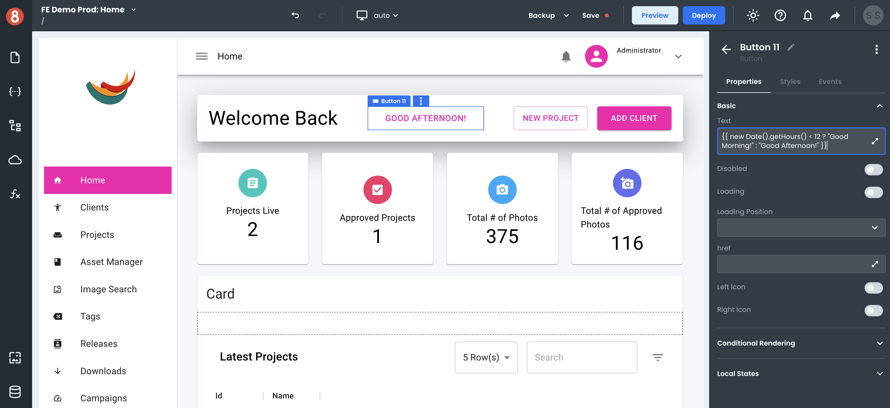

# Using Component Property Inputs

This article describes how a developer uses component properties when working with App Builder.

---

Every component in App Builder exposes many different properties inputs. Some of these properties are default, such as _id_ or _class_, while others are unique to the component itself. Regardless of the property, all components share some everyday purposes: they accept static or dynamic values that will affect the behavior or data of the component.

## Global Component Properties

The first set of properties that all components have are global properties. These inputs apply to every component and include things like _id_, _class_, and _visible_. These properties include:

• **id** - The name of the component. This name gets displayed in the Page Structure and the accessible State name of the component.

• **title** - The id of the component. This is the ID attribute value added to the parent element of the component.

• **name** - The native browser tooltip title value of the component.

• **class** - The class(es) of the component. This is the class attribute value added to the parent element of the component.

• **show if** - A dynamic value for whether the component is or isn't displayed on the Canvas (true/false).

• **draggable** - A dynamic value for whether the component is or isn't draggable (native draggable property).

• **translate** - A dynamic value for whether the component's text contents should or shouldn't be automatically translated by the browser.

• **language** - Allows for the setting of the language within a specific component container.

## Global Input Component Properties

Components that are _Input_ type components, like _Textbox_ and _Checkbox_, have a few extra global properties. These inputs are:

• **value** - The initial/default value of the input.

• **disabled** - A dynamic value for whether the component is or isn't disabled (native disabled property).

• **required** - A dynamic value for whether the component is or isn't required (native required property).

• **autocomplete** - A dynamic value for whether the component is or isn't autocomplete (native autocomplete property).

• **autofocus** - Automatically focus the form control when the page is loaded.

• **readonly** - A dynamic value for whether the component is or isn't read-only (native read-only property).

## Handlebars Enabled Inputs

Nearly all property inputs are handlebars enabled. This means that you can use handlebars expressions to dynamically set the value of a property based on other values in your app or data.

For example, you may want the value of a _Textbox_ to be set to the value of an item in your app's data object. You would set the _value_ property to `{{ item.name }}` to accomplish this.
