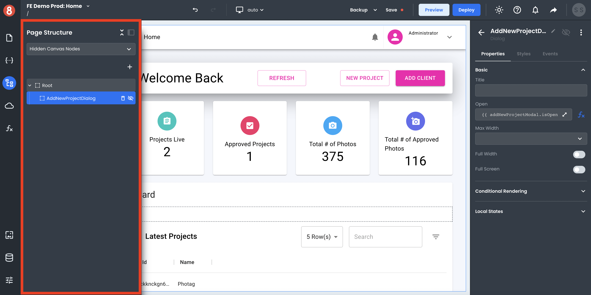
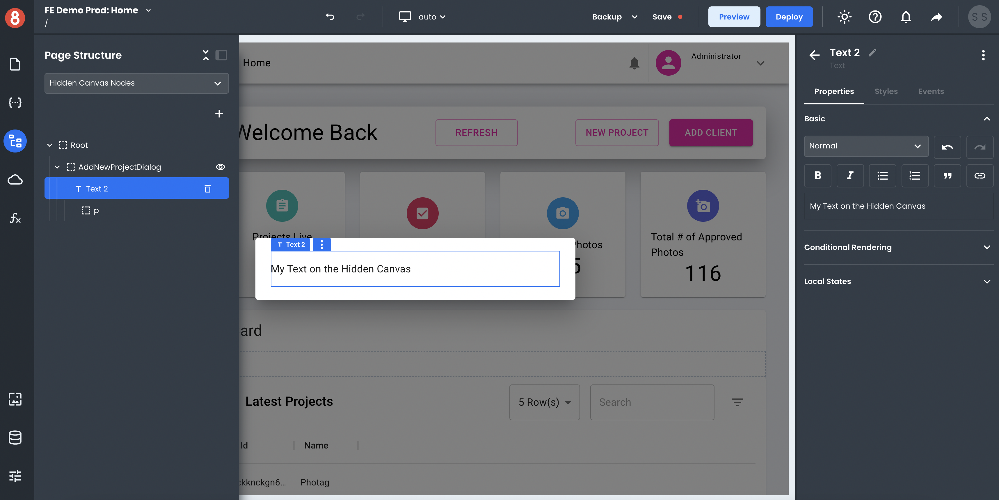

# Editor Hidden Canvas

The Hidden Canvas area gets used to build your application's "not-seen-by-default" when working inside the Editor (a.k.a, dialog boxes).

## Accessing the Hidden Canvas

To open the Hidden Canvas, open the Page Structure modal from the left menu. Using the dropdown under "Page Canvas", select "Hidden Canvas Nodes."

Thisin will show you a list of all the Hidden Components on your page and allow you to toggle their visibility. By toggling visibility to "on" by clicking the eye icon, you can bring these components into view the Editor.

## Creating Dialogs

To create a new dialog, click the "+" icon Hidden Canvas Nodes area of Page Structure. It will be hidden by default, so adding content to your dialog toggle its visibility.

## Adding Components to Dialogs

To add components to a dialog box, drag and drop them into the dialog once it's visible. If you're having trouble, try adding the dragging and dropping the component into the Page Structure. Sometimes, this approach can be more accurate.
