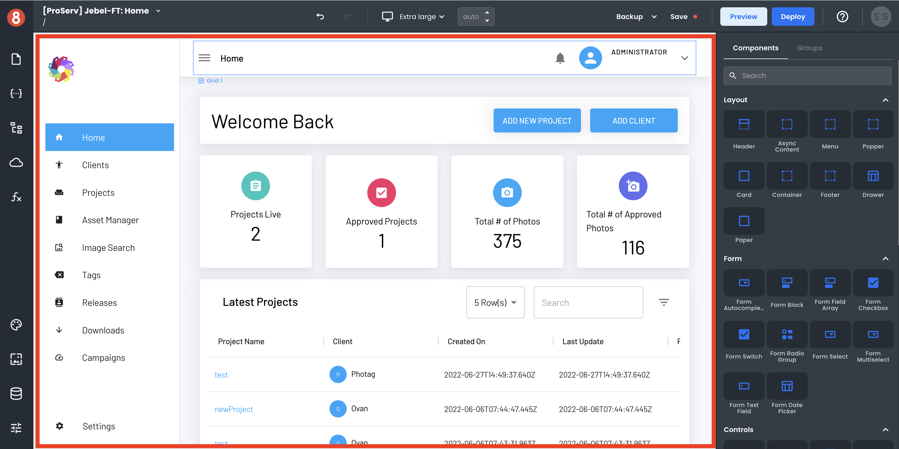

# Editor Page Canvas

The Page Canvas area gets used to build your application when working inside the Editor.

The Page Canvas is a WYSIWYG editor, meaning you can see how your app will look as you build it. To build your user interface, you can drag and drop components onto the Page Canvas.

Most often, when developing an App in App Builder, your Pages will be built using a combination of Layouts and Views.

Most often, when developing an App in App Builder, your Pages will be built using a combination of *Layouts* and *Components*. 

A **Layout** is a reusable container you can use to arrange components on the Page Canvas. App Builder ships with a few different Layout components, such as the **Authenticated** and **Empty**. You can also create custom Layouts.

### Layouts

A *Layout* is a reusable container to arrange components on the Page Canvas. The App Builder has a few different Layouts, such as **Authenticated** and **Empty**. You can also create custom layouts.

### Components

All this said Layouts and Views are always displayed and updated through the Page Canvas.

You can find more information about Layouts and Views in the _Components_ in their docs page (Coming soon...)
