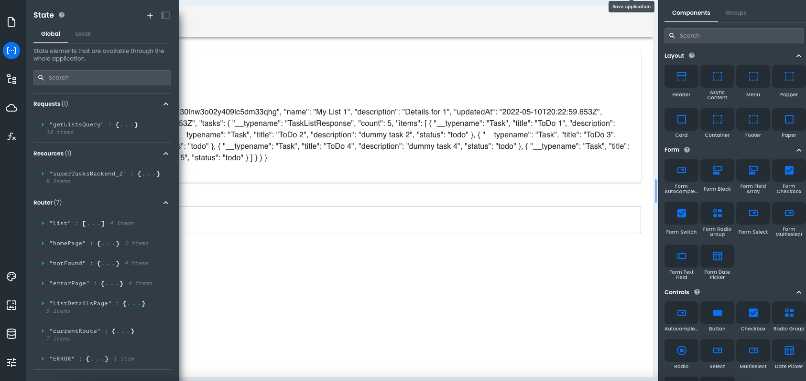

# Accessing States for Routes

This article describes how developers can access states for routes.

---

In App Builder, the `router` is a global state entry that is provided to every page. This entry allows developers to determine the currently active route, as well as any parameters that were passed to that route.



This makes it so that you can use the `router` module in any function, request, or custom script.

To access the `router` state or the state of any named route, you can look in the global namespace of the state management pane. There you will find a state entry for each named route, as well as one for the `currentRoute`:

```js
// Accessing the path of the current page from the router
var currentPagePath = router.currentRoute.path;
```

On this object, all properties, query params, fragment params, and other settings are available as well.

```js
// Accessing the query params of the current page from the router
var currentPageQueryParams = router.currentRoute.queryString;
```

While the examples above show storing a value in a variable, know that the object can also be accessed in Component property inputs and evaluated in handlebar expressions.

```js
{
  {
    router.currentRoute.params.id;
  }
}
```
