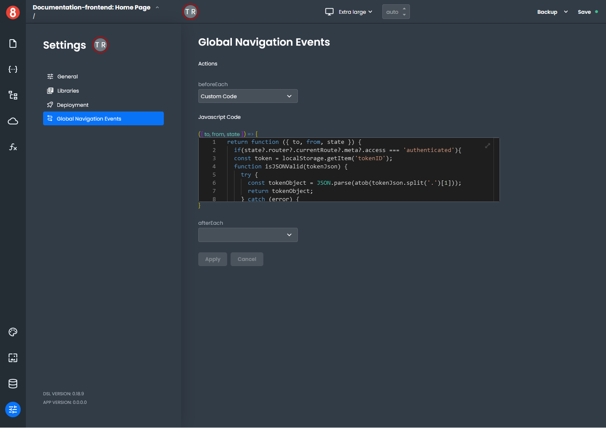
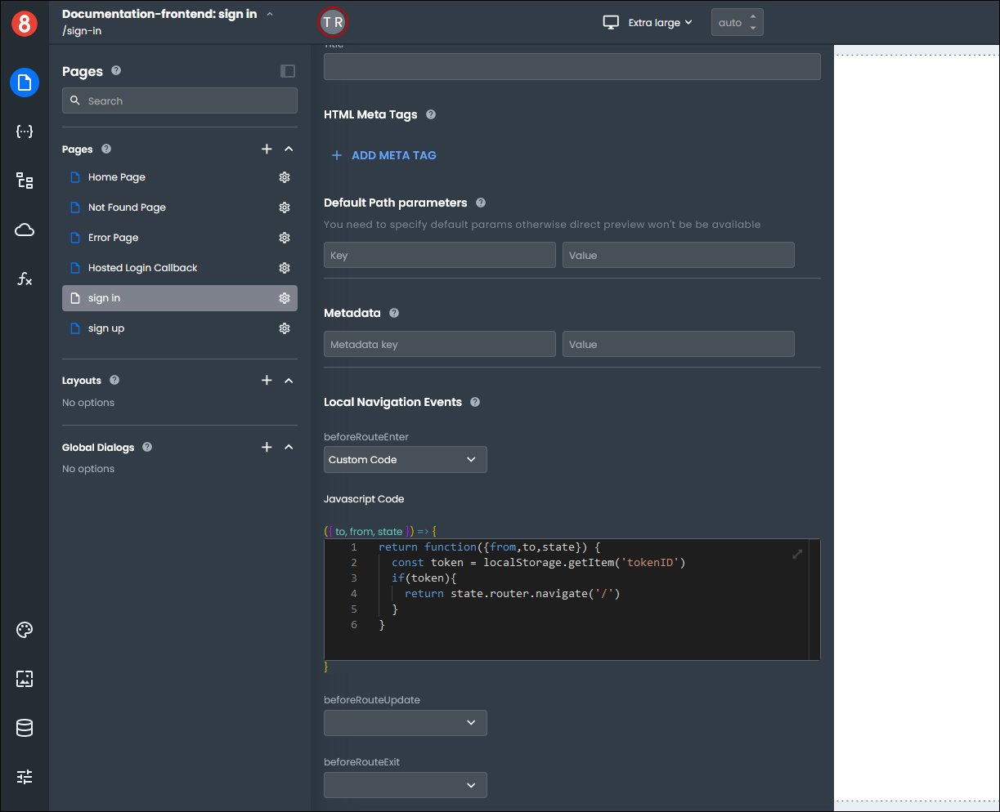
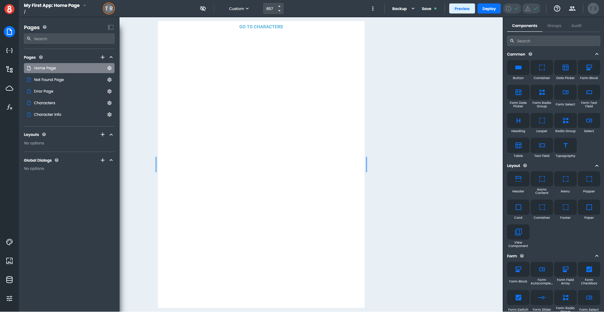
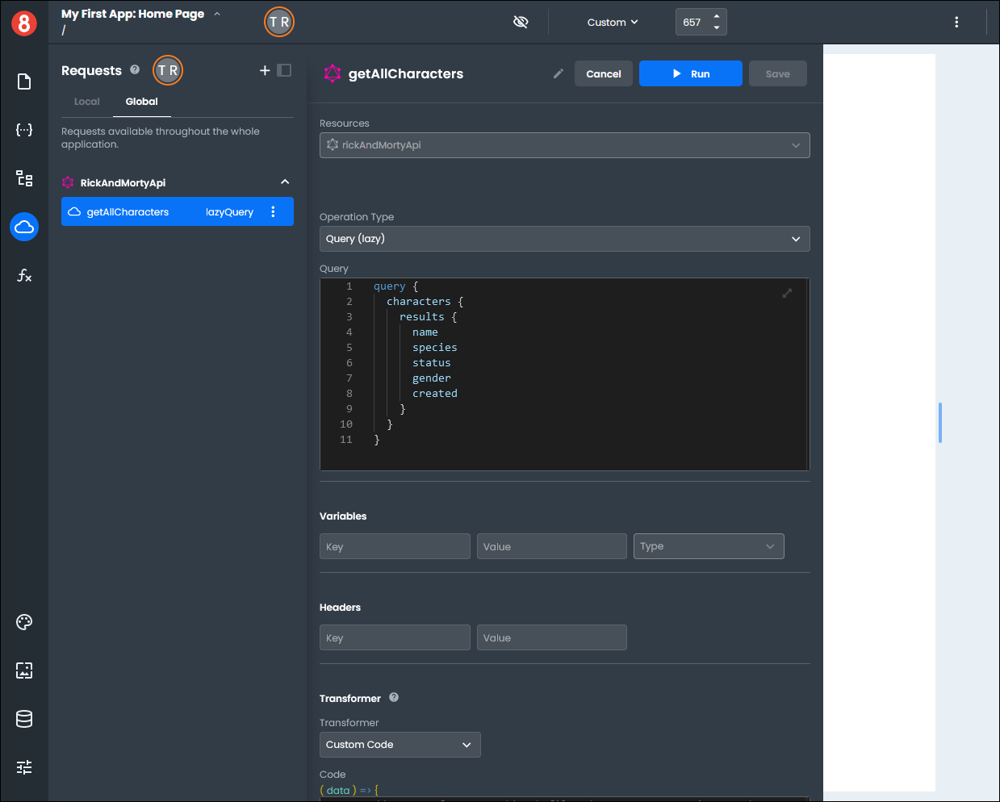
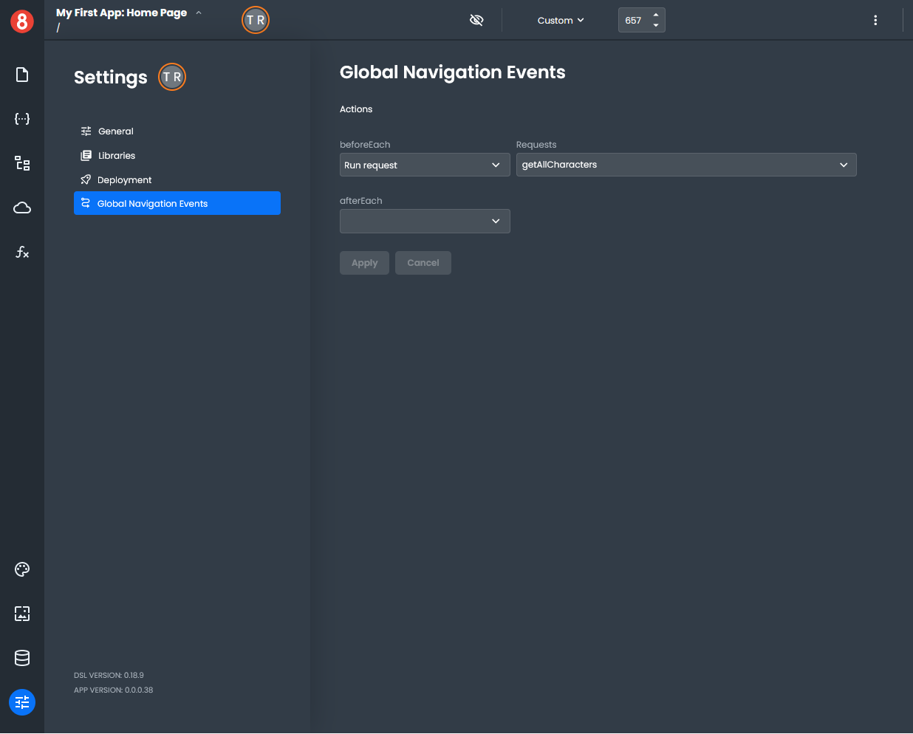
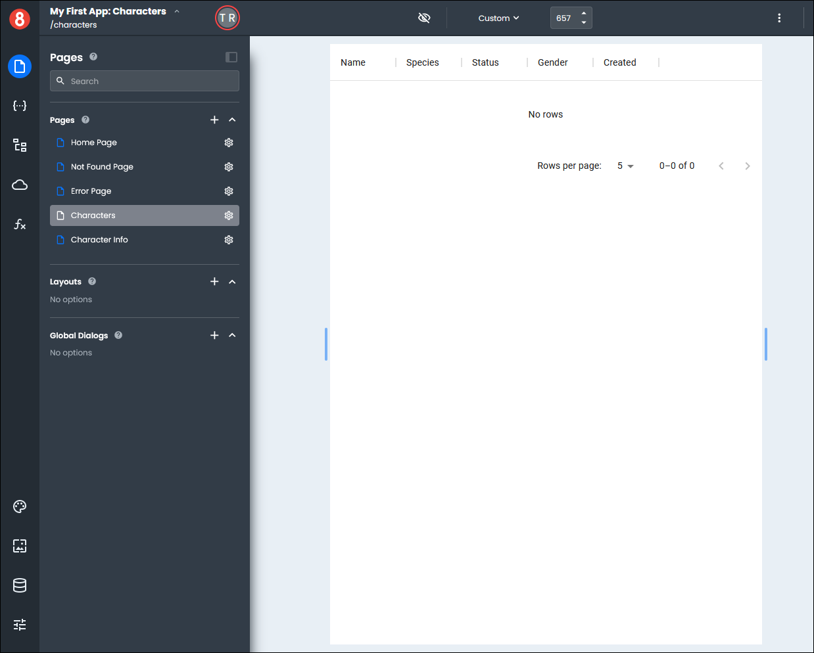
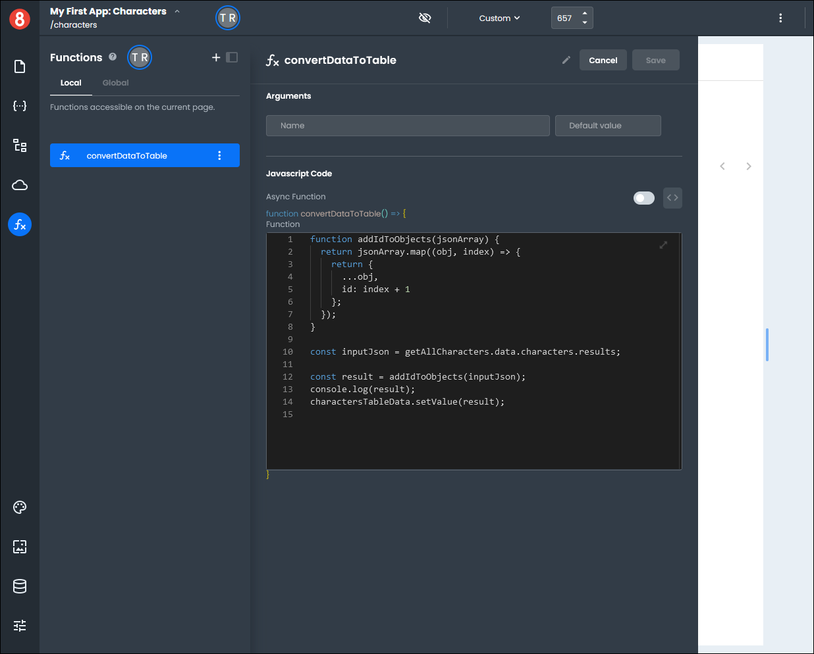
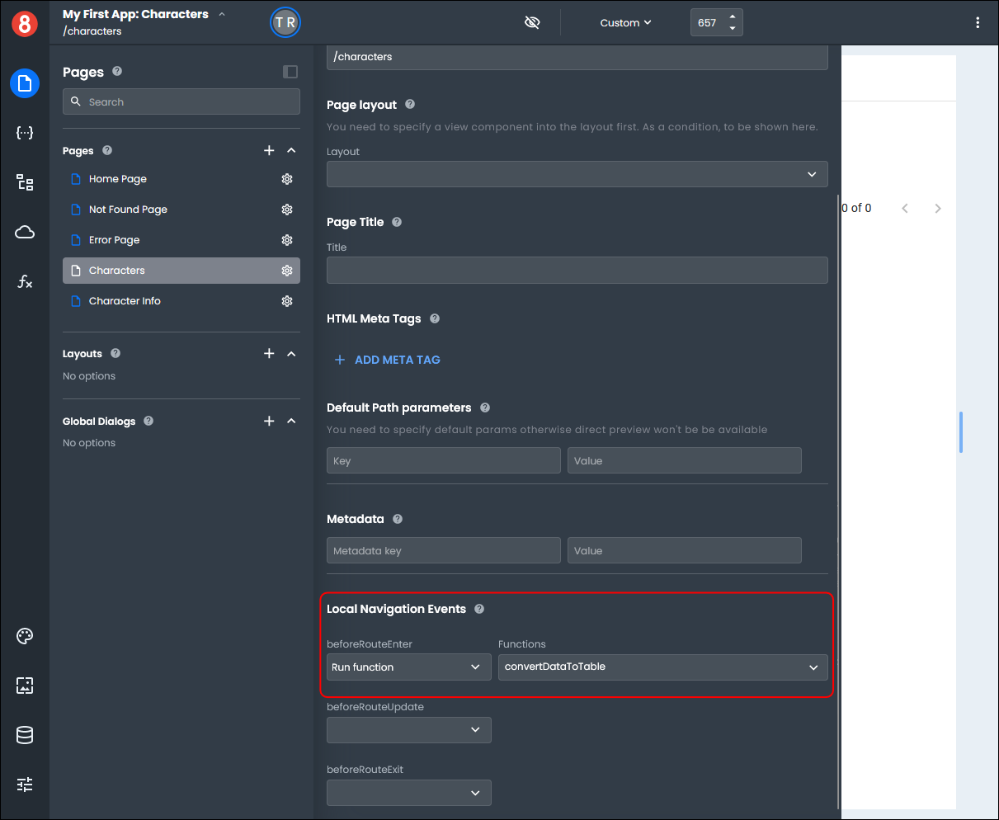
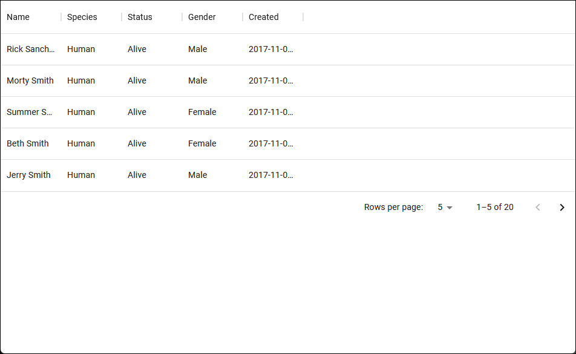

# Adding Logic to Navigation events

This article describes how developers add logic to navigation events.

---

Navigation Events allow developers to run Requests, Functions, or Router Function at different points during the routing life-cycle.

A Router Function is almost like a transform on a Resource Request. However, it provides different arguments to the function for the developer to have access to:

```js
// ARGS
// **to**: the Route being navigated to with associated state and params.
// **from**: the Route being navigated away from with associated state and params.
// **state**: the state object local state object.
return function ({ from, to, state }) {
  // type here
};
```

> NOTE: The Router Function’s return value isn’t considered or evaluated.

The following Navigation Events are available at both the Global and Local levels.

### Global

Global navigation events get specified in the _Settings > Global Navigation Events_ of a project. They run on every Route transition unless the Route.



The available global navigation events are:

- **beforeEach** - runs before opening any page.
- **afterEach** - runs after any page has been opened.

### Local

Local navigation events get specified in the Page Settings when editing a specific View. They run only when the associated Route is being navigated.



The available local navigation events are:

- **beforeRouteEnter** - runs before the Route is entered.
- **beforeRouteUpdate** - runs before the Route is entered. For example, Route /users/:id is changed from /users/20 to /users/83.
- **beforeRouteExitLeave** - runs before the Route is left.

### How to Use Navigation Events

For this example, we want a list of characters for our Characters page. Our Home page has a button that will navigate to our Characters page.



We already have our **Global Request** that will get the characters for us called *getAllCharacters*.



We want to run this request to get the data before we open any of our pages, so we need to set a **Global** navigation event in the **Settings** page.

On the *Global Navigation Events* pane, we set the **beforeEach** drop-down to "Run request" and the **Requests** to "getAllCharacters", which is the name of our request.



On our Characters page, we have a table component.



We also have a **Local Function** called "convertDatatoTable". 



We want to set the Characters page up so that the data from our request is added to the table each time the page is opened. We set up a **Local** navigation event on the Characters page to do this.

In the page settings *Local Navigation Events* section, we set the **beforeRouteEnter** drop-down to "Run function" and the **Functions** drop-down to "convertDatatoTable".



We can test the example by either Previewing it or Deploying it.

When we click the "Go to Characters" button on the Home page, we are redirected to the Characters page, and the data from the request automatically populates the table.




