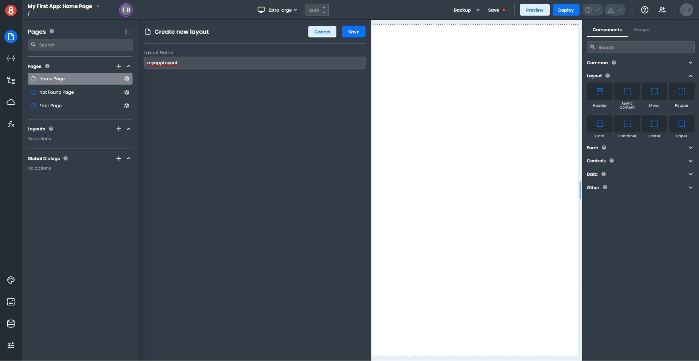
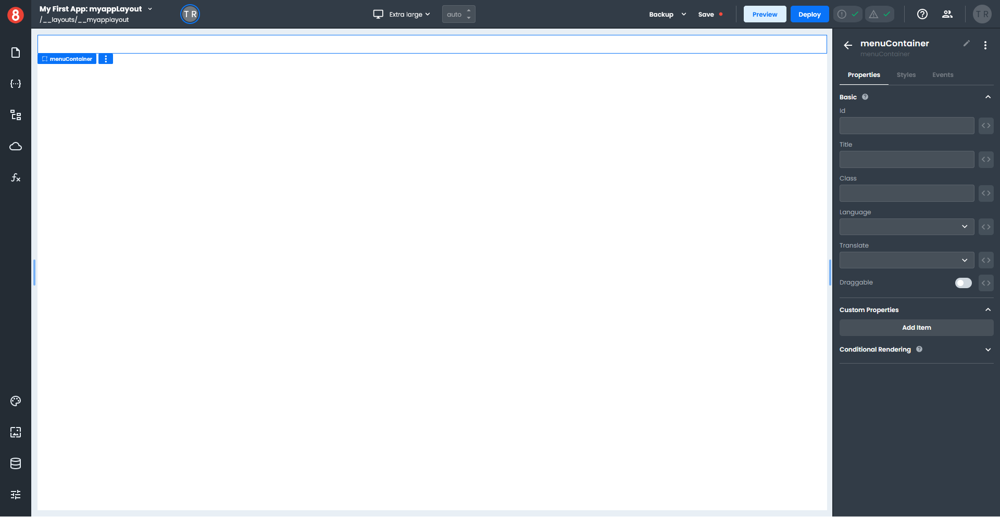
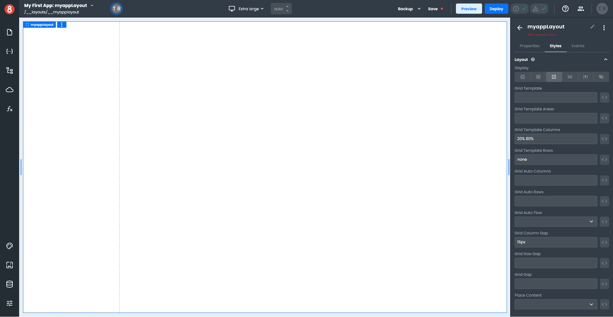
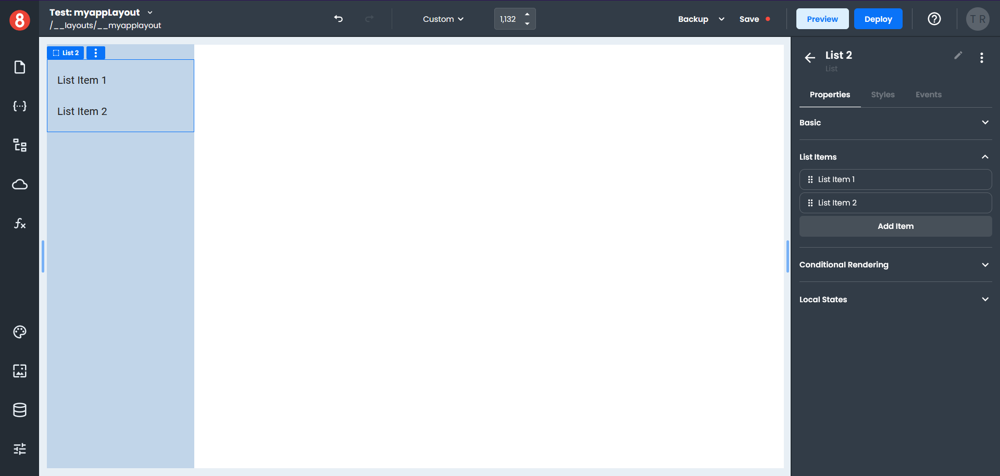
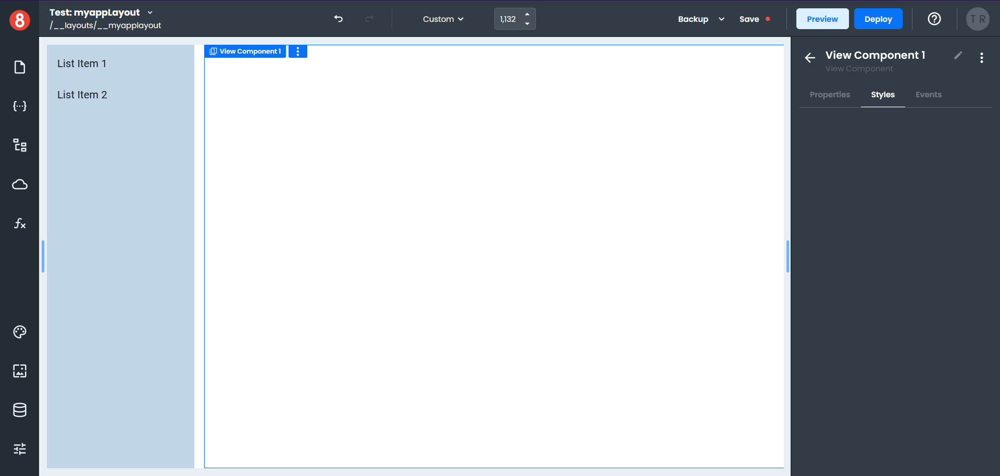
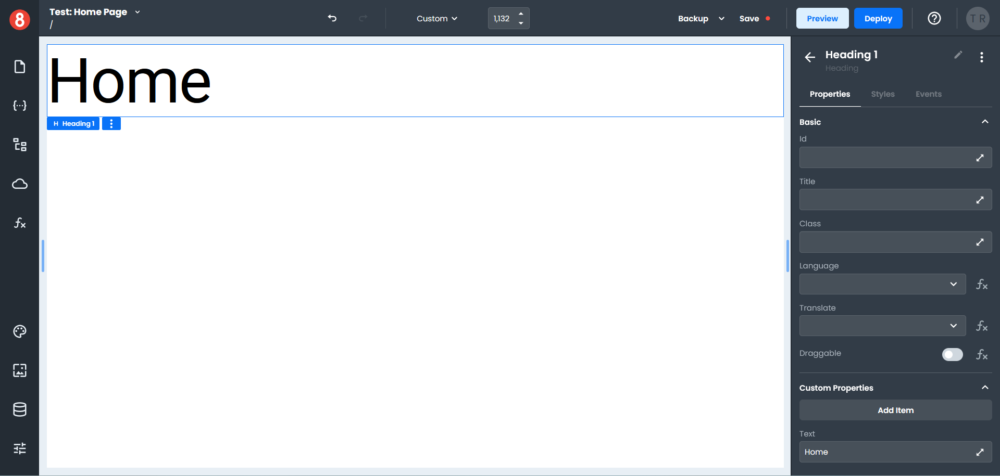
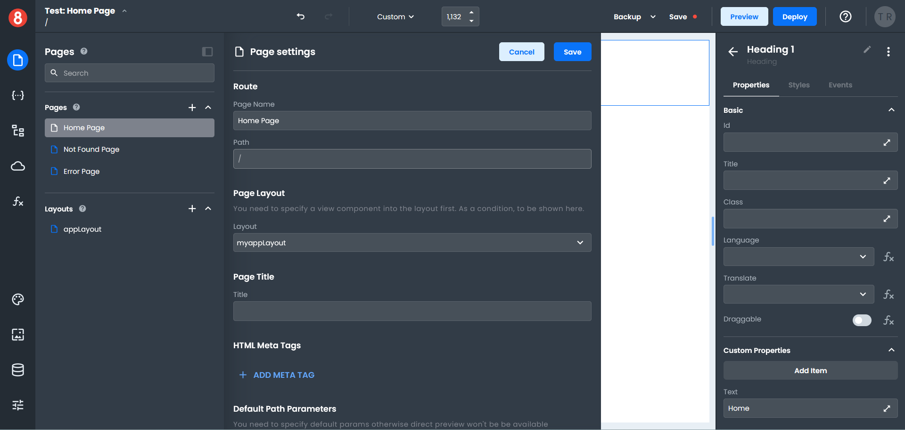
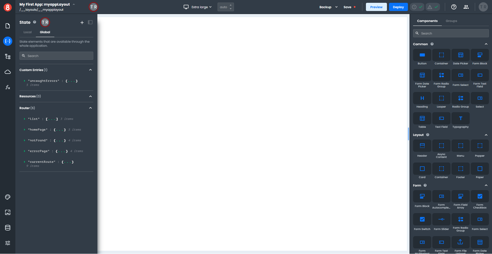
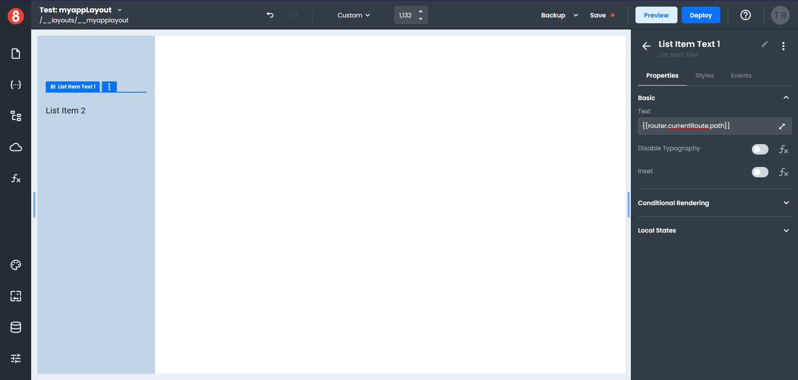
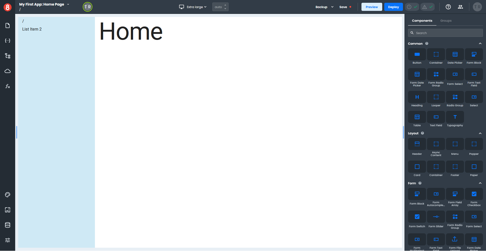

# How to create Layouts

_Layouts_ are used to create common constructs for use in multiple pages.

We'll create a small example to demonstrate how to work with layouts.

To create a new layout in the App Builder, click the plus button next to the _Layout_ name in the _Pages_ pane, and a fly-out panel will open. Enter the name of your layout and click "Save".

The name of your layout appears above the _Pages_ pane and in the upper left corner of your canvas.

Click on the page icon in the left-hand tool bar; this will collapse the panel and expand the size of your canvas.

## Working with Layouts

Working in a layout is almost the same as working on a page, except for _View_ components. A _View_ component tells the application where in your layout to render pages.

### Adding Components to a Layout

You can add components to your _Layout_ by dragging them from the right-hand _Components_ menu onto your canvas.

The right-hand menu is context-sensitive and will switch depending on whether you are working with a _Layout_ or a _Component_.

Drag a _Container_ component onto the canvas and enter the name "menuContainer" in the field above the components menu.

Click on the canvas. This will highlight the layout name in blue indicating the layout is selected.

Click on the _Grid_ icon in the _Styles_ menu and enter the following. _Grid Template Columns:_ 20% 80%, _Grid Template Rows:_ none, _Grid Column Gap:_ 15px.

Click in the left column on the canvas, to select the container component, and set a _Background_ color in the _Styles_ menu.

Click on the canvas outside the left column to switch the right-hand menu back to the _Components_ menu.

In the _Search_ type "list", this will display all the list components.

Drag a _List_ component onto the left-hand column of the canvas.

Drag a _View_ component onto the empty area of the canvas; this is where your pages will be displayed. _(If your View accidentally ends up on the left side of the canvas, just drag it to the right to reposition it.)_

Click on the _Page_ icon in the left-hand tool bar to switch from Layouts to Pages.

Click on the _Home Page_ item, which will load the page onto the canvas.

Locate the _Heading_ component under the _Other_ section and drag it onto the canvas.

In the _Styles_, menu set the _Basic_ Variant to H1.
Click on the _Properties_ tab, and under _Custom Properties_, enter Home in the _Text_ field.

### Adding a Layout to a Page

Continuing with our example, we need to set up the Home Page to use a layout.

Click the _Pages_ icon on the left-hand tool bar, and then click on the _Gear_ icon on the _Home Page_ item.

In the _Page Settings_ panel under _Page Layout_, select your layout from the Layout drop down, and click "Save". _(Only layouts in your App that have a View component are displayed in this list.)_

If you return to the Home Page, the page will now be displayed using your layout.

### Adding Data to a Layout

A Layout can access _Data_. More specifically, it can access _Routes_ for the page.

Click on the _Pages_ icon on the left-hand tool bar and select your Layout to switch to the Layout view. Then click on the _State_ icon, which opens the _State_ panel.

Under the _Routes_ section, click on the small green arrow next to the "currentRoute" name to see a list of attributes.

Hover to the right of the "path" attribute, which will display a clipboard icon. Click on the icon to copy the path to the clipboard.

Click on the _State_ icon to collapse the _State_ panel and return to the Layout view.

Select any _List Item_ and click on the _Properties_ tab in the right-hand menu. In the _Basic_ section, paste the copied "path" attribute into the _Text_ field. Add two brace brackets to the start and end of the "path" attribute.

The _List Item_ you selected will not display anything in the Layout view, but if you switch to the _Page_ view and select your _Home Page_, you will see the "path" displayed in your menu.

Click on the _Page_ icon to return to the list, and then click on the _Gear_ icon next to the _Contact_ page; set the _Layout_ to your current layout.

If you have not yet created a contact page, do that now.

### Testing a Layout

Let's add some navigation so we can test the layout.

Click on the _Page_ icon and select the _Home Page_. In the _Components_ menu, search for "button" and drag a button component onto your page.

Select the _Button_ component on your page and click on the _Events_ tab in the right-hand menu. Click the plus button to add an event and select an _On Click_ event.

Click on the _Gear_ icon next to the Action name and select _Navigate_ from the drop-down menu. Enter "/contact" as the path in the _Page_ field.

To preview the _Home Page_ in a web browser, click on the _Preview_ button in the top tool bar.

Clicking the _Button_ on the _Home Page_ will take you to the _Contact_ page. Notice the path for the contact page is displayed in the menu.

### Finishing Up

A Layout can access global objects like the router to access information within the page, which helps to create the dynamic aspects of your application.
