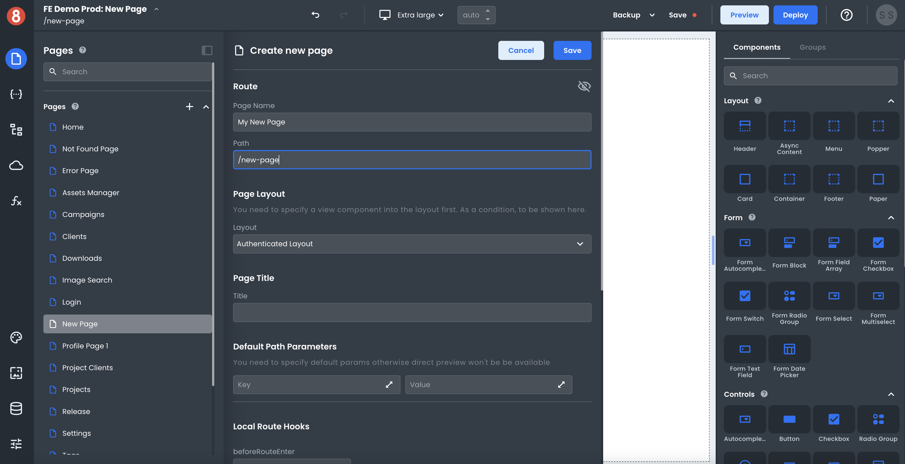

# App Navigation Page URL Settings

This document describes how a developer can set and manage Page URLs when working in App Builder.

---

Every Page in App Builder requires a unique path at which it can be accessed. This path is known as the Page URL. When you create a new Page in App Builder, it will be given a URL based on its page name. For example, if you create a new Page called "My New Page," its default URL will be "/my-new-page".

You can customize the URL for any Page in App Builder. Simply navigate to the Page Settings you wish to modify, and update the values set in the "Route" section of its settings. Once done, use the "Save" button to save your changes.

**Page Name** is solely used for internal purposes. Meanwhile, the **Path** is what defines how the Page will be accessed/referenced.

## Impact of Changing Existing URLs

It's important to note that changing a Page URL will break any links that were using the old URL. As such, it's generally recommended that you only update URLs for new Pages or for Pages whose URL needs to be changed for some other reason.

If you need to change the URL of an existing Page, we recommend that you create a new Page with the desired URL, and then move the content from the old Page to the new one. Once all content has been moved over, you can delete the old Page.

:::info

App Builder currently doesn't offer a native redirect capability. If you wish to redirect users from the old URL to the new one, you'll need to use a `beforeRouteEnter` local hook and the `router.navigate('DESTINATION_PATH')` method.
:::

## Best Practices for URL Management

When working with App Builder, we recommend following a few best practices for managing Page URLs:

• Always create new Pages with unique URLs. Do not reuse URLs for different purposes.

• When renaming an existing Page, update its URL simultaneously to avoid confusion.

• Use descriptive Page names and URLs. Descriptive names and URLs make it easier for you and other developers to understand the purpose of each Page.

• Use consistent URL patterns across your app. This makes it easier to remember how to access specific Pages, and also makes your app's structure more predictable.
