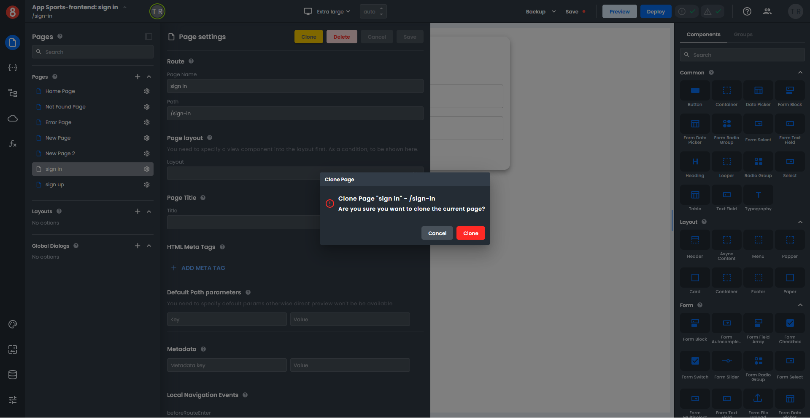
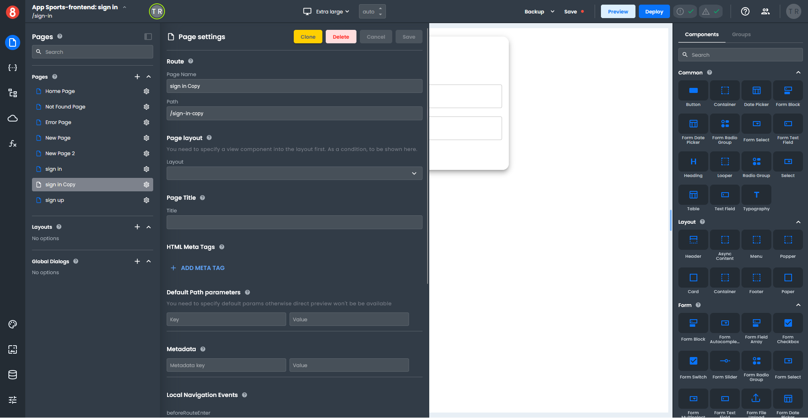
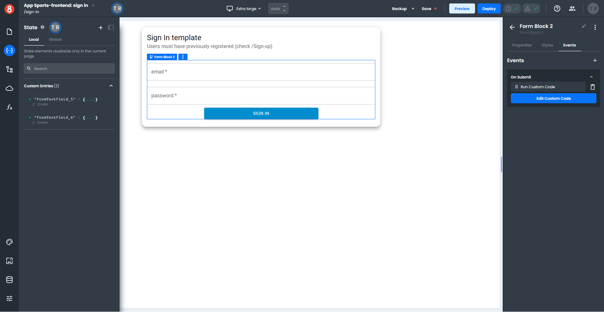

# Creating, cloning, and editing App Pages

This article describes how developers can create or clone _Pages_ and edit their _Page Settings_.

---

## Creating Pages

Assuming you have an App already created in App Builder, to Create a new Page, simply select the "+" button on the _Pages_ pane.

Pages have the following properties that can be set:

• Name: A unique name for the page. This will be used internally by App Builder and is required.

• Path: The path for the page. This is required and must be unique.

• HTML Meta Tags: These are HTML Meta tags that will be placed in the `<head>` section of the page.

• Default Path Parameters: These are parameters that will be set on the page. The format is `ParameterName=DefaultValue`.

• Route Metadata: This is metadata that will be associated with the page. The format is `MetaKey=MetaValue`.

• Local Route Hooks: These are functions that will be called when the page is navigated to. The format is `FunctionName(to, from, state)`.

After you have set all of the properties for the page, simply click the "Save" button to save the page.

## Cloning Pages

To Clone an existing _Page_, click the "Clone" button on the top of the Page Settings panel. You will be prompted to confirm you want to clone the page.

A copy of the _Page_ will be created with the same name and the word "Copy" added to the end of the page name. The page will show up in the **Pages** section of the _Pages_ pane.

When a _Page_ is cloned the following features are preserved in the cloned page.

- Page settings
- Components
- Events
- Local states
- Global states
- Custom code

## Editing Pages

To Edit an existing _Page_, simply change the values in the Pages Settings panel and click "Save":

