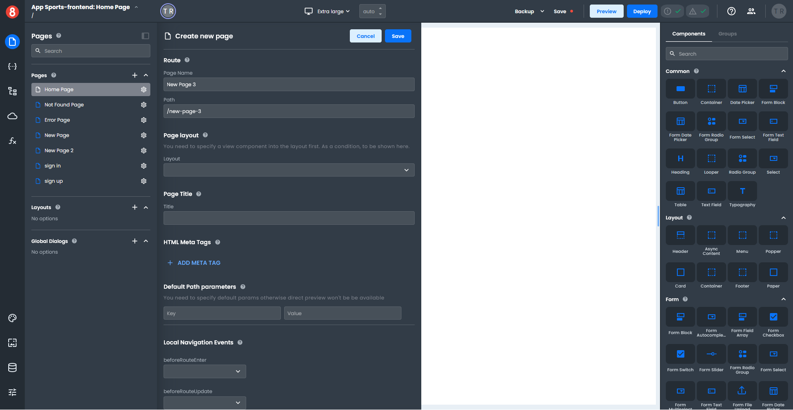
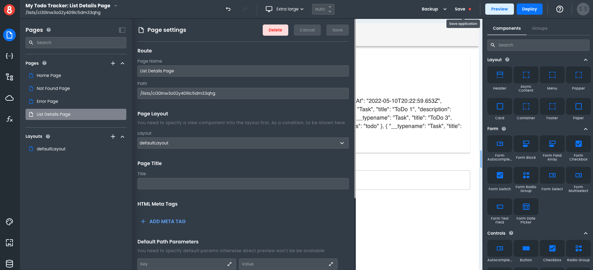

# Creating and Editing App Pages

This article describes how developers can create new Pages and Edit their Page Settings.

---

In App Builder, you can create and edit Pages in the "Pages" pane of the left menu.

## Creating Pages

Assuming you have an App already created in App Builder, to Create a new Page, simply select the "+" button from the "Pages" Pane:

Pages have the following properties that can be set:

• Name: A unique name for the Page. This will be used internally by App Builder and is required.

• Path: The path for the page. This is required and must be unique.

• HTML Meta Tags: These are HTML Meta tags that will be placed in the `<head>` section of the Page.

• Default Path Parameters: These are parameters that will be set on the Page. The format is `ParameterName=DefaultValue`.

• Route Metadata: This is metadata that will be associated with the Page. The format is `MetaKey=MetaValue`.

• Local Route Hooks: These are functions that will be called when the Page is navigated to. The format is `FunctionName(to, from, state)`.

After you have set all of the properties for the Page, simply click the "Create" button to save the Page.

## Editing Pages

To Edit an existing Page, simply change the values in the Pages Pane and click "Save":

