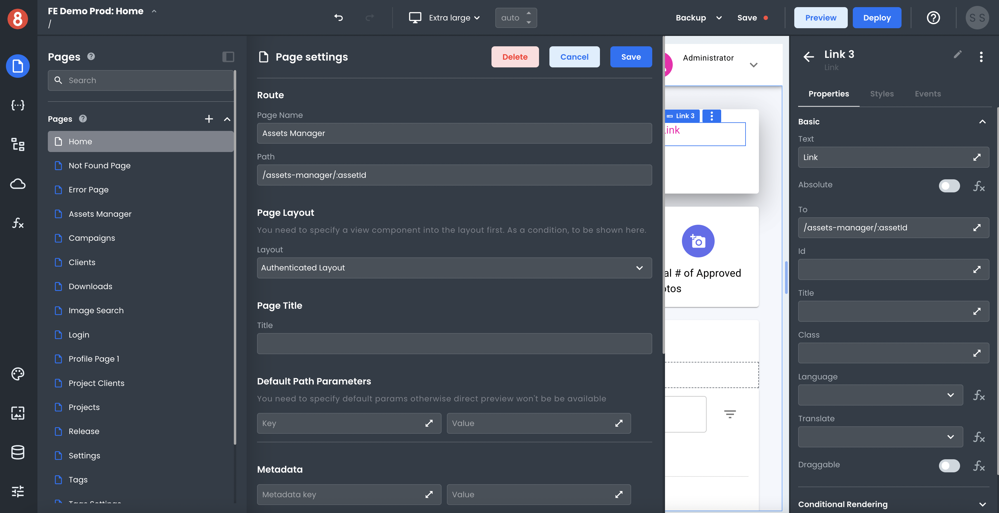

# App Navigation Introduction

This document describes at a high level how to think about app navigation when working in App Builder.

---

When working in App Builder, you primarily develop Pages, each of which is assigned a route. For example, a page that displays a User's profile may get given the path "/profile/:userId." When a user navigates to that page, the ":userId" portion of the route will get replaced with the actual User ID. Meanwhile, many navigation events occur during that process.

As your app grows in complexity, you will likely add many Pages, some of which users only assigned specific roles are allowed to access. The process of a user moving from page to page in an application, and different life-cycle events that occur during that journey, are what we refer to as App Navigation in App Builder.

There are many different ways to think about app navigation. In the following sections, we will explore some of the various aspects and concepts of app navigation so that you can better understand how it works in App Builder.
