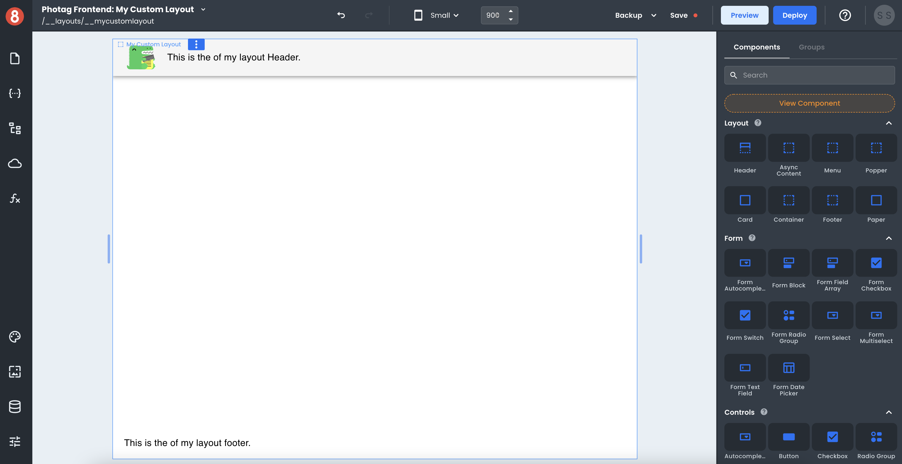
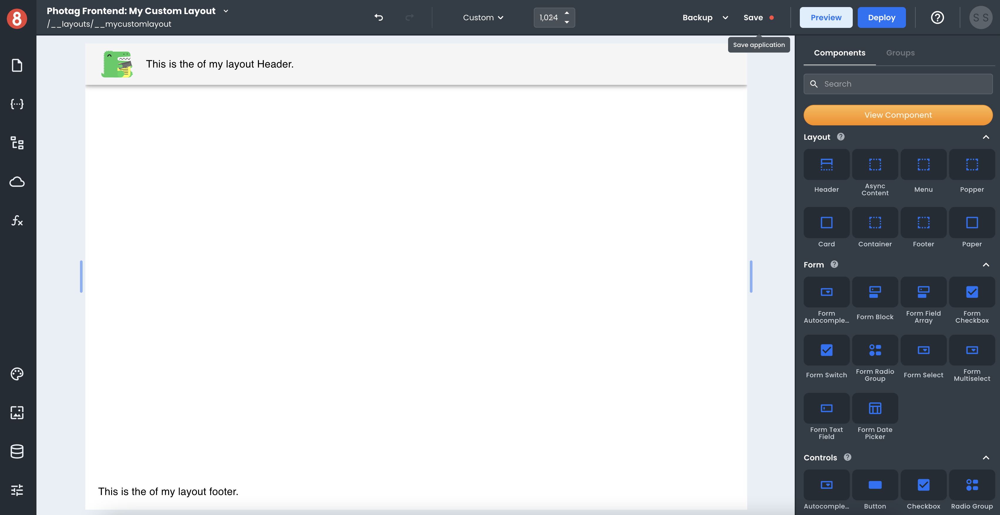
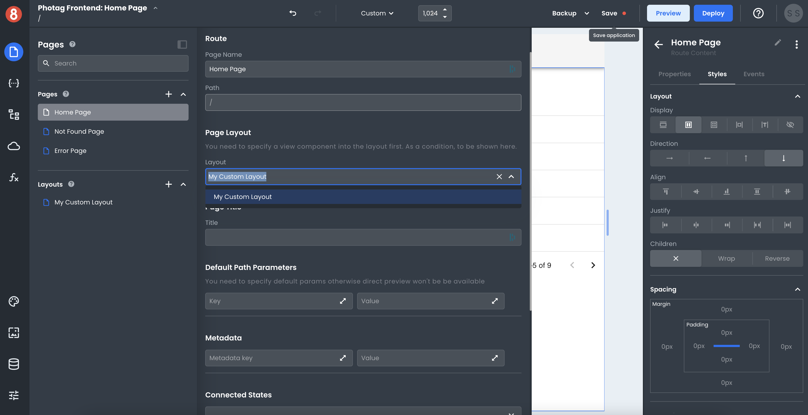
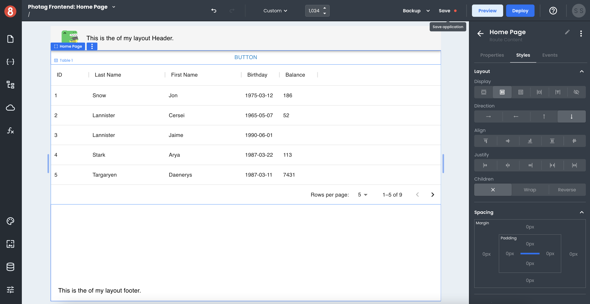

# Creating and Editing Layouts

This document describes how a developer can create and edit Layouts in App Builder.

---

All the layouts available in your application are displayed at the bottom of the Pages pane that's located in the left menu. To create your first Layout, click the "+" in the Layouts section menu. This will open a form that lets you specify the name of your Layout.

Layouts get built no differently than pages. You drag and drop components into the Layout to build it. The only difference is that layouts require the **View component** to be added to that Page.

## Understanding the View Component

The View component determines where a Page's components will be rendered within the Layout. Think of it as a slot that will render the Page's content.

:::info
Every Layout allows for one View component to be added.
:::

## Using a Layout on a Page

You're able to use a Layout by selecting it on a Page's settings. Layouts are available as an option when you open the "Page Layout" setting.

