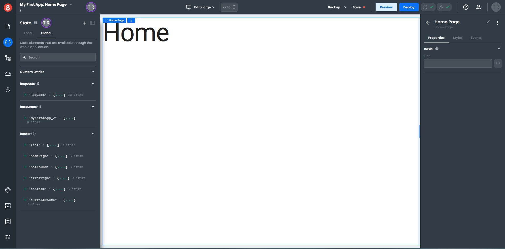
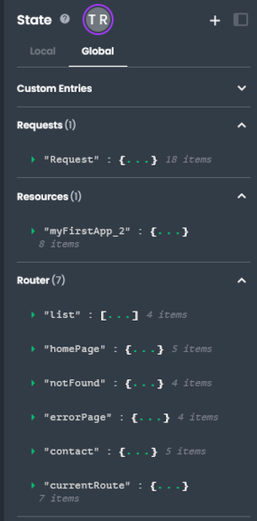
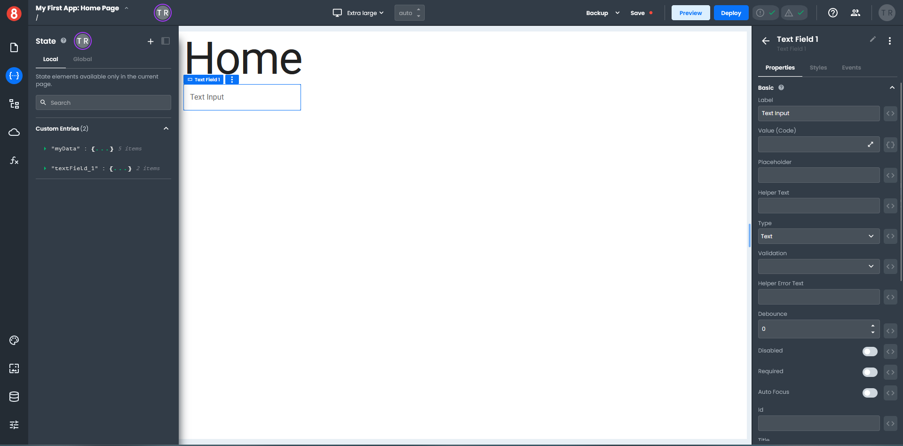
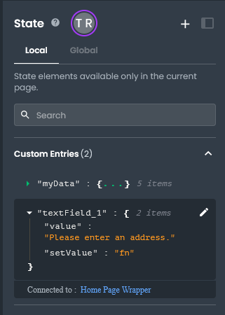
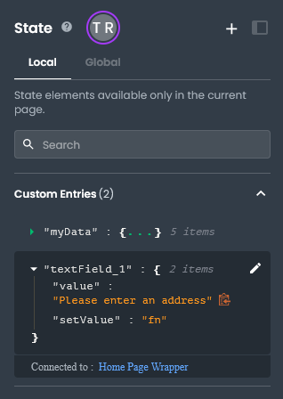
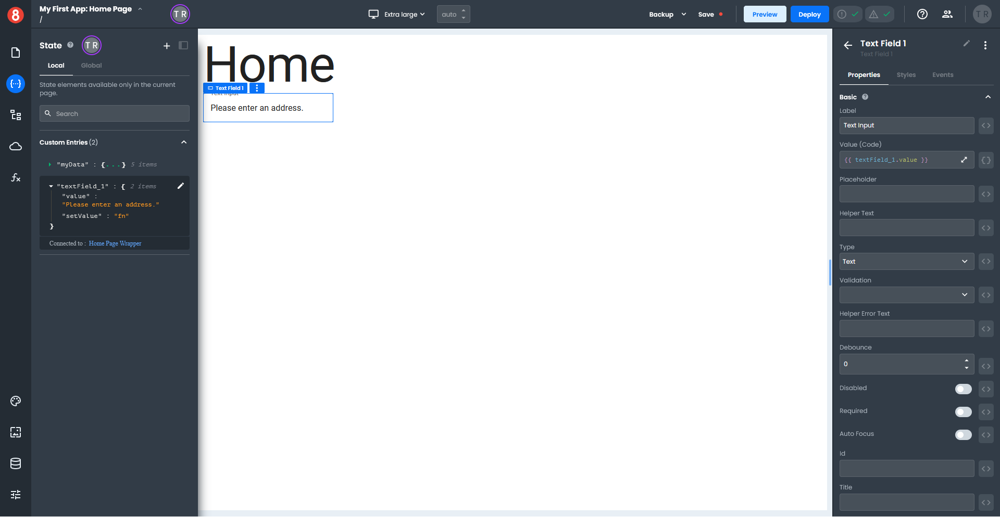

# Accessing frontend data in Projects

Frontend applications use a State management system to store data and reflect the attributes and data of elements, like Components and Requests. The State object is accessible to any element within the frontend. Any data that needs to be accessed by multiple elements can be stored in this object for easy retrieval.

Additionally, states can be either Local or Global. While Global states are accessible by any element within a frontend application, Local states are only accessible by elements within the Page they were created.

## Opening the State pane

The first step in managing state data is to open the *State* pane by clicking the "{...}" icon in the left menu. 

The *State* pane has tabs for Local and Global state data and gives you access to four different data types.

- **Custom Entries** - Custom data that you create.
- **Requests** - Data accessed through a database request.
- **Resources** - Data related to specific resources. For example, under the Global State tab, you will find data in the Resource section about your project, such as the project name, title, API, and workspace.
- **Router** - Data related to your application pages.

## Accessing State data in a Component

To access state data in a component, you must drag and drop a component onto the Page first. Try dragging a *Text Field* component onto your Page.

Open your *State* pane and expand the **textField_1** entry under Custom Entries. Let's add a default value to our *Text Field* so the user knows what to enter in the field. 

Click the "pencil icon" to the right of the **textField_1** in the *State* pane, which opens a properties dialog. In the **Default Value** field, enter the text "Please enter an address" without the quotes, and click "Save". The text will be saved in the **textField_1** value property.

When hovering over any key or value, you'll see a small clipboard icon to the right of the entry. Clicking this icon will copy the **state accessor** for you to use as input in your Component.

In frontend projects, all inputs are handlebars enabled, meaning you can dynamically read any state value as an input in your Component's properties.

For example, click the "clipboard icon" next to the **textField_1** value property and paste it into the _Text Field_ component **Value** field in the *Properties* pane. Add handlebars to the front and back of the pasted text in the field. Your **Value** should look like this {{textField_1.value}}.

Once done, you should see the rendered value on your page canvas within the component instance.

## Data Binding examples

The following examples demonstrate how to bind different types of data to commonly used components.

1. [Binding a Request to a Table](/projects/frontend/data-binding-example-binding-request-to-table-component.md)
2. [Binding Custom Entries to a Card](/projects/frontend/data-binding-example-binding-custom-entries-to-card-component.md)
3. [Binding a Request to a Looper](/projects/frontend/data-binding-example-binding-request-to-looper-component.md)
5. [Binding a Function to a Looper](/projects/frontend/data-binding-example-binding-function-to-looper-component.md)
