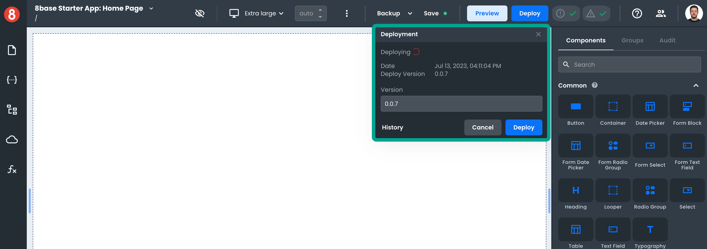
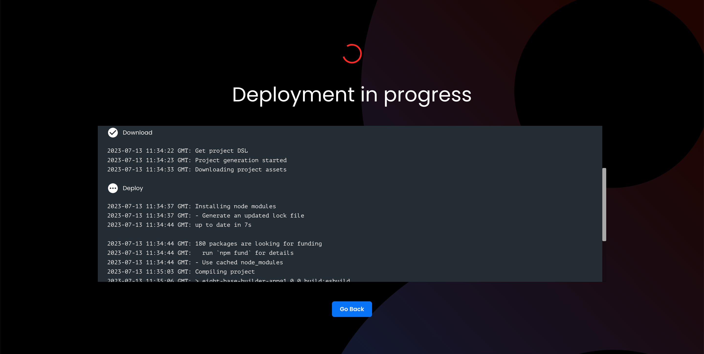
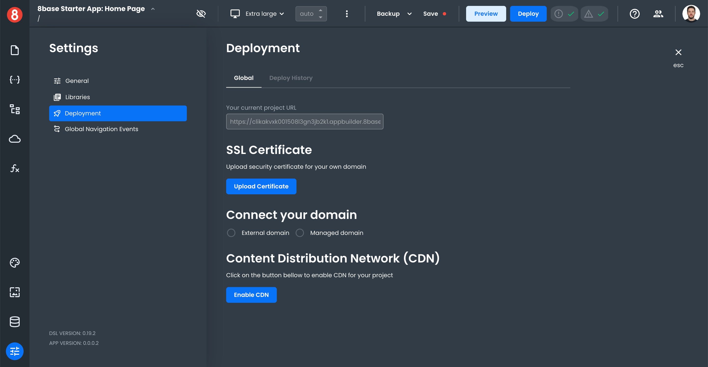
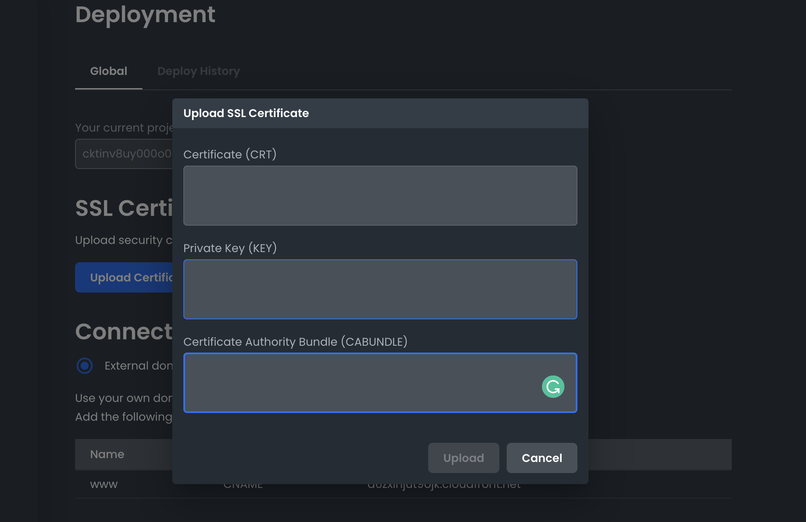
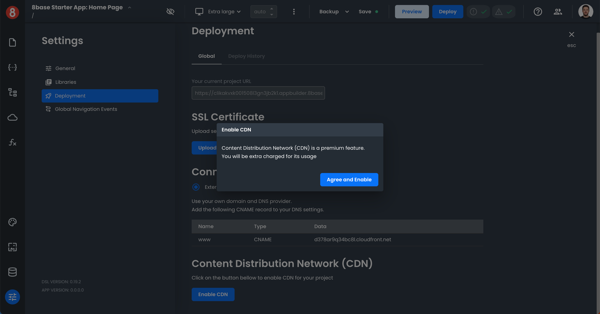

# Deploying / Publishing an App

When you're ready to deploy your app, click on the "Deploy" button located in the top navigation bar of the App Builder editor. This will open a drop-down that shows your deployment history and allows you to click on the second "Deploy" button. Every new deployment is automatically assigned a version number that automatically increments. However, you have the ability to specify. However, you as the developer have the ability to manually specify it.

This will start the process of compiling, building, and deploying your app. All apps are automatically deployed to an S3 bucket. The bucket will be assigned a static URL that is mapped to it.

## Deployment Settings

You can find more deployment options in the Deployment area of your app's Settings. Different deployment options are available, such as configuring SSL certificates, enabling a CDN, and the instructions for mapping a Custom Domain with your DNS provider.

### Adding a Custom Domain

If you want to map a custom domain (like www.example.com) with your app, you need to configure it with your DNS. In the Settings > Deployment area of the Editor, you'll find instructions for adding a CNAME entry with your DNS provider.

Once you've added the CNAME entry, come back and enter your custom domain in the App Builder editor and click Save. Your app will soon be accessible at your custom domain (note that it may take up to 48 hours for DNS changes to propagate).

### Enabling SSL

To enable SSL for a Custom Domain, you need to create an SSL certificate with your DNS provider or another SSL tool.

App Builder will require that you input the Certificate (CRT), Private Key (KEY), and Certificate Authority Bundle (CABUNDLE). Once you've done this, click the upload button.

**If you have any issues, contact support@8base.com**

### Enabling CDN

A premium feature in 8base is CDN. By clicking the enable button and agreeing to the terms, 8base will configure your application to be accessed through a global CDN. This improves load speed.
