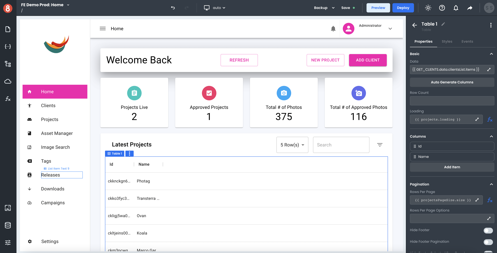

# Introduction

The 8base App Builder Editor is a fully hosted drag-and-drop environment that lets Javascript developers quickly build web applications using pre-built UI/UX components. It is simple to use and makes it easy to get started with building web applications. Inside the Editor, there are a number of different interface areas and concepts that are important to understand.

So let's jump right into them!
