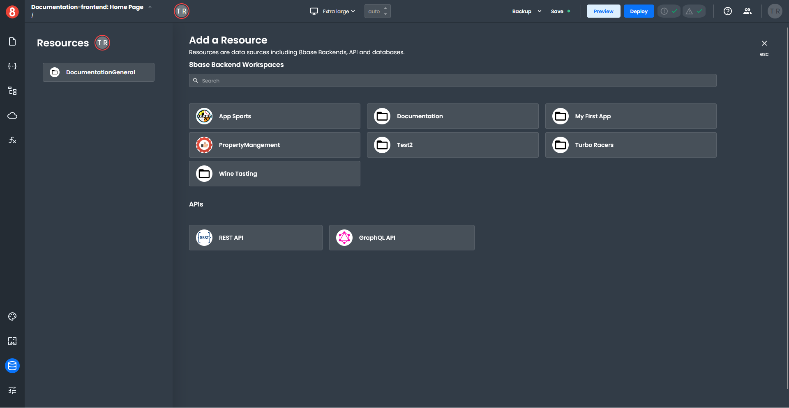
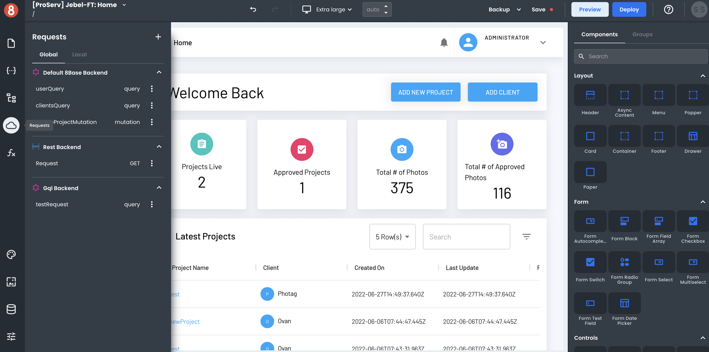
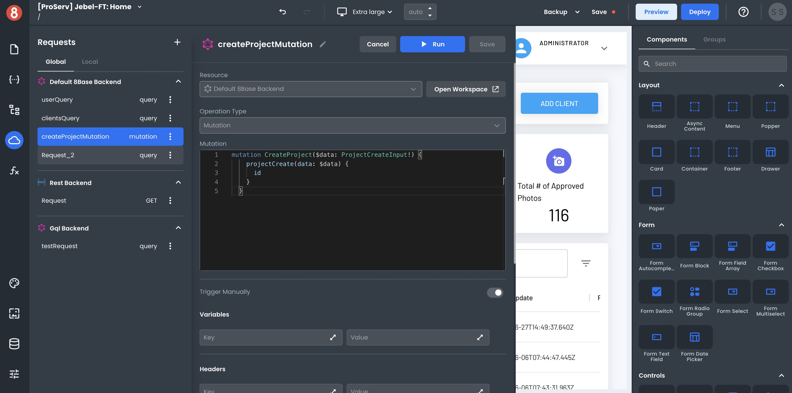

# Connecting to a GraphQL API

This article describes how developers can quickly create a Resource connected to a 3rd party GraphQL API

---

To set up a GraphQL API as a data source, click on the Resources icon in the left-side menu. It will open a modal that lists all of the available data sources.

In the "Add a Resource" area, select "GraphQL API." This will open up a configuration window in which you can specify the name of your API, endpoint URL, and any default headers.

Click "Save" to save your changes. Once saved, the new data source will be visible in the Resources list when creating Requests.

## Making an API Request to the Data Source

Once your Resource gets configured, it will become available in your app! You can then make API requests to it using the Request Modal.

To create an API request, click on the "+" button in the top-right corner of the Request modal.

In the Request create form, you can select which Resource you want to request and the different settings for that Request. The input variables, headers, and operation type can all be set. These options will vary based on the type of data source you're sending the Request to (e.g, GraphQL, REST, 8base Backend).

After you've made your request, you'll see the response. The data also gets stored in the State pane, making it accessible by components and other parts of your app.

## Understanding the different operation types

### Query (lazy)
This GraphQL query is expected to be executed in response to an event. This is the default option when fetching data, as most applications will prefer to be in control of when a query is executed. You can execute lazy queries as part of [component events](/projects/frontend/connecting-to-data-sources/how-to-make-api-calls-requests/how-to-execute-a-graphql-querymutation#setting-a-request-to-run-on-an-event) or [navigation events](/projects/frontend/app-navigation/create-and-editing-app-pages/adding-logic-to-navigation-events/). You can also execute it from any code block using the [run method](/projects/frontend/connecting-to-data-sources/how-to-make-api-calls-requests/how-to-execute-a-graphql-querymutation#setting-a-request-to-run-on-an-event).

### Query
This GraphQL query will be executed when the global or local scope, where is defined, is mounted. At runtime, your app should assume query results will be present in the state if the scope is mounted. You cannot select queries as targets of component events or navigation events. You could execute them using the run method, but please consider that would be an additional execution. 

### Mutation
Mutations are used to send data to the server and usually, they would add or modify data. Mutations behave like lazy queries, letting the app decide when is the appropriate time to execute them.