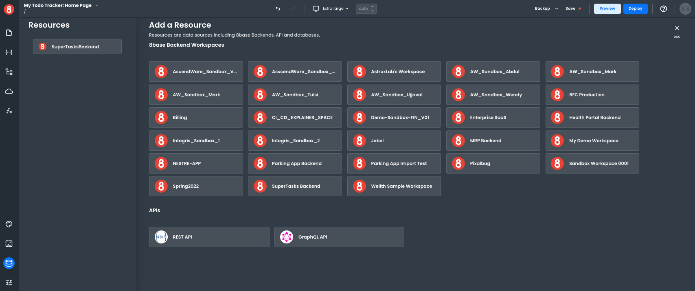

# API Connection Types

This article describes how developers can think about Resources (API Clients) in App Builder.

---

When you add a Resource to your app, App Builder creates what's essentially an API connection. The Resource becomes the API Client that you send any relevant request to get executed.

There are three types of APIs you can connect to:

- **REST API's** are the most common, and likely the ones you'll be working with most often. They use standard HTTP methods like `GET`, `POST`, `PUT`, and `DELETE`.
- **GraphQL API's** are becoming more popular, and use a single endpoint for all requests.
- **8base Workspace API's** are GraphQL APIs specific to 8base, and provide an easy way to query your data without having to write any code.

The process for connecting to each type of API is slightly different, but the end result is the same: you have a Resource that contains all the methods necessary to fetch or update data in your app.
