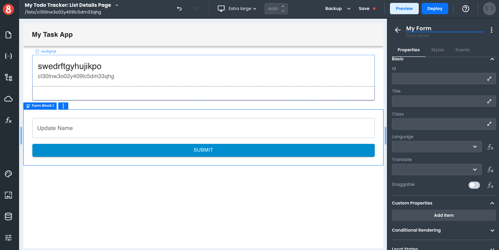
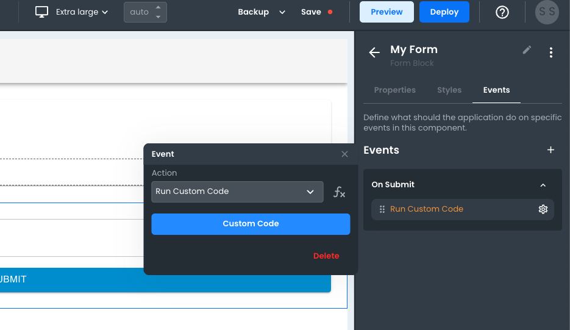
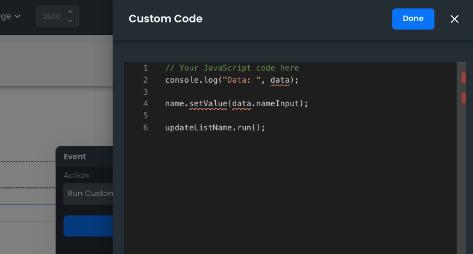
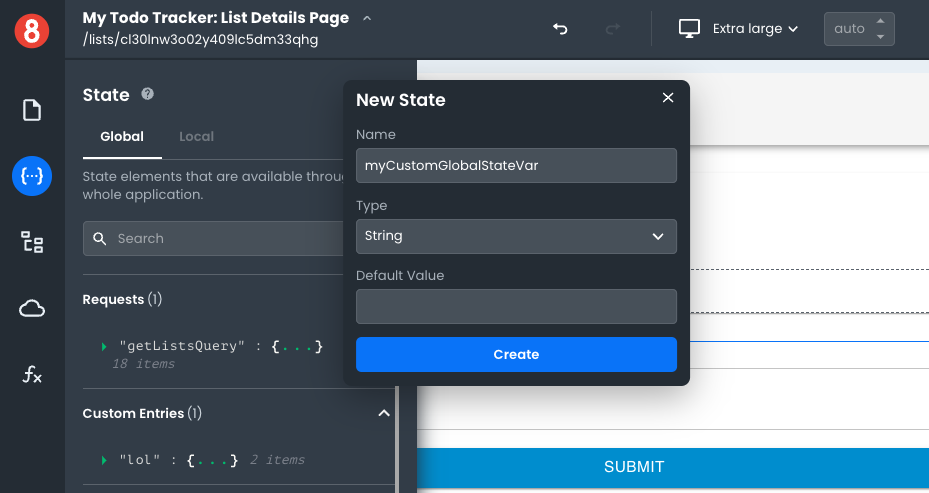
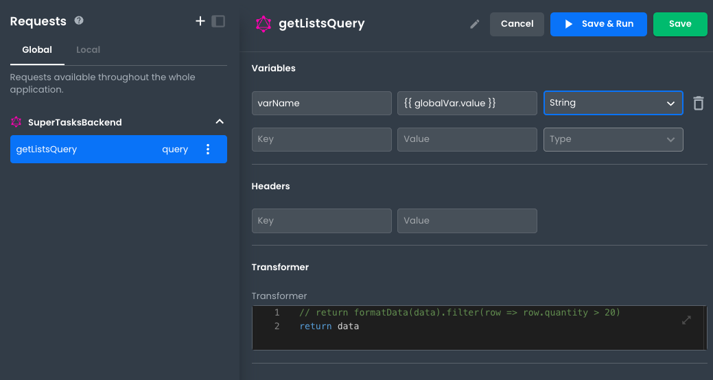

# Send form data with an API Request

This article describes the process a developer must go through to send data with an API request collected in a form.

---

In App Builder, developers can send form data to an API (GraphQL or REST). To do so, there are several concepts that they need to be familiar with.

1. Form Components
2. Component Events
3. Custom Code (JavaScript)
4. Setting/Accessing Global State Values
5. Setting Variables in Requests

With those listed, let's walk through each one so you can start sending data from the front end.

## Form Components



Form Components are Inputs that are allowed to be placed in the Form Block Component. To collect values from Forms in App Builder, you must use Inputs placed inside a Form Block component.

There are several types of inputs:

- Text Input
- Number Input
- Date/Time Input
- Single Select Dropdown
- Multi Select Dropdown
- Checkbox Group
- Radio Button Group
- and more.

These inputs allow you to collect user values, but only on the Form's "On Submit" event.

## Component Events



In App Builder, developers can use Component Events to trigger actions associated with custom code execution. In this case, we'll need to set an Event listener for the Forms Block's "On Submit" event.

On a Form Block Component, go to the "Events" tab a select the "On Submit" Event. Then configure the action to run "Custom Code." Once configured, open the code editor.

## Custom Code (JavaScript)



The code editor will give you a blank editor in which you can write any Javascript you want.

**Know that the arguments that you need to use in order to collect your Form data App Builder will explicitly tell you do NOT exist and will show visual errors. Just ignore those.**

Inside the function, know that you'll be able to access any Form data from the inputs included in the form on a hidden variable called `data` with the accessor that matches the Input component name.

For example, if your Form has a text input component that you named "TextInput1" you'll be able to access the data on the "On Submit" event using `data.TextInput1`.

## Setting/Accessing Global State Values



To set a global state value, you'll need to use the `setValue` function on a Global State Entry. Makes sure that you add a separate entry in the Global State (DO NOT USE LOCAL STATE) for every form Input. Once you do, you'll be able to reference it by name and use the `setValue` method.

```js
let inputValue = data.TextInput1;
globalStateKeyName.setValue(inputValue);
```

Now that you've been able to store the input value in the Global State, you can reference it in the arguments/variables passed to a Request.

## Setting Variables in Requests



To set a Variable in a Request, you'll need to add the entry for it in the Request's "Variables" editor of either a REST or GraphQL request. Add an entry and give it a name. Then, in the value input use handlebars syntax to reference your Global State entry value like so, `{{ globalStateKeyName.value }}`.

## Final Step

You'll probably now want to make sure that the actual Request runs! You can accomplish this by adding an extra line to your Javascript code that references the Request by name and then calls the `run` method. It's important that the `run` method gets called after the value is set since you will want to ensure that the Request accesses the Global State value after it's been updated.

```js
// Access value from form Submit event
let inputValue = data.TextInput1;
// Update value
globalStateKeyName.setValue(inputValue);
// Run request AFTER value set
myRequest.run();
```

That's it! Follow these 6 steps and you'll be able to start sending data with API Requests in App Builder.
