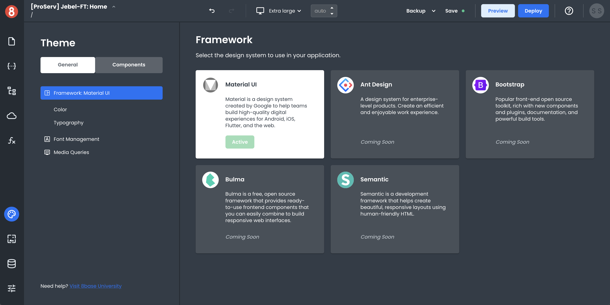
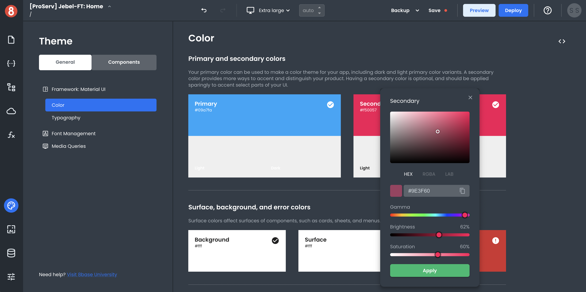

# Creating App Themes Introduction

This document describes what comprises an App Theme and how to create and customize themes.

App Builder Themes are what define the look and feel of your application across different screen sizes. As a result, there are 3 areas of focus that are relevant when we discuss Themes. They are:

- **CSS Framework** - The set of predefined CSS classes that help with the overall layout and presentation of an application. The default App Builder theme includes Material Design as the CSS Framework.

- **Component Defaults** - The set of default style property values for all the various components in your component library.

- **Media Queries** - The set of breakpoints that help with how an application looks on different screen sizes.

## CSS Framework

App Builder ships with the Material Design CSS framework by default. However, you're not limited to using only this one CSS framework. If you want, you can include custom CSS code you can do so. We're also working to enable more CSS frameworks in the future. For example, we're planning to add support for Bootstrap and Ant Design.

### Theme Variables

App Builder ships with a set of variables that help with the overall look and feel of an application for the selected CSS framework. These variables vary for each framework, but all of them are available for customization using the Theme configuration pane available in `Theme`.

The goal of these variables is to provide a single place where the Theme level customizations can be changed. For example, if you wanted to change the primary color used in the CSS framework, you could do so by modifying the primary color variable.

## Component Defaults

Component Defaults are the set of default style property values for all the various components in your component library. These defaults can be customized as well and are available for modification in the `Theme > Components` area using CSS code.

Changing a Component Defaults for a Theme affects the way a Component Instance is styled when first dropped onto the Page Canvas. By updating the Component Defaults to best reflect your desired end state of a component, you can save a lot of time during development.

## Media Queries

Media Queries are the set of breakpoints that help with how an application looks on different screen sizes. These breakpoints may vary for different CSS frameworks, but they're all available for customizations using the Media Query builder in App Builder.

The goal of the Media Query builder is to provide an interface for creating responsive breakpoints without having to write any code. After you create your breakpoints, you can begin adding custom CSS to the breakpoints.

## Conclusion

Using these three different elements/concepts, you're able to develop themes for your applications in App Builder. We're currently working on capabilities for Importing/Exporting these Themes in an easy way (Last updated July 13, 2022).
