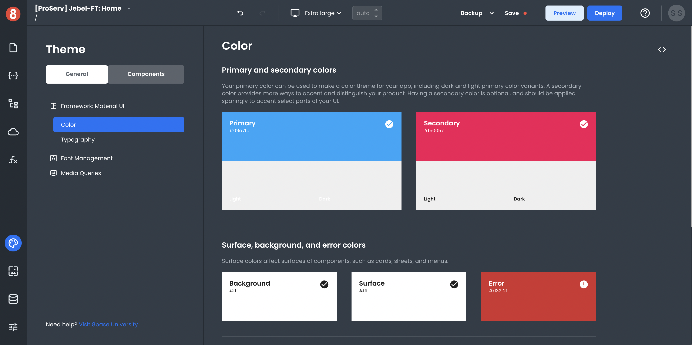

# Introduction

App Builder makes it easy to customize the look and feel of your apps. Using existing CSS Design Frameworks, you can create unique and consistent app designs without having to start from scratch.

There are three ways to style your apps in App Builder:

1. **Themes** – App Builder includes a number of built-in themes that you can apply to your app with just a few clicks. Themes also let you create Component Default Styling.

2. **Custom CSS** – You can also use your own CSS stylesheets to style your app.

3. **App Builder Styling Panes** – App Builder Editor allows you to visually edit the CSS styles for your app.

When you first create an app in App Builder, it will use the Default Theme. This can be changed at any time from the Themes area of the Editor. There are a number of built-in themes to choose from, or you can create your own custom theme.

If you want more control over the look and feel of your app, you can use Custom CSS. This is CSS that you write yourself and can be applied to any element in your app.

That said, we'll further break down all of these in the upcoming sections!
