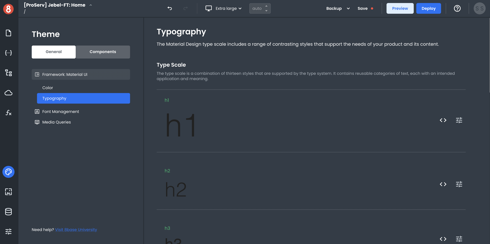
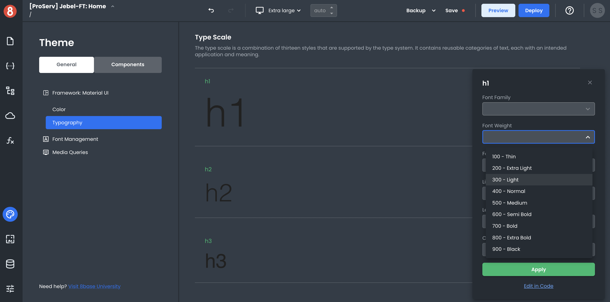
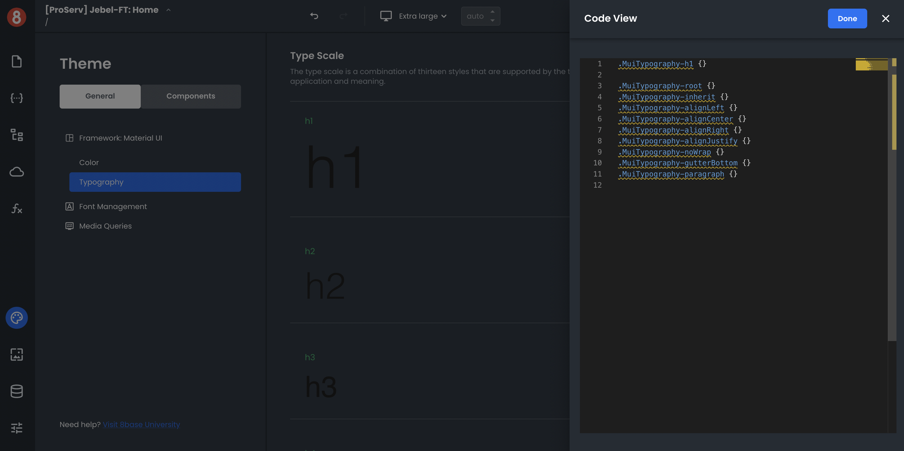

# Configurations in the Theme Editor

Different Frameworks have different customization options under the active frameworks name under the active frameworks name. When you select hown that Framework's unique options. The categorized sections will appear in the nested left menu under the active frameworks name.

## Framework Variables

The variables exposed by each Frameworks section will overwrite the default values set by App Builder. For example, Material UI exposes specific color variables that customize the color palette of your applications.

Through the "Colors" interface you can quickly change an app's primary color, secondary color, and others. The changes you make through these settings will be reflected across all parts of the app and components that use these colors.

**Framework Variables are static and do not allow for dynamic (handlebars enabled) inputs**. That said, you're able to dynamically toggle class names and CSS selectors on components to dynamically change styles.

## Changing Framework Variables

App Builder provides relevant input types for the Framework Variables. By clicking the slider icon next to the design element, you can open the styling panel for that element and make changes.

## Changing Framework Defaults using Custom CSS

You can also use custom CSS to overwrite any default framework values set in the Framework defaults.

By clicking the `<\>` icon next to the design element. This will open the CSS panel for that element with all of the selector classes pre-defined.

