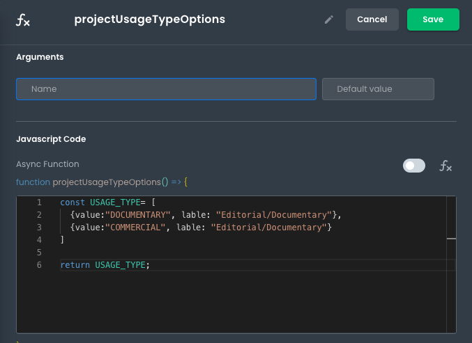

# Custom Frontend Logic Introduction

This article describes how developers can add custom state entries in their front-end applications.

---

The idea of (Custom Frontend Logic) Functions in App Builder is the ability to author and use Javascript functions locally and globally within App Builder front-end applications. This enables developers to easily modularize and reuse any custom code they write.

In the following sections, we'll break down exactly how to do this and explore some tips for getting the most out of Custom Frontend Logic Functions.
