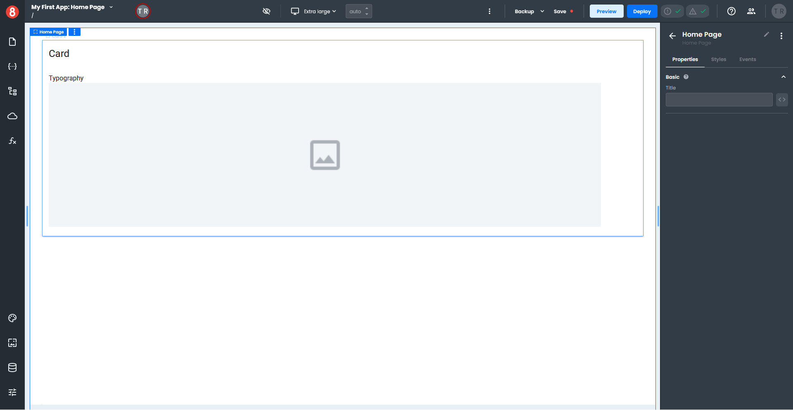
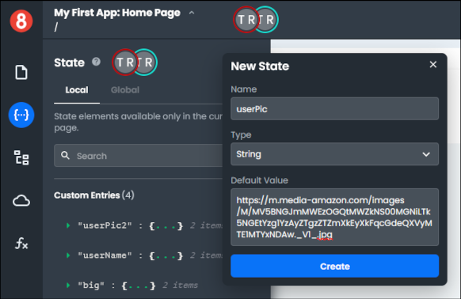
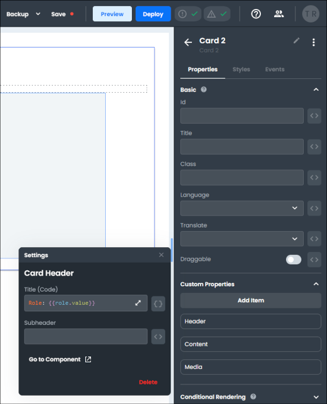
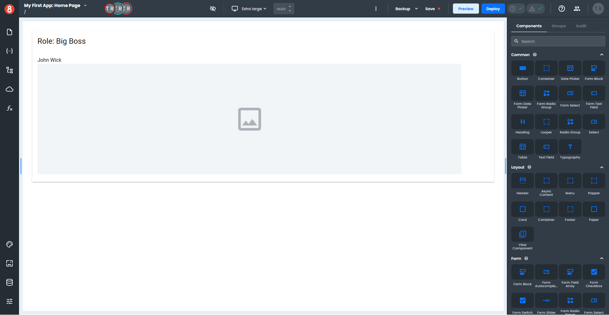
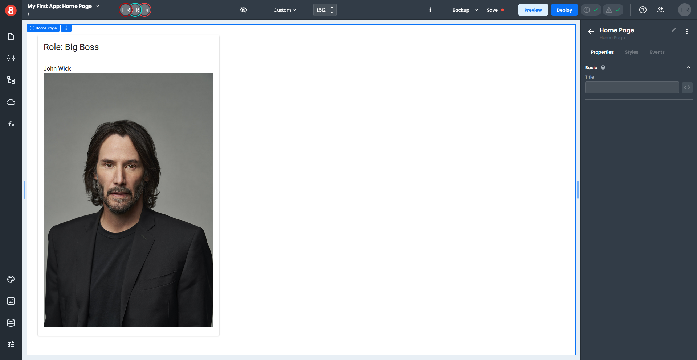

# Binding Custom Entries to a Card

This example will demonstrate how to access data in **Custom Entries** for use in a *Card* component.

You will need a Page with no content.

1. Select a *Card* component from the **Layout** section of the Components pane and drag it onto your page. 
2. Select a *Typography* component from the **Common** section of the Components pane and drag it onto the *Card Content* area of your *Card* component.
3. Select an *Image* component from the **Other** section of the Components pane and onto the *Card Content* area of your *Card* component.
4. The *Typography* component should be above the *Image* component. If not, open the Page Structure pane and adjust the components so they are in the proper order.

Your page should look like this.

Next, you will set up the data the *Card* component will use by creating four **Custom Entries** in the Local State.

1. Click the **State** icon on the left menu and ensure the Local tab is selected.
2. Click the "+" at the top of the State pane to create a new State, which opens a small pop-up window.
3. Enter "userPic" in the **Name** field, set the **Type** to String, and enter "https://m.media-amazon.com/_images/M/MV5BNGJmMWEzOGQtMWZkNS00MGNiLTk5NGEtYzg1YzAyZTgzZTZmXkEyXkFqcGdeQXVyMTE1MTYxNDAw._V1_.jpg" in the **Default Value** field.
4. Click "Create". 

Your first custom entry should look like this.

Let's add the remaining **Custom Entries**. 

As before, click the "+" to add a new State, enter the values indicated for each custom entry below, and click "Create".

For the **second** custom entry, enter the following:
- **Name** - userName
- **Type** - String
- **Default Value** - John Wick
	
For **third** custom entry, enter the following:
- **Name** - big
- **Type** - String
- **Deafult Value** - 500

For the **fourth** custom entry, enter the following:
- **Name** - role
- **Type** - String
- **Deafult Value** - Big Boss

Now that you have all your **Custom Entries** set up, you will add data to the *Card* component.

1. Select your *Card* component, which opens the *Properties* pane.
2. Click the *Styles* tab to switch to the *Styles* pane and expand the **Size** section.
3. Next to the **Width** field, click the three-way icon "\<\>" and switch to State format.
4. Select "big" from the drop-down inside the **Width** field, which sets the width of your *Card* component using your custom entry.
5. Click the *Properties* tab to switch back to the *Properties* pane.
6. In the **Custom Properties** section, click the gear icon to the right of the **Header**, which opens a pop-up settings window.
7. Next to the **Title** field, click the three-way icon "\<\>" and switch to the code format "{}". 
8. Enter `Role: {{role.value}}` in the **Title** field.
9. The **value** of the **role** custom entry will appear as the title of your *Card*.

Next, you will add text to the *Typography* component to your *Card* from the **userName** custom entry.

1. Select the *Typography* component on your *Card*, which opens the *Properties* pane.
2. Next to the **Text** field, click the three-way icon "\<\>" and switch to the State format.
3. Select "userName" from the drop-down inside the **Text** field.
4. Your *Typography* component should display **John Wick**.

At this point your *Card* should look like this.

You will now add the final piece, which is setting up the image to display.

1. Select the *Image* component on your card, which opens the *Properties* pane.
2. Next to the **Source** field, click the three-way icon "\<\>" and switch to the code format "{}". 
3. Enter `{{userPic.value}}` in the **Source** field.

Your completed *Card* should look like this.

