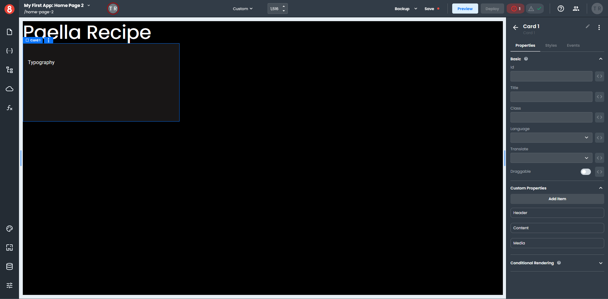
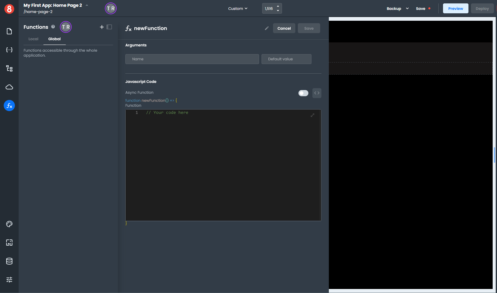
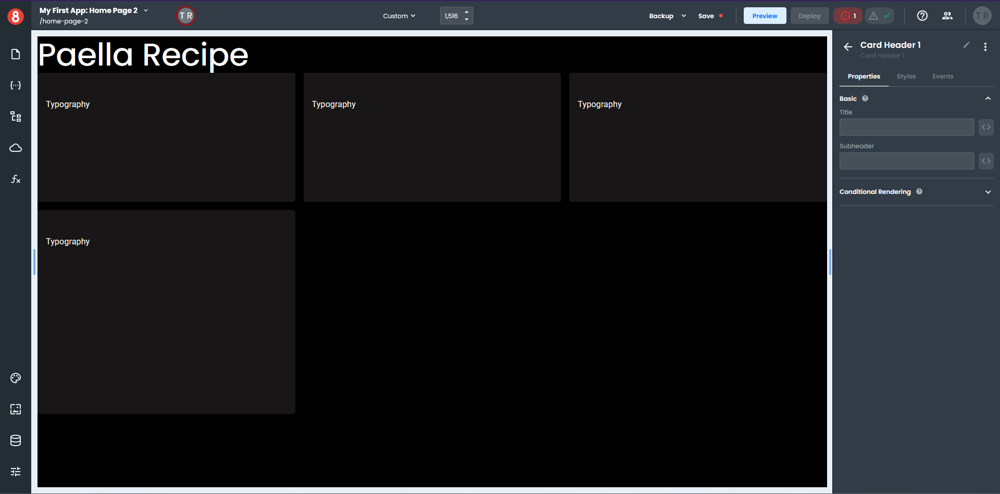
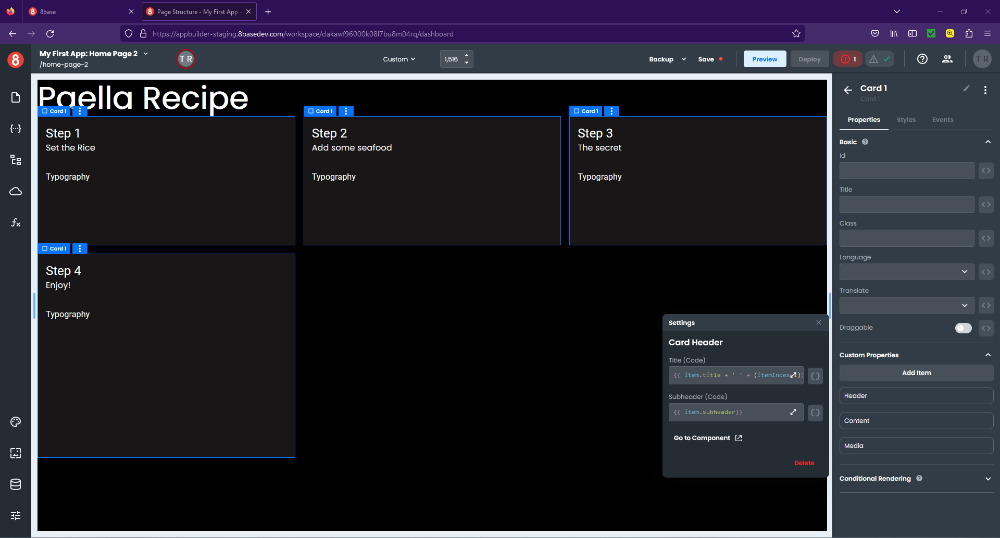
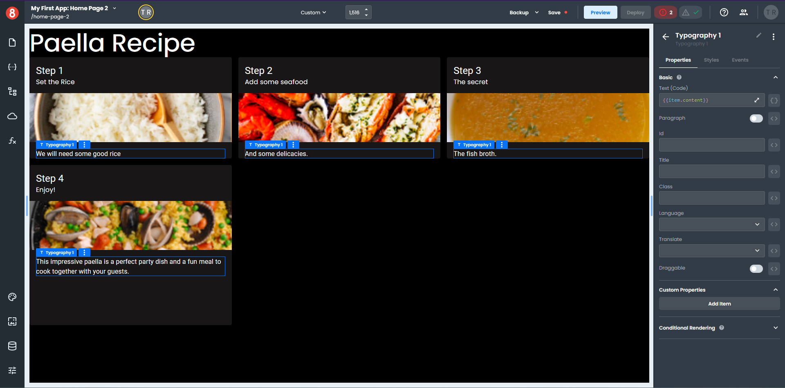
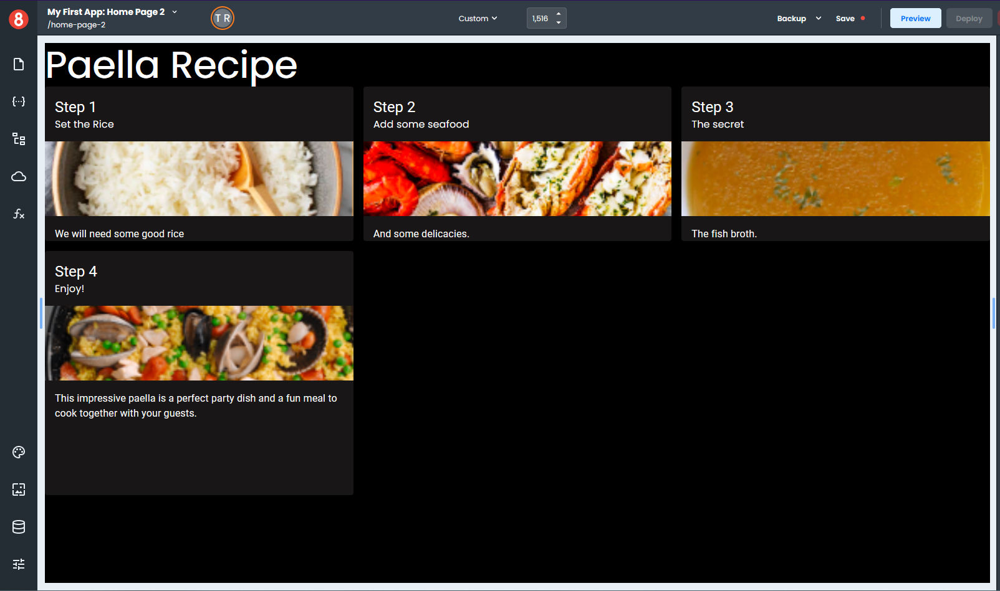

# Binding a Function to a Looper

This example will demonstrate how to access data in a **Function** for use in a *Looper* component.

You will set up your Page and then build your **Function** so you can dynamically add data to your components.

1. Select your Page on the canvas, which opens the *Properties* pane.
2. Select the *Styles* tab and set the **Background Color** to black.
3. Click the arrow next to the Page name at the top of the *Styles* pane to return to the Components pane.
4. Select a *Heading* component from the **Common** section of the Components pane and drag it onto your page. 
5. Enter "Paella Recipe" into the **Text** field and set the drop-down in the **Tag** field to H1 on the *Properties* pane.
6. Click the the *Styles* pane and set the drop-down in the **Variant** field to H1.
7. Check that the **Font Color** is set to Initial and the **Align** is set to Inherit.
8. Select a *Looper* component from the **Data** section of the Components pane and drag it onto your page. 
9. Click the *Styles* tab in the right-hand pane and select the *grid* icon under **Display**.
10. In the **Grid Template** field enter 248.016px 392.016px / 258.656px 258.672px 258.672px / none.
11. In the **Grid Template Columns** field enter 1fr 1fr 1fr.
12. In the **Grid Template Rows** field enter 248.016px 392.016px.
13. In the **Grid Column Gap** field enter 16px.
14. In the **Grid Row Gap** field enter 16px.
15. In the **Grid Gap** field enter 16px.
16. Select a *Card* component from the **Data** section of the Components pane and drag it onto your *Looper*.
17. Click the *Styles* tab in the right-hand pane and set the **Background Color** to `#181616`.
18. Select a *Typography* component from the **Common** section of the Components pane and drag it onto the *Card Content* component.

Your page should look similar to this.

It's now time to build your **Function**.

1. Click the function icon on the left-hand menu to open the *Functions* pane and select the *Global* tab.
2. Click the "+" on the top of the *Functions* pane to create a new **Function**.

3. Enter "spanishRecipe" at the top on the *Functions* pane where it says **newFunction**. This will be the name of your new function.
4. Click the expand arrow in the **code area** of the *Functions* pane to open the the **code panel**.
5. Copy and paste the following code into the **code panel** and click "Done".

~~~js
 return [
  { 
    title: 'Step',
    subheader: 'Set the Rice',
    content: 'We will need some good rice',
    media: 'https://ucarecdn.com/02ef0351-393c-46f2-a4c5-fba8bc9a2f5d/looper1.png'
  },
  {
    title: 'Step',
    subheader: 'Add some seafood',
    content: 'And some delicacies.',
    media: 'https://ucarecdn.com/9f209dae-009c-415d-ae3a-c12719318a38/looper2.png'

  },
   {
    title: 'Step',
    subheader: 'The secret',
    content: 'The fish broth.',
    media: 'https://ucarecdn.com/b79b1adf-c5ad-4c33-9ad3-8302cb6cef74/looper3.png'
  },
   {
    title: 'Step',
    subheader: 'Enjoy!',
    content: 'This impressive paella is a perfect party dish and a fun meal to cook together with your guests.',
    media: 'https://ucarecdn.com/90574ffc-3d95-47e2-8d0d-627b66d91be9/looper4.png'
  }
 ]
~~~

We will now add the *Function* data to the *Looper* component.

6. Select your *Looper* on the Page, which opens the *Properties* pane.
7. Enter `{{ spanishRecipe() }}` in the **Loop Data** field and the word *item* in the **Item Name** field.

The *Looper* will display four blank Cards on your Page, which is how many objects are in your **Function**.

8. Select your *Card* component, which opens the *Properties* pane.
9. In the **Custom Properties** section, click the gear icon to the right of the **Header** item, which opens a pop-up settings window. 
10. Next to the **Title** field, click the three-way symbol `<>` and switch to the code format `{}`. 
11. Enter `{{ item.title + ' ' + (itemIndex+1)}}` in the **Title** field. 
12. Next to the **Subheader** field, click the three-way symbol `<>` and switch to the code format `{}`.
13. Enter `{{ item.subheader}}` in the **Subheader** field and click the "x" to close the pop-out.

14. Click the gear icon to the right of the **Media** item, which opens a pop-up settings window. 
15. Next to the **Image** field, click the three-way symbol `<>` and switch to the code format `{}`. 
16. Enter `{{item.media}}` in the **Image** field, set the **Height** to 120 px, and click "x" to close the pop-out.
17. Select the *Typography* component on any *Card*, which opens the *Properties* pane. 
18. Next to the **Text** field, click the three-way symbol `<>` and switch to the code format `{}`.
19. Enter `{{item.content}}` in the **Text** field, and click "x" to close the pop-out.

Once you start adding data elements to your components you can see the data immediately on the page.

As you can, see the *Looper* component is an extremely powerful component for building dynamic pages.

