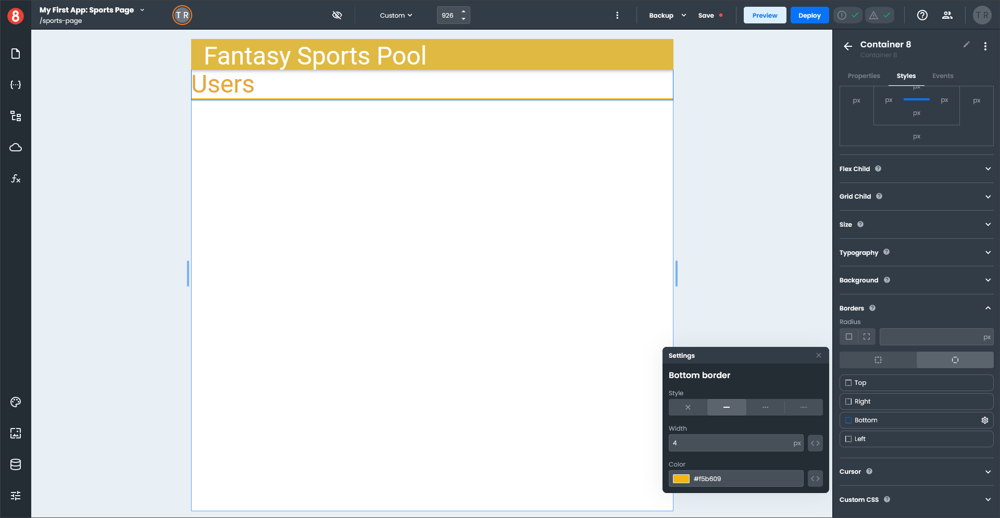
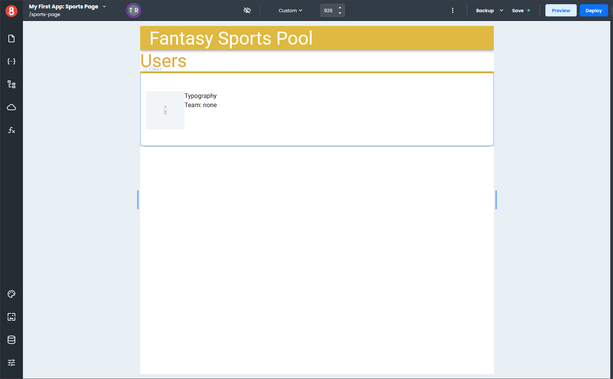
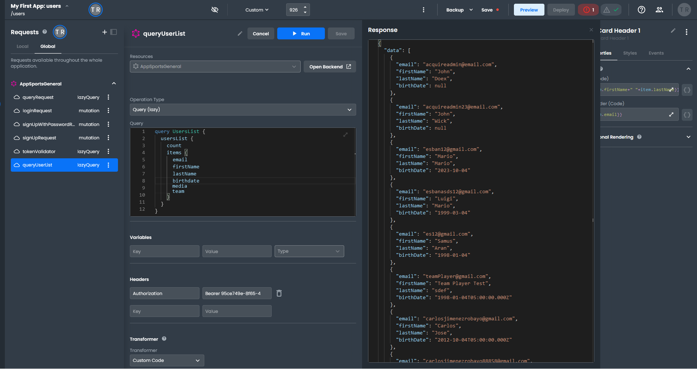
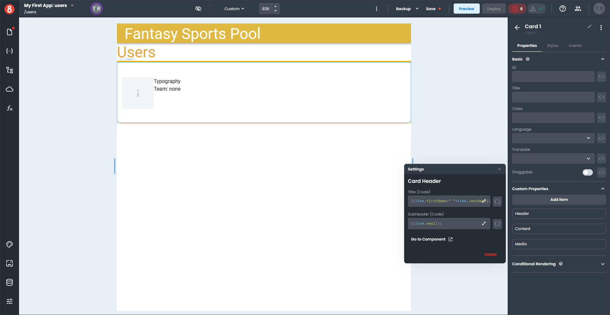
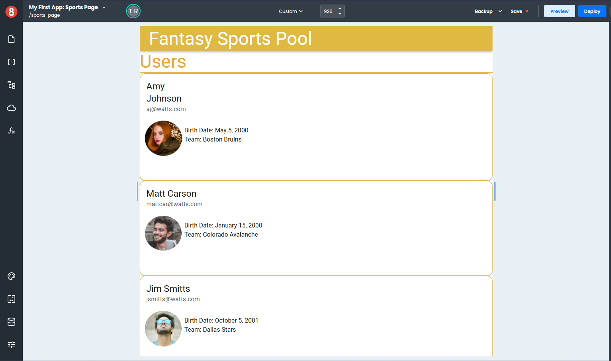

# Binding a Request to a Looper

This example will demonstrate how to access data in a **Request** for use in a *Looper* component.

You will need a Page with no content and a **Request** called "queryUserList" that contains an array of objects with the following properties: **firstName**, **lastName**, **email**, **media**, **birthdate**, and **team**.

1. Set the Viewport size to 926; this can be found at the top of the application builder.
2. Select a *Header* component from the **Layout** section of the Components pane and drag it onto your page. 
3. Click the *Styles* tab in the right-hand pane and set the *grid* icon under **Background Color** to `#dfb94`.
4. Select a *Heading* component from the **Common** section of the Components pane and drag it onto your *Header*.
5. Enter "Fantasy Sports Pool" into the **Text** field and set the drop-down in the **Tag** field to H3 on the *Properties* pane.
6. Click the *Styles* pane and set the drop-down in the **Variant** field to H3.
7. Check that the **Font Color** is set to Initial and the **Align** is set to Inherit.
8. Expand the **Typography** section and set the **Color** to `#ffffff`.
9. Select a *Container* component from the **Common** section of the Components pane and drag it onto your Page.
10. At the top of the *Properties* pane to the right of the arrow, enter "Users" as the container name.
11. Click the *Styles* tab in the right-hand pane and set the **Display** to Flex and the **Direction** to column (the down arrow).
12. Expand the **Flex Child** section and set **Flex Grow** and **Flex Shrink** to 1.
13. Expand the **Size** section and set the **Height** to 100 px.
14. Select another *Container* component from the **Common** section of the Components pane and drag it onto your first *Container*.
15. Click the *Styles* tab in the right-hand pane and set the **Display** to Flex.
16. Expand the **Size** section and set the **Width** to 100%.
17. Expand the **Border** section and click the large button with a rectangle; this allows you to independently set properties on the Top, Right, Bottom, and Left borders.
18. Click the gear icon next to the **Bottom** item to open the settings pop-out.
19. Set the **Style** to solid, the **Width** to 4, and the **Color** to `#f5b609`, and click "x" to close the pop-out.
20. Select a *Heading* component from the **Common** section of the Components pane and drag it onto your second *Container*.
21. Enter "Users" into the **Text** field and set the drop-down in the **Tag** field to H3 on the *Properties* pane.
22. Click the *Styles* pane and set the drop-down in the **Variant** field to H3.
23. Check that the **Font Color** is set to Primary and the **Align** is set to Inherit.

At this point, your page should look like this.

24. Select a *Looper* component from the **Data** section of the Components pane and drag it onto your Users *Container*.
25. Click the *Styles* pane, expand the **Size** section, and set the **Height** to 100 px.
26. Select a *Card* component from the **Common** section of the Components pane and drag it onto your *Looper*.
27. Click the *Styles* pane, expand the **Size** section, and set the **Width** to 100 %.
28. Expand the **Border** section and set the **Radius** to 15 px.
29. Select a *Container* component from the **Common** section of the Components pane and drag it onto your *Card Content*.
30. At the top of the *Properties* pane to the right of the arrow, enter "Content" as the container name.
31. Click the *Styles* tab in the right-hand pane and set the **Display** to Flex.
32. Expand the **Size** section and set the **Height** to 120 px.
33. Select a second *Container* component from the **Common** section of the Components pane and drag it onto your Content *Container*.
34. At the top of the *Properties* pane to the right of the arrow, enter "Image" as the container name.
35. Click the *Styles* pane, expand the **Size** section, and set the **Width** to 100 px.
36. Select a third *Container* component from the **Common** section of the Components pane and drag it onto your Content *Container*.
37. At the top of the *Properties* pane to the right of the arrow, enter "Text" as the container name.
38. Select an *Image* component from the **Other** section of the Components pane and drag it onto your Image *Container*.
39. Click the *Styles* pane, expand the **Size** section, and set the **Height** to 100 %.
40. Select a *Typography* component from the **Common** section of the Components pane and drag it onto your Text *Container*.
41. Select a second *Typography* component from the **Common** section of the Components pane and drag it onto your Text *Container*.
42. Click the *Styles* pane and enter "Team: none", without quotes, into the **Text** field.

Your page should now look like this.

Now that all your components have been set up on the page, you are ready to add data.

43. Click the Request icon (cloud) on the left-hand menu, which opens the *Requests* pane.
44. Click on the **Global** tab and select your request *queryUsersList*, which opens the *Query* panel.
45. Click the "Run" button at the top of the panel.
46. A *Response* window will open to the right of the *Query* panel.

You now have data that you can test in your components.

47. Select your *Looper* component.
48. On the *Properties* pane in the **Custom Properties** section, enter `{{ queryUserList?.data }}` in the **Loop Data** field.
49. Select your *Card* component.
50. On the *Properties* pane in the **Custom Properties** section, click the gear icon to the right of the **Header**, which opens a pop-up settings window.
51. Next to the **Title** field, click the three-way symbol `<>` and switch to the code format `{}`. 
52. Enter `{{item.firstName+" "+item.lastName}}` in the **Title** field.
53. Next to the **Subheader** field, click the three-way symbol `<>` and switch to the code format `{}`. 
54. Enter `{{item.email}}` in the **Subheader** field and click "x" to close the pop-out.

55. Select your *Image* component.
56. On the *Properties* pane, next to the **Source** field, click the three-way symbol `<>` and switch to the code format `{}`. 
58. Enter `{{item.media}}` in the **Source** field.
59. Select the first *Typography* component.
60. On the *Properties* pane, next to the **Text** field, click the three-way symbol `<>` and switch to the code format `{}`. 
61. Enter `Birth Date: {{lux.DateTime.fromISO(item.birthDate, "DD-MM-YYYY").toFormat('MMMM d, yyyy')}}` in the **Text** field.
62. Select the second *Typography* component.
63. On the *Properties* pane, next to the **Text** field, click the three-way symbol `<>` and switch to the code format `{}`. 
64. Enter `Team: {{item.team}}` in the **Text** field.

Your completed page should look something like this.

This example gives you some idea of how to access **Request** data from inside a *Looper* and use it in any component within the *Looper*.
