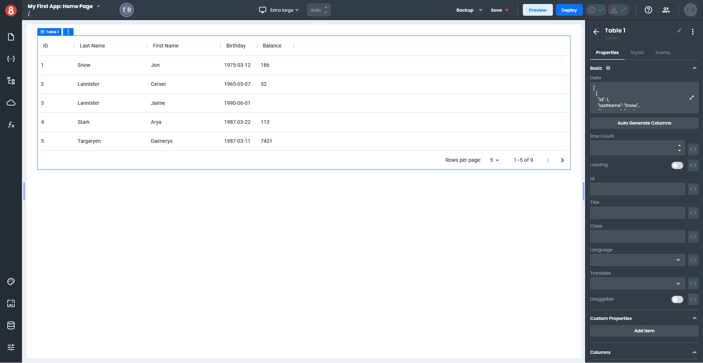
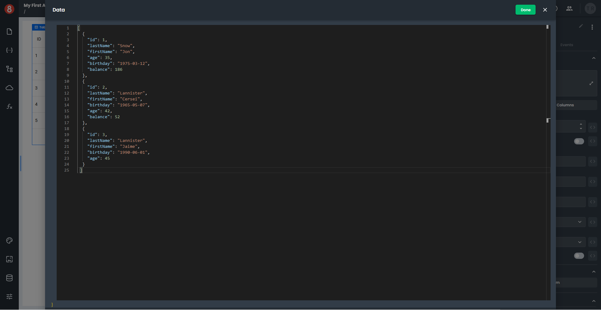
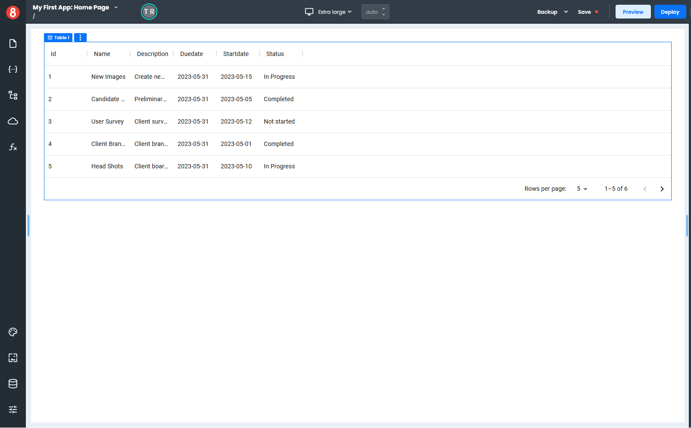
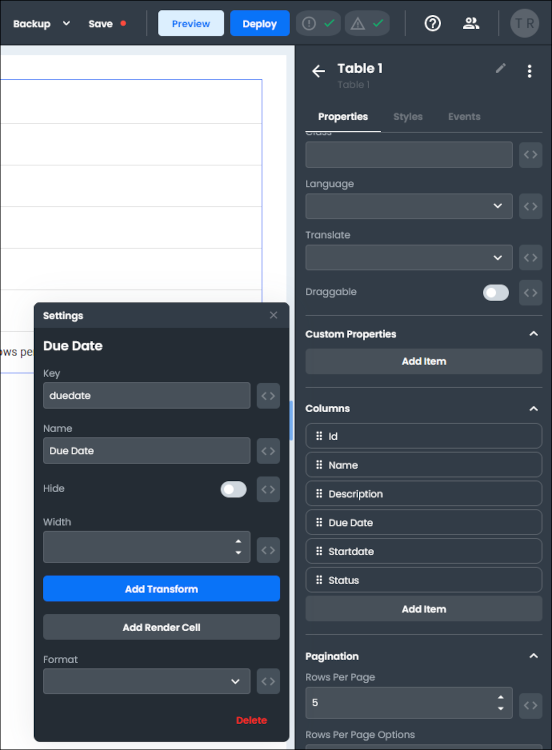
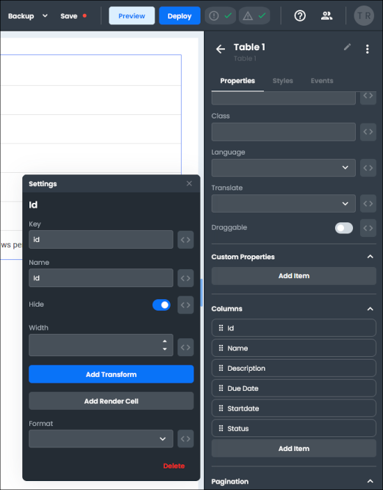
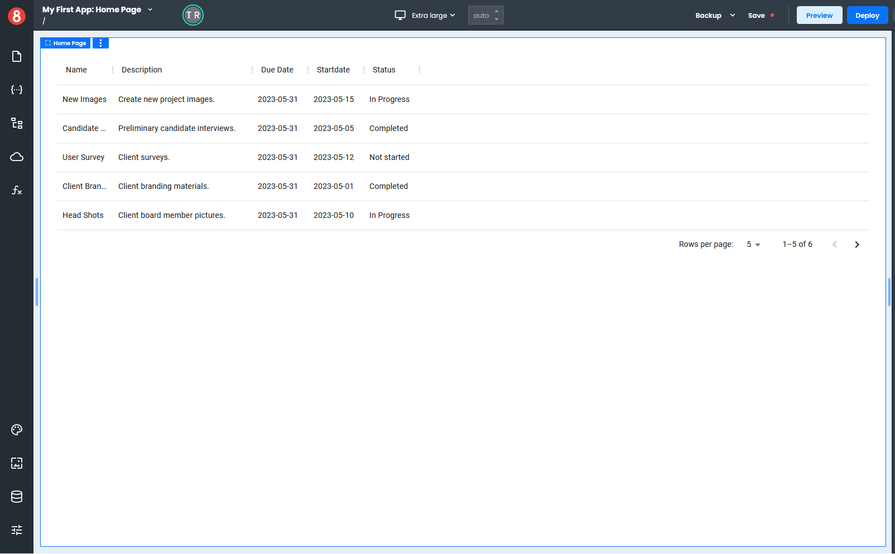

# Binding a Request to a Table

This example will demonstrate how to access data in a **Request** for use in a *Table* component.

You will need a Page with no content and a **Request** called *allTasks* that contains an array of objects with the following properties: **id**, **name**, **description**, **duedate**, **startdate**, and **status**.

Adding a new *Table* component to your page creates a default set of columns. The columns are generated based on the array in the *Data* field on the *Properties* pane. 

Each object in the array represents a **row** in a *Table*, and the **properties** in the object represent the **columns** in a *Table*.

Each object's **id** property is a *primary key*, which is required for the column to display in a *Table*.

The following is an example of an object's appearance in a data array.

~~~ js 
{ 
"id": 1,
"lastName": "Snow",
"firstName": "Jon",
"age": 35,
"birthday": "1975-03-12",
"balance": 186 
}
~~~

1. Select a *Table* component from the **Common** section of the Components pane and drag it onto your page.

2. In the *Properties* pane, click the expand arrow in the **Data** field to open the **code panel**. 

3. Select the array, delete it, and click "Done".
4. Type your **Request** name into the **Data** field like this `{{allTasks.data}}`.
5. You must click the "Auto Generate Columns" button to create new columns from the data in your **Request**.
6. A confirmation window opens for you to confirm your action.
7. Click "Delete" to create your new columns.

Each column has its own properties that you can customize independently of others.

You can see that some column sizes and names differ from what you would like them to be, so let's fix that.

8. Scroll down to the **Columns** section in the *Properties* pane.
9. Click the gear icon next to the **Duedate** column, which opens a pop-out settings pane.
10. Enter "Due Date" in the **Name** field and click the "x" to close the pop-out.

11. Click the gear icon next to the **Startdate** column to open the pop-out settings pane.
12. Enter "Start Date" in the **Name** field and click the "x" to close the pop-out.
12. Click the gear icon next to the **Description** column to open the pop-out.
13. Enter 150 in the **Width** field and click the "x" to close the pop-out.
14. Let's hide the **Id** column because we don't need to see it. Click the gear icon next to the **Id** column to open the pop-out settings pane.
15. Switch the "Hide" toggle to **on** to hide the **Id** column and click the "x" to close the pop-out.

You now have all your column properties how you want them to display, and the data in your **Request** displays in your *Table*.

