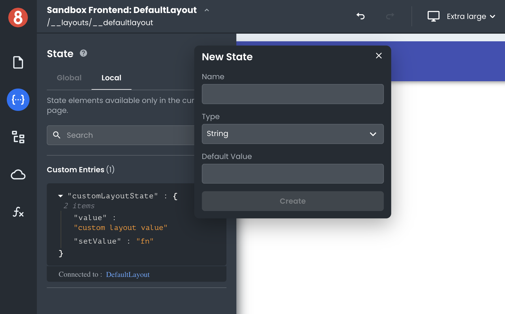

# Data Scopes for App Builder Layouts

This article describes how developers can expect data scopes to be applied when working with Layouts.

---

When working with App Builder Layouts, developers can expect data scopes to be applied in the following way:

## Local Scopes

A local namespace is created for every Layout created in App Builder. This allows developers to add custom state entries with reading/write permissions from any element within the Layout; Functions, Requests, and Components.

## Global Scopes

Any Layout has access to any global state entries in the App, such as Resources, Router, and any custom state entries added to the global state.
