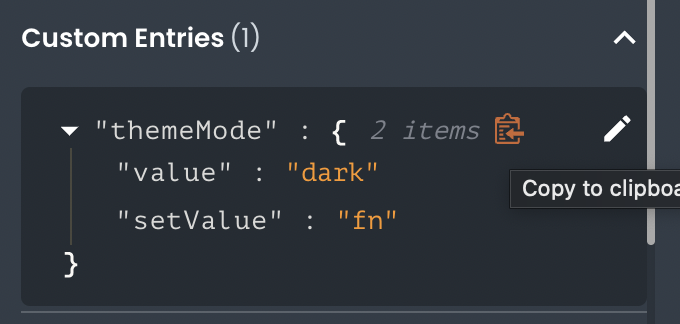

# Getting and setting state data

This article describes how developers can getting and setting state data in their front-end applications.

---


In App Builder, non-permanent data can be stored globally or locally accessible in State Management. Any data stored in the state is subject to specific scope rules, as determined by the element type it represents (i.e., Request, Function, Custom Entry) and whether it exists in a Global or Local namespace.

## Reading State Data

To read a piece of data from the state, you only need to reference it by its object key (dot notation) within a script or using handlebars notation (double brackets). The App Builder runtime will dynamically read the value for you. For example, to read a piece of data called "foo" from the Request namespace, you can use the following code:

```js
// Handlebars
{
  {
    objectName.value;
  }
}

// In script or function
objectName.value;
```

You can easily find a state's accessor by clicking the clipboard icon next to the property name in the App Builder State Management pane. The tooltip will list all available states for the highlighted element:



## Writing State Data

While most states for different element types are read-only, developers are free to create custom state entries in both the global and local namespaces, which allows read-write access to those states.

To write a piece of data to the Custom namespace, simply reference it by its object key and use the `setValue()` function:

```js
// In script
return function (mode) {
  themeMode.setValue(mode);
  return;
};
```
