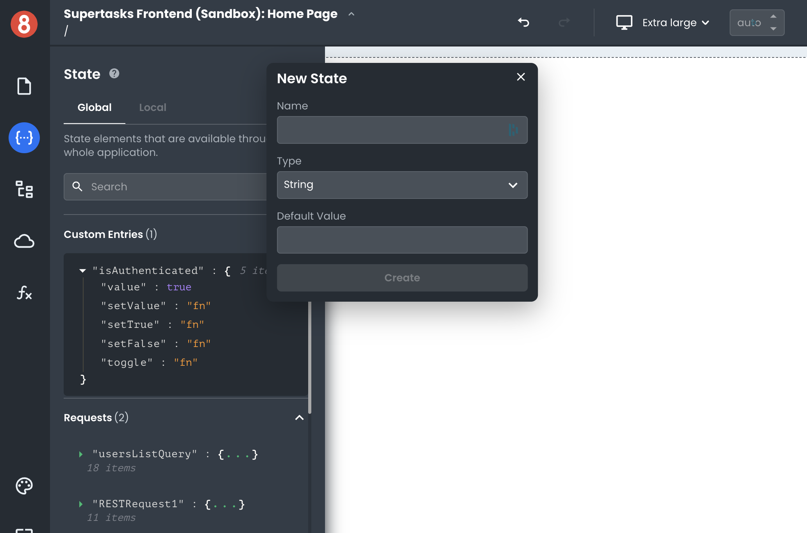

# Introduction

This article describes how developers can store and access data in their front-end applications and manage the state.

---

In App Builder, frontend data (State Management) refers to global or locally accessible and reactive data that can be read and updated by components, resources, functions, and other app elements.

State entries are created for every component and other elements in your App Builder project, which are read-only and managed by the element itself. Meanwhile, developers can create their own custom read/write state entries.

## Next

In the following sections, we'll take a look at how to:

• Create and Access custom state entries

• Access managed state entries

• Think about global vs. local states
