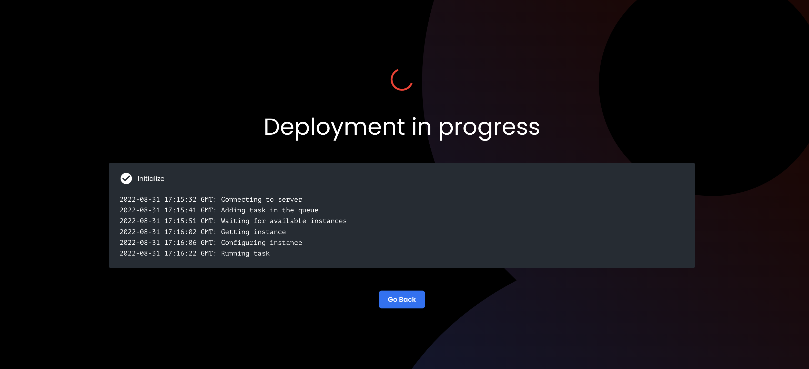

# Introduction

This article describes how App Builder compiles, builds, and deploys apps to make them publically available.

---

When you're ready to publish your app, App Builder compiles, builds, and deploys your app so that it can be used by anyone. This process is straightforward and only takes a few minutes.

Here's how it works:

1. App Builder is a _Design Time_ tool that generates a DSL file representing your application.
2. When you're ready to _Deploy_, App Builder uses the DSL file as the input to a _Code Generator_
3. The _Code Generator_ output is a _React.js_ application.
4. App Builder then builds the _React.js_ application and uploads the built app to Amazon S3.
5. The S3 bucket that stores your app is configured to serve the app using HTTPS.
6. Once the app is deployed, anyone can access it at the https://{some-slug}.appbuilder.8base.com URL.

That's it! App Builder takes care of all the details so that you can focus on building great apps.

## Next

Now that you have an understanding of how Deployment is handled, let's take a look at how you can actually go about the process.
