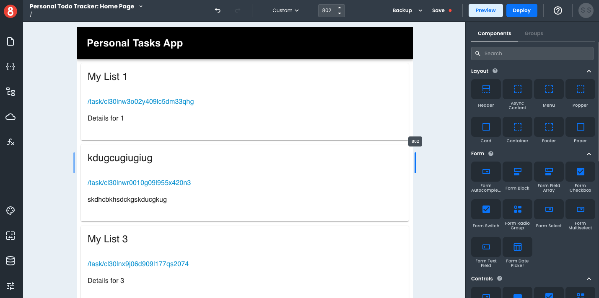

# Setting a Custom Viewport Width

To set a custom viewport width, simply drag the Viewport slider to the desired width or enter a width value into the input field. The drag sliders are located on either side of the Page Canvas.

To find the exact width of a targeted device, we recommend using [ScreenSize.es](https://screensiz.es/).
