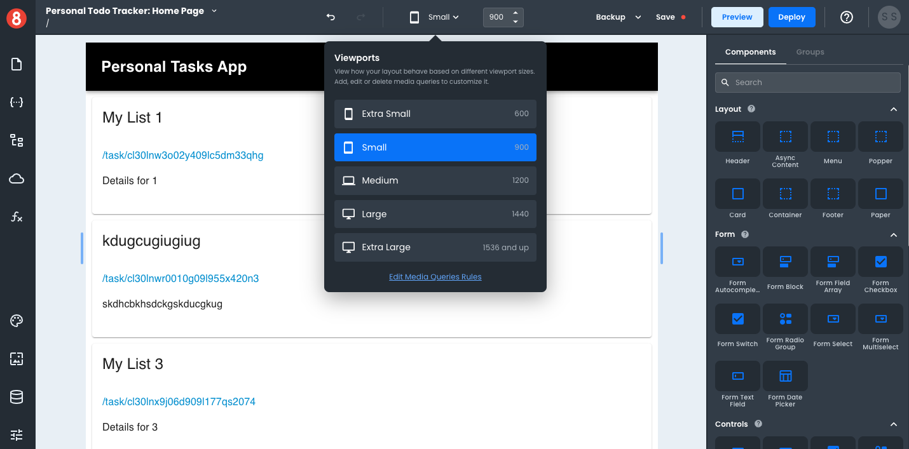

# Setting a Tablet Viewport

If you want to set a specific viewport for tablets, you can either select the "Small" Viewport option or drag the Viewport slider within the range of 800px to 1000px wide. Given that responsive design aims to accommodate many device types and screen sizes, as opposed to a single device, we recommend moving the slider around during development so that you're considering different size tablets.

To find the exact width of a targeted device, we recommend using [ScreenSize.es](https://screensiz.es/).
