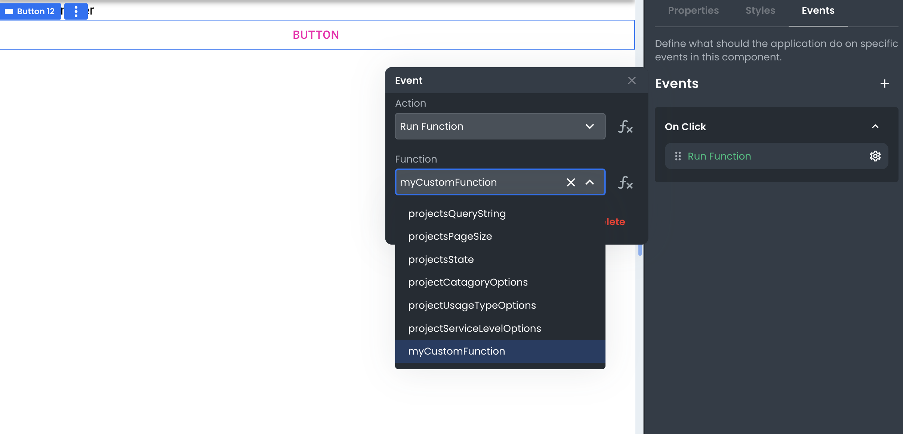

# Triggering Events in the App

This article describes how developers can expect to trigger Events in an App Builder project.

---

When building an App in App Builder, triggering Events happens at the Component and Request level. Event listeners get set on Components with associated Actions that will run when an Event occurs. Some common examples of Events that can be triggered include:

- A button press (click)
- A cursor hovering a container (mouseover)
- A form being submitted (submit)

In the next two sections, we'll look at examples of these different types of Events and how to set them up in App Builder.
