# Building Responsive Applications

Ensuring that applications display correctly across various devices and screen sizes requires a blend of design and development strategies. In App Builder, developers have enough tools and control to set up their applications.

## Overview

Here are a few key concepts:

 - **Viewport**: The area in App Builder that renders the page currently being edited. Users can change the size of the viewport in three ways:
	- Selecting from the viewport size selector in the center on the top bar. This selector has typical screen sizes.
	- Entering a specific size in the viewport size input next to the viewport size selector.
	- Dragging the edges of the viewport.

 - **Media query CSS**: This can be accessed from the bottom viewport size selector. This is the ideal location to put size-specific styling instructions.

 - **Media query breakpoints**: Managed from the theme module, this allows developers to set up the breakpoint for their media query rules used in the media query CSS. Adding or deleting breakpoints does not affect the viewport size selector.

Let's review the steps to add responsive instructions to an existing app. Below is the **User profile** page of the "Jumpstart with accelerators”.

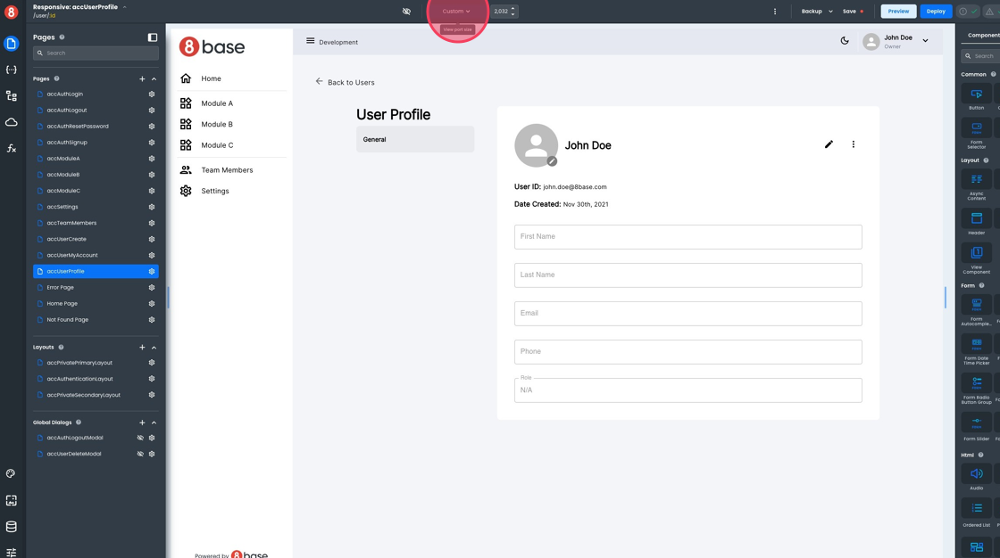

 We will use the viewport size selector to see how the app looks in other resolutions.

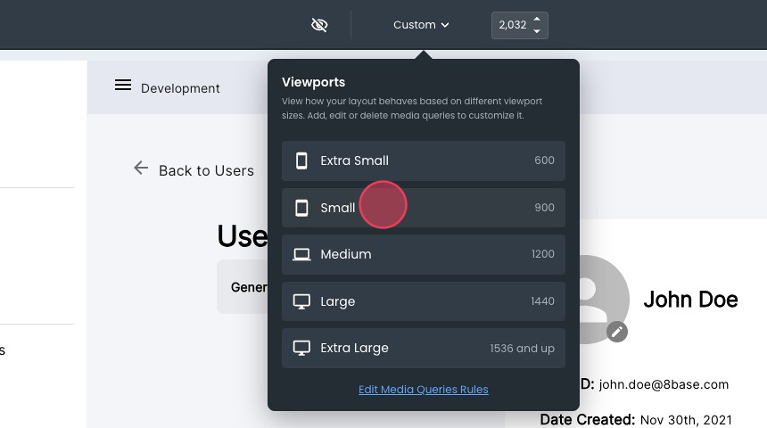

Once the width gets smaller, some of our elements start to overlap. We can test more by dragging the viewport's edges to understand where to add a rule.

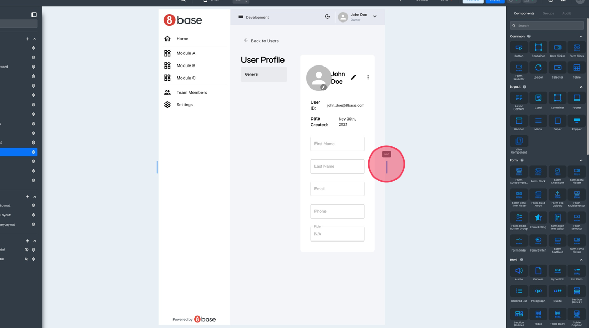

## Editing and Deleting Breakpoints

Let's assume we want a rule for screens of width below 992px. The first step is to ensure our breakpoints are set up to let us achieve what we want. Open the theme section and navigate to **Media Queries**.

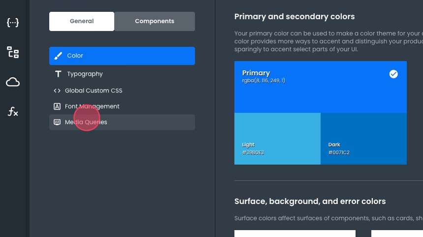

App Builder comes with a set of default breakpoints, but users can modify these as needed. Let’s remove some breakpoints and edit others to have a breakpoint for screens smaller than 992px. 

You can delete breakpoints by clicking the trash icon next to it:

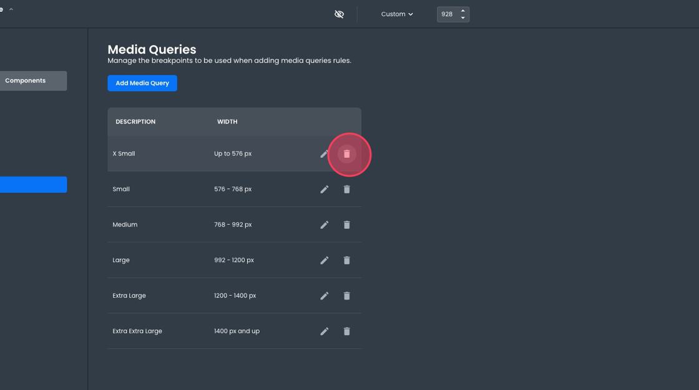

You can edit breakpoints by clicking the pencil icon:

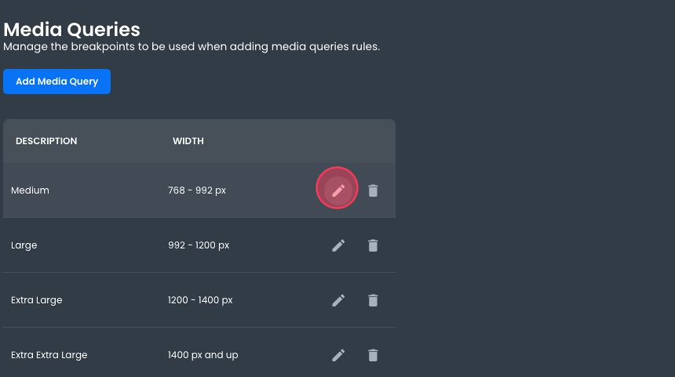

You can lower the limit and then save it by clicking the checkmark icon.

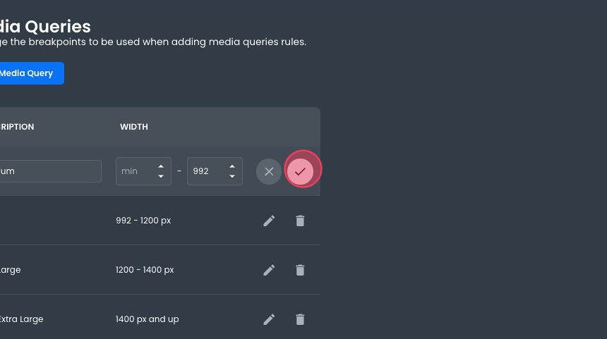

In the end, our breakpoints look like this:

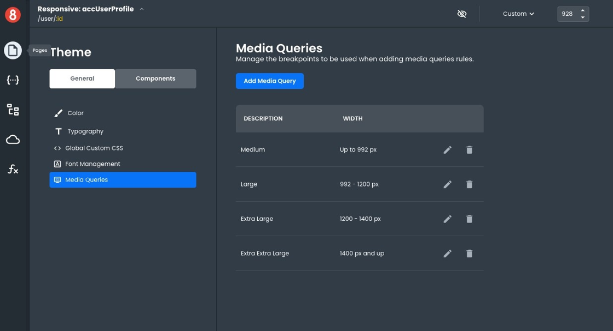

## Working with CSS Selectors

Back on our page, we aim to make the inner menu disappear on smaller resolutions. We will need a [CSS Selector](https://www.w3schools.com/cssref/css_selectors.php). When writing your media query CSS, you can use any valid CSS selector. To make our lives easier, let's just add an ID to the container we want to hide. In our example, we used `UserProfileInnerLeftBar`.

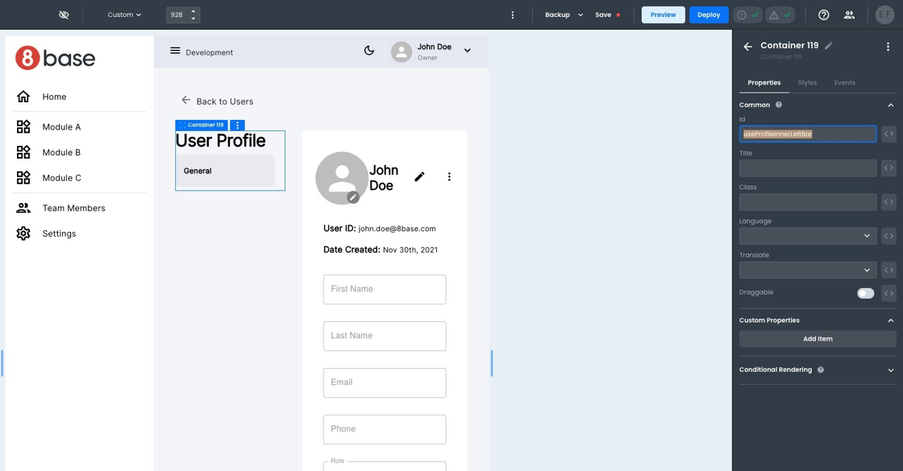

There are plenty of options for styling within App Builder. App Builder uses rules to manage the precedence of each style configuration to make its behavior predictable. In general, styling rules are evaluated in this order (with subsequent rules overriding the previous one):

 1. Theme configuration, configured in the theme module.
 2. Component defaults, configured in the theme module.
 3. Global CSS, managed from within the theme module.
 4. Media query CSS, accessible from the viewport size selector.
 5. Component instance style, configurable from the style tab of each component instance. 
 6. Component instance custom CSS, available at the bottom of the style pane of each component instance.

In our example, we will be overriding the `display` attribute of the element, so we need to ensure it is not set from the component instance style. Otherwise, as indicated in the above rules, its presence will override our media query CSS.

With the container in question selected, we access its style pane.

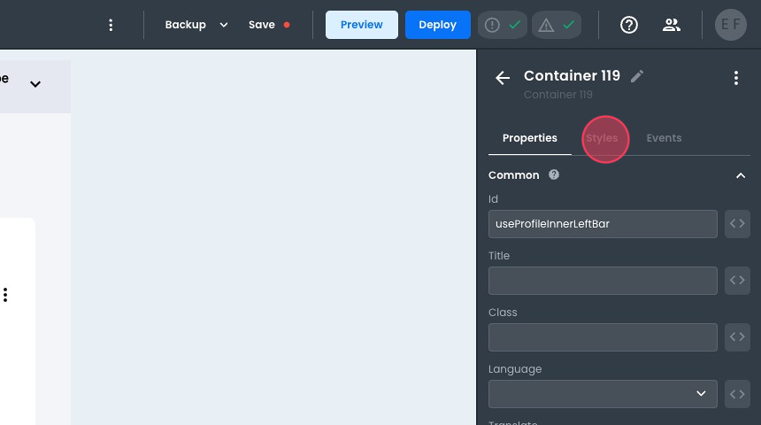

Click on the current option to make sure none is selected.

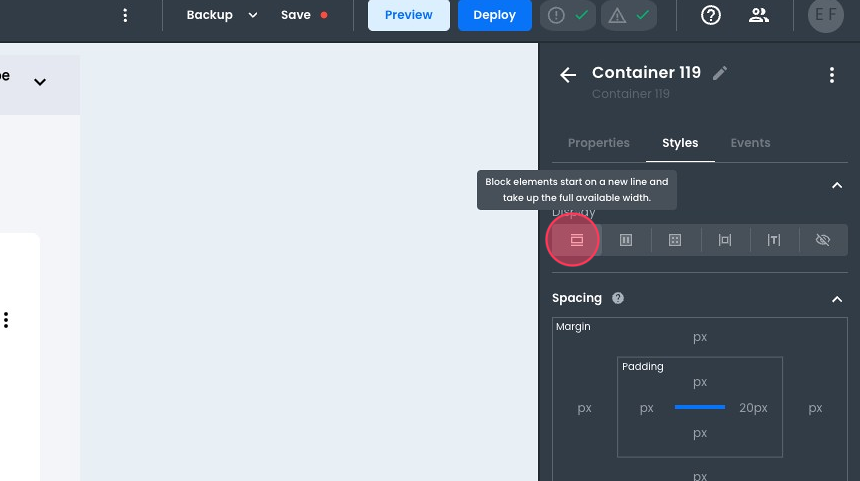

Now, we can edit our media query CSS by opening it using the viewport size selector.

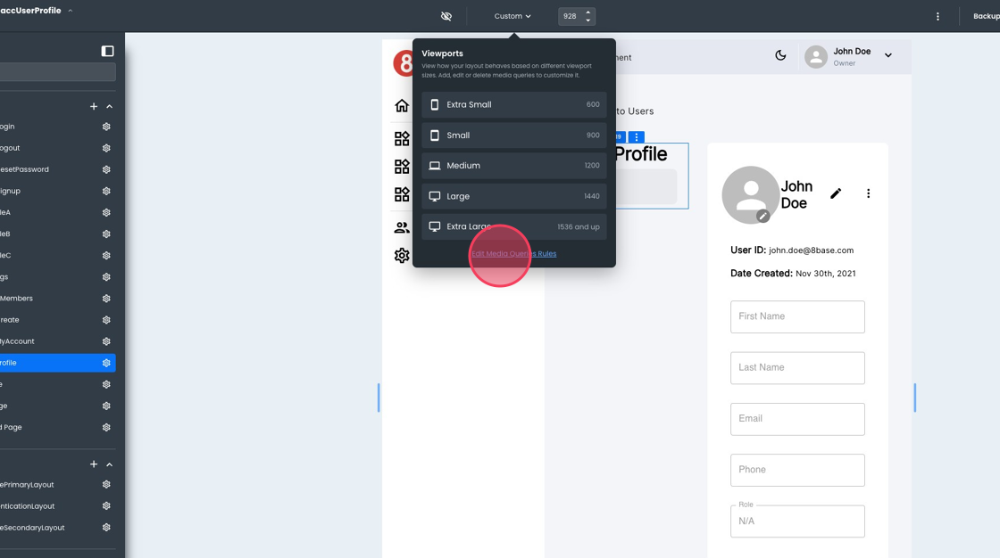

Notice how our breakpoints are represented here. In the appropriate place, we can add a CSS rule using the component identifier as the selector.

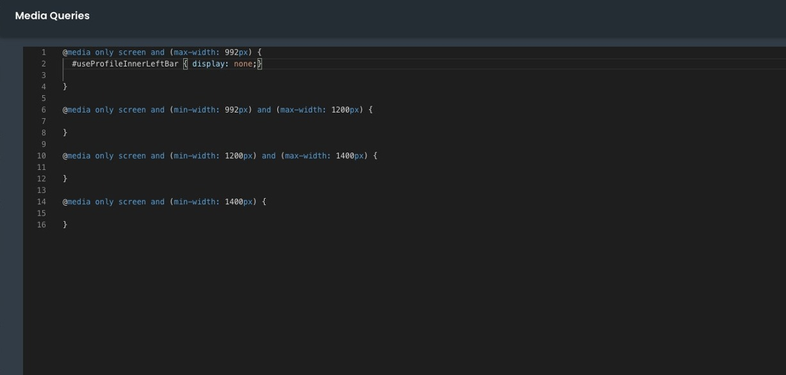

Returning to our page, we can see the element is not visible on smaller resolutions.

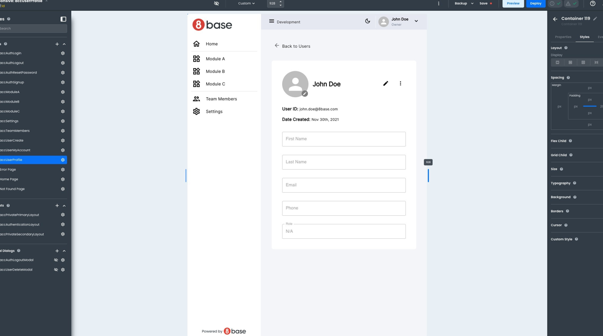

Although this was a straightforward example, the sequence and approach to implementing responsive design are always the same. You can use similar steps to ensure your application renders correctly in different resolutions.
