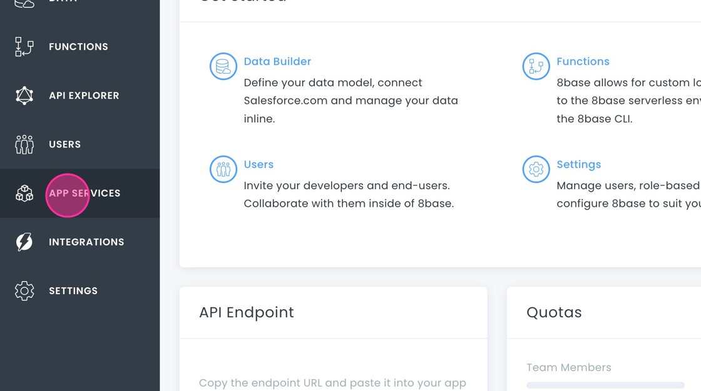
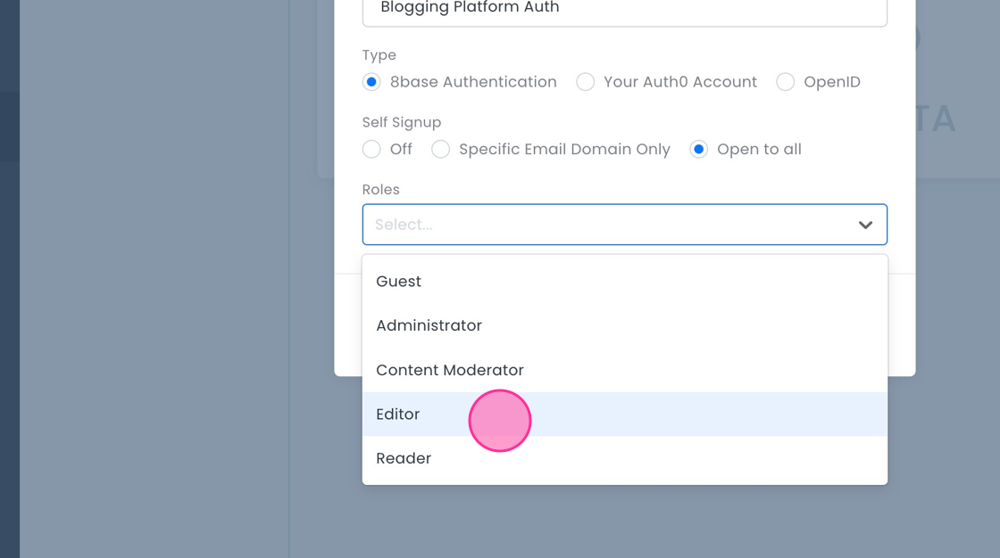

# Configuring Role-Based Access Control

When developing applications, there are two key aspects that can potentially inhibit your progress: **Authentication** and **Authorization**. Authentication confirms the identity of a user, ensuring that they are who they say they are. Authorization, on the other hand, decides what an authenticated user is allowed to do. In 8base, we streamline these features through our **Role-based Access Control (RBAC)** API.

Whether you are creating a simple blog or a multi-tenant SaaS solution, setting clear boundaries through roles and permissions is essential. This ensures that users only interact with the data and functionalities they are allowed to access. 8base's RBAC is tailored to offer both adaptability and potency, allowing developers to define nuanced permissions effortlessly.

In this section, we will delve into a practical example, outlining roles and permissions for a hypothetical blogging platform. For or a more in-depth exploration of RBAC in 8base, please refer to [Roles and Permissions](/backend/roles-and-permissions) and [Authentication](/backend/authentication).

## The Data

In our example, we are building a blogging platform. In our application, we have the following tables:

-   **Posts**: Stores the articles written by editors.
-   **Authors**: Contains the list of authors who can write posts.
-   **Users**: 8base default system table that maintains the registration details and roles of every individual accessing the platform, be it as an editor, a reader, or an admin.

## Note on Users vs Team Members

There is a difference between Users and Team Members in 8base:

-   **Team Members** are individuals invited to the workspace. Their roles define permissions within the 8base Management Console.
-   **Users** are individuals who sign-up for the application you have built. Their roles determine permissions within the application.


For an in-depth understanding, refer to [Teams](/backend/teams.md) and [Users](/backend/console/users.md).

## Setting up Roles and Permissions

### For App Users
#### Editor

We need to create a new user role called "Editor".


1. Navigate to **App Services > Roles**.

2. Click on **Roles**.

3. Click the **+** button.

4. Type in “Editor” and click **Add Role**.


Now we will edit the "Editor" role permissions.

1. Under the **Data** tab, find **Posts**.    
2. Grant CRUD permissions for the `Posts` table. Click the **Create** checkbox.

3. Click the dropdown.

4. Use the custom filter to ensure that Editors can only update posts from authors in their domain. We will explain more about configuring a custom filter in section 3 of this document.


#### Reader
Now we will create another new role called "Reader". Readers will only have read permissions for posts.

1. Click the **Add Role** button.
2. Type in “Reader” and click **Add Role**.
3. Under the **Data** tab, find **Posts**.    
4. Grant CRUD permissions for the `Posts` table.
5. In the **Read** column, select **All Posts**.

### For Team Members

We need an administrator role, which can only be given to team members. We will use the default "Administrator" role that 8base provides. This role has all permissions enabled by default, granting team members full access to manage content, users, and application settings within the 8base Management Console.

🔍 For more on roles and permissions, explore [Roles and Permissions](/backend/teams/#roles-and-permission-for-team-members).

## Authentication

Authentication ensures that only authorized users access the platform.

### Authentication Profile

We will start by creating an Authentication Profile.  

1. Go to **App Services > Authentication** in the 8base Management Console.

2. Click on the **+** button to create a new authentication profile.

3. Fill in the form:
- **Name**: A descriptive name, e.g., "Blogging Platform Auth".

- **Type**: Choose **8base Authentication**.
- **Self Signup**: Select **Open to all**.
- **Roles**: Attach the "Editor" role you created.

- Configure client-side information and callback URLs if needed.
 4. Save the profile.
 5. Repeat this process for the "Reader" role.

### User Sign Up with `userSignUpWithPassword` Mutation
   
We will use the `userSignUpWithPassword` mutation for user sign-up:    

```graphql    
mutation UserSignUpWithPassword(
  $user: UserCreateInput!
  $password: String!
  $authProfileId: ID
) {
  userSignUpWithPassword(
    user: $user
    password: $password
    authProfileId: $authProfileId
  ) {
    id
    email
  }
}
```
  
To learn more about authentication in 8base, see [Understanding Authentication](/backend/authentication/#understanding-authentication).

## Custom Filters

Custom filters control data access. Here's how to set one up:

1. Navigate to **App Services > Roles**.
2. Click on "Editor" to edit role permissions.
3.  Under the **Data** tab, find **Posts**.
4. In the **Update** column, click the dropdown in the  **Posts** row. Click **Custom Filter**.    

5. Paste the following code

```
{
  "authors": {
    "users": {
      "email": {
        "ends_with": "@stagemedia.com"
      },
      "roles": {
        "some": {
          "name": {
            "equals": "Editor"
          }
        }
      }
    }
  }
}
```
6. Click **Save**.

This filter ensures that Editors can only update posts from authors in their domain.
   

🔍 Interested in mastering custom filters? Check out [Custom Filters](/backend/roles-and-permissions/#custom-filters).

## API Tokens

API Tokens allow scheduled post publication without direct user intervention. To create an API token:

1. Go **Settings > API Tokens**.

2. Click **Create API Token**.
3.  Name it "Scheduled Post Publication Token".
4. Add the 'Administrator' role.

5.  Click **Create**.

6. Store the token securely after creation.


Using this token, a server-side script can fetch scheduled posts and publish them without user intervention. Note that by default, API Tokens have no permissions, hence associating roles is crucial.

🔍 For a deeper dive into API tokens and their capabilities, visit [API Tokens](/backend/roles-and-permissions/#api-tokens).

With these settings, your blogging platform offers differentiated access for Editors, Readers, and Administrators. It is also primed for server-side operations via API Tokens, ensuring a secure and efficient environment.
