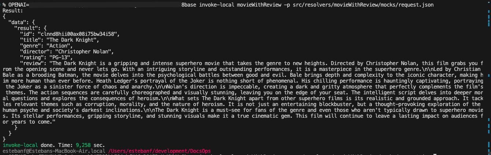
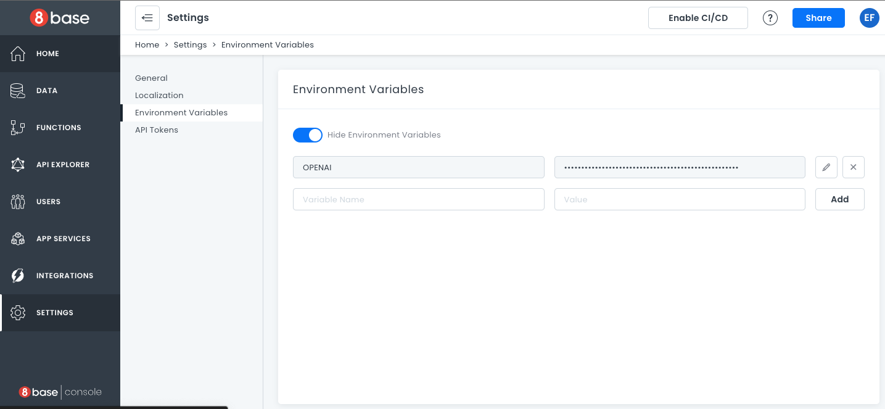
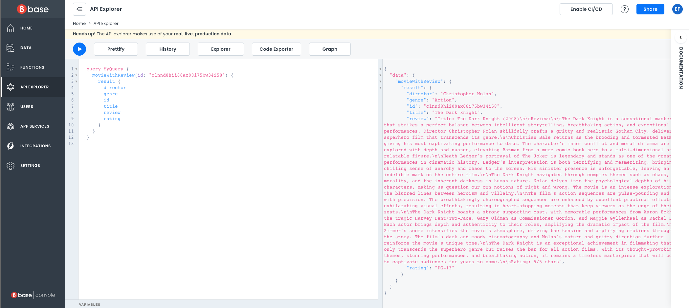

# Extending the API

There are situations where the default API does not cover every requirement. Applications may want to have more complex operations, integrations, or additional logic. For that you can add different capabilities to your backend.

For more information about custom functions, see: [Custom Functions](https://docs.8base.com/projects/backend/custom-functions). 

## Getting Started

In our case we have a movie database, but we want to be able to get reviews for each movie straight from ChatGPT. For that, we will add an additional resolver. For more information, see: [Resolvers](https://docs.8base.com/projects/backend/custom-functions/resolvers). 

First we will generate our local development environment and select our project:


```bash
    8base init DocsOps
```


Before we start coding, we need to add axios to interact with the OpenAI API and install the dependencies.


```bash
    npm install axios --save
    npm install
```


Next we will generate our resolver. The command below gives:

- The skeleton of the resolver
- A file to manage the associated schema 
- A default mock file to use for local testing


```bash
    8base generate resolver movieWithReview -s js
```


The default project has four examples. You can clean up the file structure and the `8base.yml` until only the resolver we need remains.


```yaml
    functions:
        movieWithReview:
        type: resolver
        handler:
            code: src/resolvers/movieWithReview/handler.js
        schema: src/resolvers/movieWithReview/schema.graphql
```


## Define the Schema

Let's modify the schema (`src/resolvers/movieWithReview/schema.graphql`) so we can specify what our resolver will receive and return.

We will add a type with the data we want to return:


```graphql
    type  MovieWithReviewType {
	    id: ID,
	    title: String,
	    genre: String,
	    director: String,
	    rating: String,
	    review: String
    }
```


Then we can specify what  the result will look like:


```graphql
    type  MovieWithReviewResult {
	    result: MovieWithReviewType
    }
```


Lastly, we need the caller to send the id of the movie we want to get the review for. And we will specify that we are returning a `MovieWithReviewResult` instance.


```graphql
    extend  type  Query {
    	movieWithReview(id: ID!!): MovieWithReviewResult
    }
```

## Implementing the Handler

Now let's write our resolver in `src/resolvers/movieWithReview/handler.js`.

We will need to retrieve the data of the movie in question, using the id provided by the parameter. Incoming data can be accessed using the event object. As our data is in 8base, we can use a GraphQL query to get it.

First we define the query:


```javascript
    const  GETMOVIE  =  gql  `
    query  getMoview($id: ID!) {
        movie(id: $id) {
            id
            title
            genre
            director
            rating
        }
    }
```

And then we execute it:


```javascript
    const  result  =  await  ctx.api.gqlRequest(GETMOVIE, { id:  event.data.id })
```


For the interaction with OpenAI, we will wrap things in a function. OpenAI endpoints require an API key, so we will keep that as an environment variable.


```javascript
    const  openAiChatEnpoint  =  'https://api.openai.com/v1/chat/completions';
    const  openAIKey  =  process.env.OPENAI;
    const  chat  =  async  function (movie) {
        const  data  = {
            "model":  "gpt-3.5-turbo",
            "messages": [
                {
                    "role":  "user",
                    "content":  `You are a movie critic. Provide a brief review of the movie ${movie}}`
                }
            ]
        }
        return  axios.post(openAiChatEnpoint, data, {
            headers: {
                'Authorization':  `Bearer ${openAIKey}`,
                'Content-Type':  'application/json',
                'Accept':  'application/json'
            }    
        });
    }
```


Once we have retrieved the details of the movie, we can call our chat method to get the review from ChatGPT:


```javascript
    const  review  =  await  chat(result.movie.title);
```


From there, we just need to assemble the response to send. Putting it all together, it looks like this:


```javascript
import gql from 'graphql-tag';
const axios = require('axios').default;

const openAiChatEnpoint = 'https://api.openai.com/v1/chat/completions';
const openAIKey = process.env.OPENAI;
const chat = async function (movie) {
  const data = {
    "model": "gpt-3.5-turbo",
    "messages": [
      {
        "role": "user",
        "content": `You are a movie critic. Provide a brief review of the movie ${movie}}`
      }
    ]
  }
  return axios.post(openAiChatEnpoint, data, {
      headers: {
        'Authorization': `Bearer ${openAIKey}`,
        'Content-Type': 'application/json',
        'Accept': 'application/json'
      }
  });
}

const GETMOVIE = gql `
  query getMoview($id: ID!) {
    movie(id: $id) {
      id
      title
      genre
      director
      rating
    }
  }
`

module.exports = async (event, ctx) => {
  const result = await ctx.api.gqlRequest(GETMOVIE, { id: event.data.id })
  const review = await chat(result.movie.title);
  const returnData = {
    id : result.movie.id,
    title: result.movie.title,
    genre: result.movie.genre,
    director: result.movie.director,
    rating: result.movie.rating,
    review: review.data.choices[0].message.content
  }
  return {
    data: {
      result: returnData
    },
  };
};
```


## Testing and Deploying

We can use mocks to test different scenarios without custom functions. In our case, our mock should look like this:


```json
    {    
        "data": {
            "id": "clnnd8hii00ax08i75bw34i58"
        }    
    }
```


Because we are using an environment variable, we need to set it up before making our local call. There are many ways to accomplish this, but we will set it before calling our method locally.


```bash
OPENAI=XXXXXXX 8base invoke-local movieWithReview -p src/resolvers/movieWithReview/mocks/request.json
```


We will get the following results:





Input this call in order to deploy:


```bash
    8base deploy
```


## Executing the Custom Resolver

First, we need to set up our environment variable: 

1. Go to **Settings**. 
2. Select **Environment Variables**. 
3. Enter the name and then the value of your key. In our case, the name is “OPENAI”.
4. Click **Add**.

Now the environment variable will be available to your custom function.




Then we can execute our query in the **API explorer**.





As you can see, our results include a full movie review. 