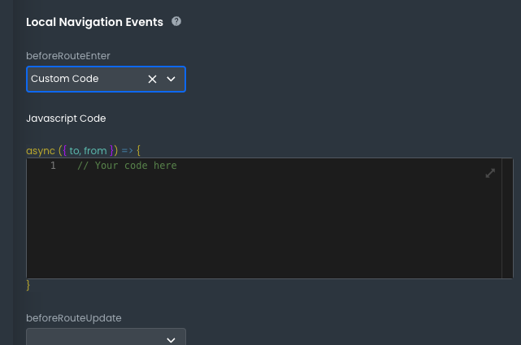

# Implementing Pagination Using 8base GraphQL API Queries

Effectively managing large data sets is a crucial aspect of any robust application. One proven way to enhance the efficiency and speed of data retrieval is through pagination. In essence, pagination works by dividing your data into smaller, more manageable segments.

Pagination is primarily achieved using the  `first`  and  `skip`  arguments.

## Understanding the  `first`  and  `skip`  Arguments

The  `first`  argument specifies the number of items to display on a page. It essentially sets a limit on the number of records that a query returns. The default and maximum limit for this argument is 5000 records.

On the other hand, the  `skip`  argument determines the number of items to skip before something is displayed. It specifies the starting point for data retrieval in the context of the entire data set. This argument is particularly useful for accessing subsequent pages of data.

## Implementing Pagination

When implementing pagination in a query, the  `first`  and  `skip`  arguments are manipulated to control the subset of data that is retrieved. For instance, to display the first two items,  `first`  is set to 2 and  `skip`  is set to 0.

**Query:**

```graphql
query {
# First consider 0 as the starting slice of paginated rcords. As this
# number is increased, the prior results leave out previously fetched
# records. (i.e., skip 0 -> skip 3 -> skip 6 -> skip 9...)
  postsList(skip: 0, first: 3) {
    items {
      title
    }
  }
}
```

**Response:**

```graphql
{
  "data": {
    "postsList": {
      "items": [
        {
          "title": "Awesome Possum"
        },
        {
          "title": "A Sunset and Waves"
        },
        {
          "title": "Vapor Distilled Water for All"
        }
      ]
    }
  }
}
```

## The Backend Data

Every 8base Backend automatically delivers a user table.


To query these users, we input the following query into the **API Explorer**:

**Query:**

```graphql
query TeamMembers(
  $filter: UserFilter
) {
  usersList(
    filter: $filter

    sort: { firstName: ASC }
  ) {
    count

    items {
      id
      email
      firstName
      lastName
      status
      createdAt
      avatar {
        downloadUrl
      }
      roles {
        items {
          id
          name
        }
      }
    }
  }
}

```

**Response**

Here is a snippet of the response:

```graphql
{
  "data": {
    "usersList": {
      "count": 12,
      "items": [
        {
          "id": "clnnv3fj3007q08ml5z3p5fft",
          "email": "Bruce@wayne.com",
          "firstName": "Bruce",
          "lastName": "Wayne",
          "status": "active",
          "createdAt": "2023-10-13T00:19:49.984Z",
          "avatar": {
            "downloadUrl": "https://cdn.filestackcontent.com/security=policy:eyJjYWxsIjpbInJlYWQiLCJjb252ZXJ0Il0sImV4cGlyeSI6MTY5NzI0MTYwMCwiaGFuZGxlIjoiVWd1UUNESGhUb2V2ZWozMDkxYXEifQ==,signature:0988af19fa9d94c3024d88029982c90c996cbef76cad1749b3410fb9ebc52f6b/UguQCDHhToevej3091aq"
          },
          "roles": {
            "items": [
              {
                "id": "cllye657r004t08kw5hncblc0",
                "name": "Administrator"
              }
            ]
          }
        },
        {
          "id": "clnnv14n2005t08mleu9b35v8",
          "email": "Charles@dean.com",
          "firstName": "Charles",
          "lastName": "Dean",
          "status": "active",
          "createdAt": "2023-10-13T00:18:02.558Z",
          "avatar": {
            "downloadUrl": "https://cdn.filestackcontent.com/security=policy:eyJjYWxsIjpbInJlYWQiLCJjb252ZXJ0Il0sImV4cGlyeSI6MTY5NzI0MTYwMCwiaGFuZGxlIjoidFZIRDl6RGRSeGlFMGFwNExJamwifQ==,signature:ab6f47734b4fa02ecd034592cc2d731a1b7ae13da9359fa2ff7d25b2a14d0736/tVHD9zDdRxiE0ap4LIjl"
          },
          "roles": {
            "items": [
              {
                "id": "cllye657r004t08kw5hncblc0",
                "name": "Administrator"
              }
            ]
          }
        },
        {
          "id": "cllyfazq000ih08jyf1ty79jw",
          "email": "carlosjimenezrobayo@gmail.com",
          "firstName": "Charlie",
          "lastName": "Garcia",
          "status": "active",
          "createdAt": "2023-08-31T00:23:52.152Z",
          "avatar": {
            "downloadUrl": "https://cdn.filestackcontent.com/security=policy:eyJjYWxsIjpbInJlYWQiLCJjb252ZXJ0Il0sImV4cGlyeSI6MTY5NzI0MTYwMCwiaGFuZGxlIjoiN0ZmWVQ1YjhTU2EwVlRPUVhFS0gifQ==,signature:faa5f1982b733dd1a3dc117bb908a8db95dd84029efa73e4ad6f421a492dcee3/7FfYT5b8SSa0VTOQXEKH"
          },
          "roles": {
            "items": [
              {
                "id": "cllye657r004t08kw5hncblc0",
                "name": "Administrator"
              }
            ]
          }
        },
      ]           
      }
      
    }
  }
```


Now we want to split the previous query response into two pages, to show the list of users in the Frontend. We will use the `first` and `skip` arguments.

**Query:**

```graphql
query TeamMembers(
  $filter: UserFilter
) {
  usersList(
    skip: 0
    first: 6
    filter: $filter
    sort: { firstName: ASC }
  ) {
    count
    items {
      id
      email
      firstName
      lastName
      status
      createdAt
      avatar {
        downloadUrl
      }
      roles {
        items {
          id
          name
        }
      }
    }
  }
}

```

Using `skip: 0` / `first: 6` will bring only the first six records of the response. To get the following 6, we must send the following:

`skip: 6` / `first: 6`.

This way, we have two pages showing six records each. 

## Frontend Implementation 

### Adding the Query

Our data is set up in the backend and we have a query ready. Let's dive into how we can leverage pagination in our frontend. We need to add a resource to our application.

To assess the resources integrated with your frontend, navigate to the **Resources** section. This can be accomplished by selecting the corresponding icon located in the sidebar.


You can select a specific resource to view more detailed information.


Here is the detailed view for a resource:


Now let’s craft the query: 

1. On the right-hand side, click **Requests**.

2. Create a **Global Request** as a **Lazy Query**.

3. If you want to update the `first` and `skip` values with a frontend event, you will need to modify their values to use variables. So, instead of using:

```graphql
query TeamMembers(
  $filter: UserFilter
) {
  usersList(
    skip: 0
    first: 6
    filter: $filter
  )
  }
```
Your query should look like this:

```graphql
query TeamMembers(
  $filter: UserFilter
  $skip: Int
  $first: Int
) {
  usersList(
    skip: $skip
    first: $first
    filter: $filter
    sort: { firstName: ASC }
  ) {
    count
    items {
      id
      email
      firstName
      lastName
      status
      createdAt
      avatar {
        downloadUrl
      }
      roles {
        items {
          id
          name
        }
      }
    }
  }
}
```

4. Enter the query above in the query field of your new request and give it a name.
5. Click **Save & Run**.


At this moment, we will not send the variables for `first` and `skip`. We will do this in another section, because this is not mandatory. If we execute the request, it will give us the total list without pagination.

### Using the Query

In this section, we will guide you through the process of using a GraphQL query in the frontend of your application. We will construct a webpage that displays a list of personnel data fetched from our backend.

To achieve this, we will leverage a local navigation event, with the **Run custom code** option. This action is necessary as our **Lazy Query** requires the values of the  `skip`  and  `first`  variables to be passed according to the data we intend to display.

In this scenario, the variables will be passed as follows:

```
-   `skip: 0`
-   `first: 6`
```

Our backend table contains twelve records. This configuration will display the first six records on the initial page.

### Accessing Local Navigation Events

1.  Click on **Pages** in the sidebar.

2.  Locate your page and click on the gear icon to view its settings.

3.  The settings panel will appear. The Local **Navigation Events** section is located at the bottom.


### Configuring **BeforeRouteEnter** Event


1. Select the **BeforeRouteEnter** option. We want the query to execute when the page loads. 
2. Then, choose the custom code option to enter the request execution code.

3. The code should be structured as follows, sending the  `skip`  and  `first`  variables:

```javascript
accUsersGet.run({
    variables: {
        "skip": 0,
        "first": 6
    }
});
```


4. After implementing the code, be sure to save your changes. Click on the **Save** button located at the top of the page settings.


Now your page is set up to execute the GraphQL query upon load. 

### Rendering Query Responses with the Looper Component

The time has come to render the query response to the user.

We will use the looper component to show the information that comes in the query response. 

The looper component is designed to iterate over an array of data, providing a repeating structure to display each array item.

### Connecting the Query Response to the Looper

First, we need to connect our query response to the looper component. This connection can be achieved through the Loop Data field. In this example, we will use the **Enter Code** option.


The reference to our query response will be placed in the **Loop Data** dropdown between `{{ }}`:  `{{ accUsersGet?.data }}`.


By default, the **Item Name** field is set to "item". This serves as the argument we will use to access each element in our query response.

### Configuring the Card Component

Next, we will add a component within the looper to display the iterated information. For this instance, we will use a **Card Component** as it aligns well with our example.


The **Card Component** should be configured as follows:

1.  **Card Header**: The header will display the first and last name of each user. Using our "item" argument, it will look like this:  `{{item?.firstName}} {{item?.lastName}}`.
    

2.  **Card Content**: The content will display the user's profile photo. The image source configuration will be:  `{{item?.avatar?.downloadUrl}}`.
    

3.  **Typography Component**: Within the card content, we will add a typography component to display the user's email. The text of this component will be:  `{{item?.email}}`.

    

### Previewing the Result

Once these steps have been completed, the component is set to display the information. To preview the result, execute the request from the requests panel.


:::note
The pagination will not appear in the preview. When executing the query from the request panel, it is performed without a value in the `skip` and `first` variables.
:::

### Displaying the Second Page

Previously, we configured a local navigation event to trigger our query when the page loads. This displays the first page of our response, corresponding to the first 6 records. The next step involves providing a mechanism for the user to re-execute the query, this time aiming to display the subsequent page.

In order to achieve this, we will enhance our application's interface by adding a button to the canvas.

**Configuring the Button**

Here are the steps to add an `onClick` event to the button:


1. Drag a button onto the canvas.
2. Go to the component and click on it. This action will open the properties panel.

3.  In the properties panel, select the **Events** tab.

4.  Under this tab, add an **On Click** event and choose **Run Custom Code**.

5. Just like we did for the local navigation event, we will incorporate the code to execute our request. This code will send the values for the  `skip`  and  `first`  variables.

```
-   `skip`: 6
-   `first`: 6
```

6. These particular values will trigger the query execution and fetch the next 6 records in the response.
```javascript
accUsersGet.run({
    variables: {
        "skip": 0,
        "First": 6
    }
});
```


7. After entering the code, save the configuration by clicking **Done**.

With that, we have successfully configured the pagination for the second page of our application.

### Previewing the Application

In the editor's header menu, click the **Preview** button to launch a preview of your application. 


Here is the first page:


And here is the second one:


Congratulations! Your application now has pagination.
