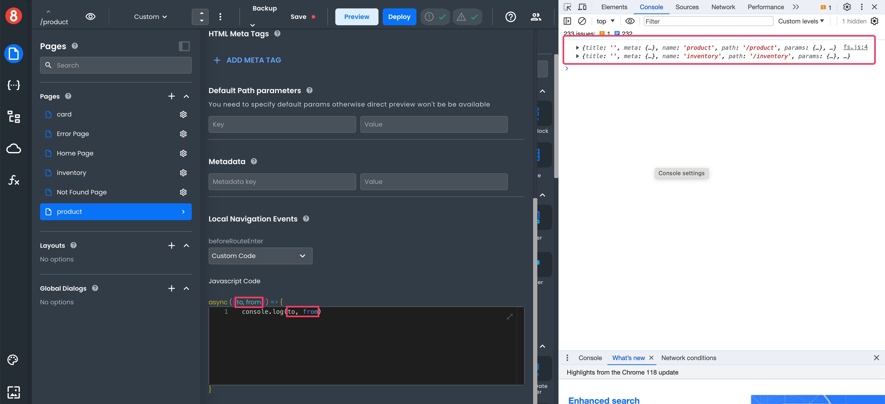

# Leveraging Navigation Events in a SaaS Project Management Tool

Navigation is more than transitioning between pages—it's about proactively responding to user activities. Incorporating these events strategically can heighten user experience, ensuring navigation within the application is both intuitive and meaningful. 

## About Navigation Events

Navigation events in 8base address this in two ways: **Global** and **Local**.

**Global Navigation Events** are actions that apply across every page transition in your application.

You can access them by going to **Settings** > **Global Navigation Events**. 
 


**Local Navigation Events** are specific to transitions into or out of a particular page. You can see them when you open a page’s settings.


Each event can initiate one of three actions: **Run Request**, **Run Function**, or execute **Custom Code**.


When opting for the **Custom Code** action, you gain access to two essential arguments: 


* `to`: Provides insights into the page being navigated to.
* `from`: Provides insights into the page being navigated away from.





There are several different hooks:

-   **`beforeEach`**: Triggered before any navigation takes place. Useful for actions or checks that need to be executed prior to any route transition, like preloading user preferences or checking authentication.
    

-   **`afterEach`**: Invoked after a navigation event has completed. Beneficial for post-navigation activities, such as logging or analytics.


-   **`beforeRouteEnter`**: Executed before navigating into a specific route. This can be employed to ascertain if the user should be allowed access to a specific route, like verifying membership for a dashboard.
   

-   **`beforeRouteUpdate`**: Triggered when the route remains the same, but the route parameters change. For instance, navigating from `/project/1` to `/project/2` would activate this event. Useful for fetching updated data without a full page reload.
   

-   **`beforeRouteExit`**: Invoked before navigating away from a specific route. Vital for tasks like warning users of unsaved changes.

Now we will explore practical scenarios within a fictional SaaS Management Tool designed to streamline project management and foster team collaboration.

## Global Navigation Events

### `beforeEach`: Preloading User Preferences

**Use Case**: As users move between sections of the SaaS tool, you can preload certain data or settings. For example: a user's preferred theme or language settings. This ensures a consistent and personalized experience.

**Action**: **Run Request**

```graphql
query GetUserPreferences {
  PreferencesList(
    filter: {
      id: "someUserId"
    }
  ) {
    items {
      theme
      language
    }
  }
}
``` 


**OnComplete Callback for Request**:

```javascript
themeService.setValue(data.preferences.items.theme);
languageService.setValue(data.preferences.items.theme;
``` 


<!---->


### `afterEach`: After Every Route Transition

**Use Case**: After navigation events, you can log user activity for insights on the sections most visited.

**Action**: Execute **Custom Code**

```javascript
analyticsService.log(`Navigated from ${from.path} to ${to.path}`)
``` 


<!---->


## Local Navigation Events

### `beforeRouteEnter`: Before a Specific Route is Entered

**Use Case**: Before displaying a project's detail page, fetch its latest data. This ensures users get the most recent information.

**Action**: **Run Request**

**GraphQL Request**:

```graphql
query GetProjectDetails(
  $projectId: ID!
) {
  project(id: $projectId) {
    id
    name
    description
    createdAt
    updatedAt
  }
}
``` 

### `beforeRouteUpdate`: Updating Parameters within the Same Route

**Use Case**: On a task list, if a user clicks a specific task, update the URL and task detail view without a full page reload.

**Action**: Execute **Custom Code**

 ```javascript
 if (to.params.taskId !== from.params.taskId) {

    // Fetch and update the task detail view

    taskService.fetchAndUpdateView(to.params.taskId);

  }
``` 

### `beforeRouteExit` (Local Event): Invoked Before Navigating Away from a Specific Route 

**Use Case**: Imagine you're working within the **Task Creation** page of our management tool. It is important to ensure that users have either saved their progress or are aware they might be discarding unsaved tasks before navigating away.

**Action**: Run Function

**Function**: `warnUnsavedChanges()`

This function could be designed to check if any changes have been made within the **Task Creation** page and, if so, display a modal or alert warning the user about potential data loss.

```javascript
	if (document.getElementById('task-input').value) {  // Checking if the input field has any content
        return "You have unsaved changes! Are you sure you want to leave without saving?";
    }
``` 

Here, the function checks if the task input field has any content. If it does, it returns a warning message. The actual method of displaying this message can vary, but a common approach is to use a browser's default confirmation dialog.
