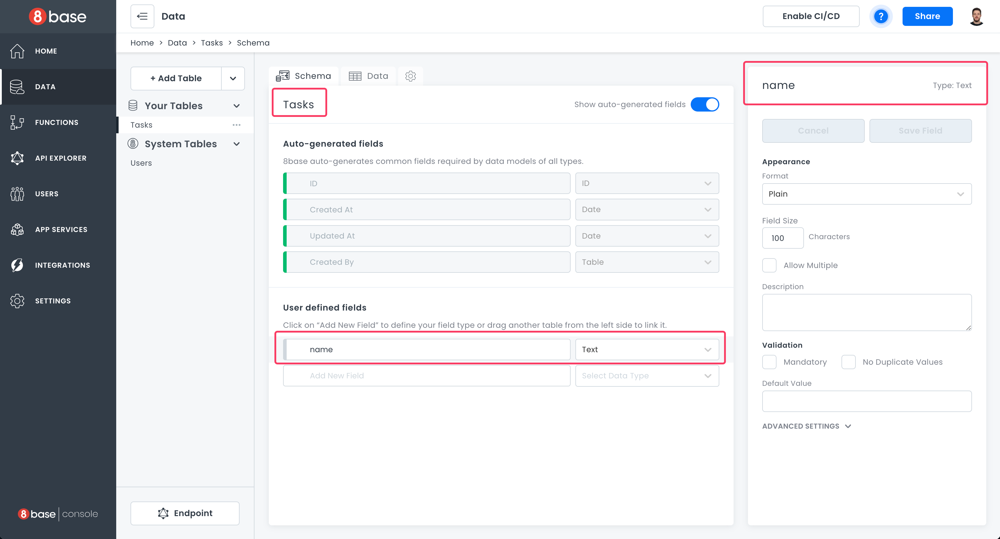
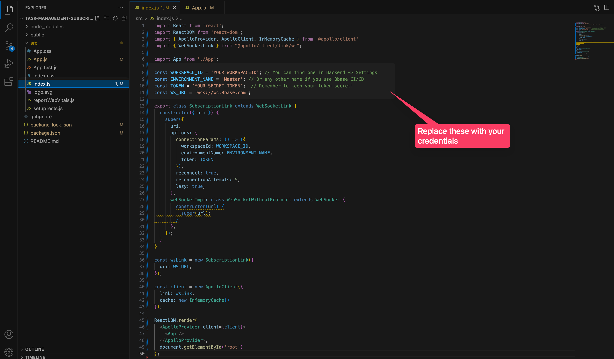
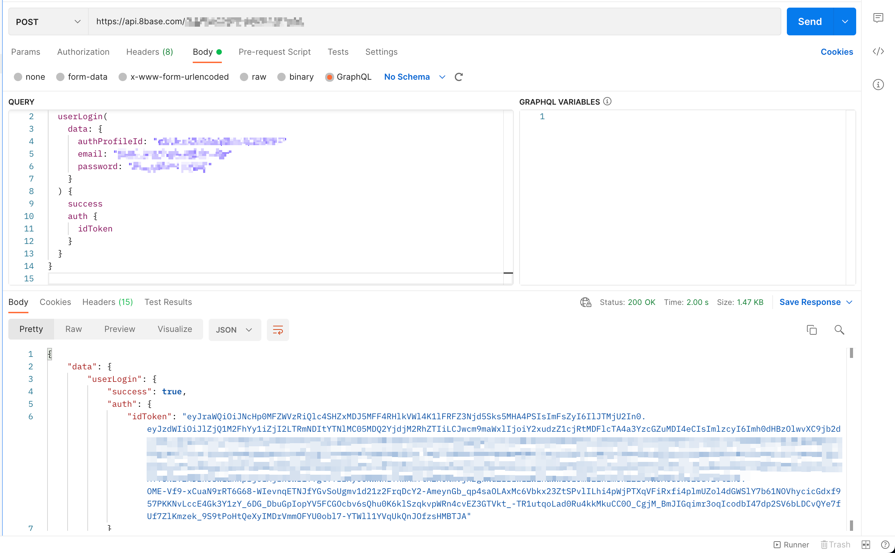
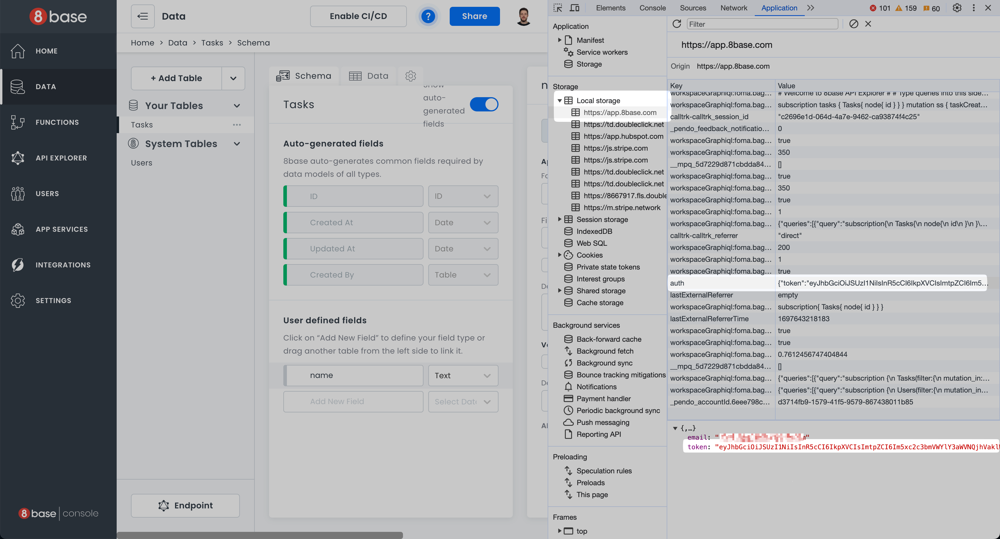
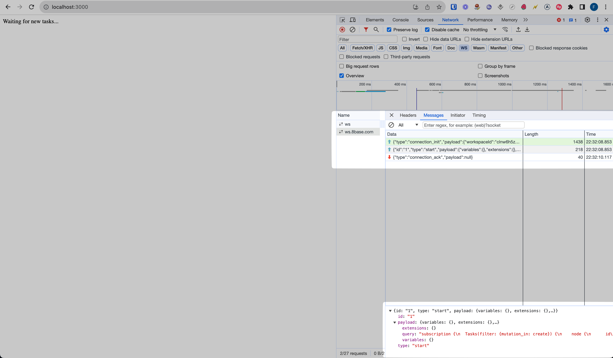
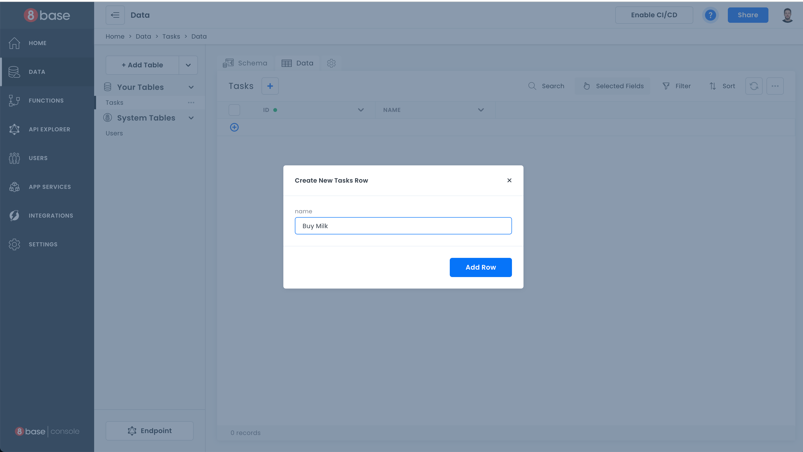
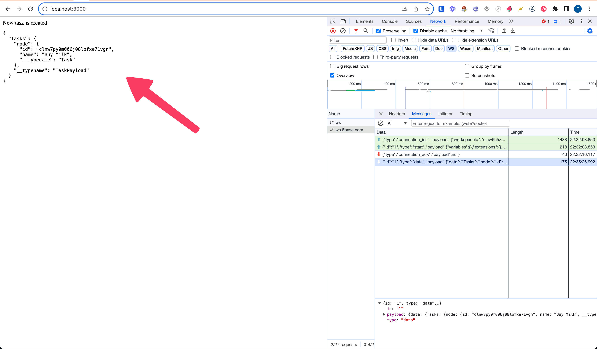

# Real-time Applications: Using 8base Subscriptions with your Frontend

In dynamic web applications, real-time updates are integral for enhancing user experience. Think of a Task Management SaaS application where team members are distributed across different locations. Being instantly notified about new tasks without having to constantly refresh the page can significantly improve the app's interactivity. GraphQL subscriptions make such real-time features — like chats, notifications, and live feeds — a reality.

## Advantages of GraphQL Subscriptions

-   **Real-time Data**: Changes are reflected immediately, eliminating the need for manual reloads.

-   **Efficiency**: Only specific parts of the page that change are updated.

-   **Interactivity**: Enhances the responsiveness of applications, making them feel more alive.

For the scope of this guide, we will not be building an entire Task Management SaaS. Instead, we will create a foundational piece of it: a basic React application that demonstrates the power of real-time notifications. Through this example, users will receive instant alerts whenever a new task entry is made.

## Step 1: Backend Setup

Start by preparing the backbone of your data model. In the 8base backend, set up a `Tasks` table with a `name` text field. This table will store the tasks that we want to monitor in real-time.





## Step 2: Setting Up the React Project

We leverage `create-react-app` here, the official tool backed by the React team, to bootstrap our project. It effortlessly sets up a new project environment, ensuring we dive straight into coding without dealing with initial configurations. For this walkthrough, Node.js version `18.11.0` was used:

`npm i -g create-react-app`
`create-react-app task-management-subscription-example && cd task-management-subscription-example`

## Step 3: Integrating Apollo Client and WebSocket Support

Apollo Client forms the cornerstone of our application. It handles tasks like data fetching, caching, and UI updates. To ensure our app can seamlessly stream real-time data, we will employ WebSockets. Hence, we include the `subscriptions-transport-ws` library to grant our GraphQL subscriptions WebSocket support.

We will add these libraries:

`npm i @apollo/client subscriptions-transport-ws` 

These libraries link the frontend to the backend service via Apollo Client. WebSockets ensures a channel for secure and rapid data streaming. Implement the supplied code in the `src/index.js` file, adjusting with your credentials. 

```javascript
import React from 'react';
import ReactDOM from 'react-dom';
import { ApolloProvider, ApolloClient, InMemoryCache } from '@apollo/client'
import { WebSocketLink } from "@apollo/client/link/ws";

import App from './App';

const WORKSPACE_ID = 'YOUR WORKSPACEID'; // You can find one in Backend -> Settings 
const ENVIRONMENT_NAME = 'Master'; // Or any other name if you use 8base CI/CD 
const TOKEN = 'YOUR_SECRET_TOKEN';  // Remember to keep your token secret!
const WS_URL = 'wss://ws.8base.com'; 

export class SubscriptionLink extends WebSocketLink {
  constructor({ uri }) {
    super({
      uri,
      options: {
        connectionParams: () => ({
          workspaceId: WORKSPACE_ID,
          environmentName: ENVIRONMENT_NAME,
          token: TOKEN
        }),
        reconnect: true,
        reconnectionAttempts: 5,
        lazy: true,
      },
      webSocketImpl: class WebSocketWithoutProtocol extends WebSocket {
        constructor(url) {
          super(url);
        }
      },
    });
  }
}

const wsLink = new SubscriptionLink({
  uri: WS_URL,
});

const client = new ApolloClient({
  link: wsLink,
  cache: new InMemoryCache()
});

ReactDOM.render(
  <ApolloProvider client={client}>
    <App />
  </ApolloProvider>,
  document.getElementById('root')
);
```





You can get the ID of your backend and Websocket Endpoint under **Settings**.


As for `TOKEN`- you can get it two ways:

- As the response of a `userLogin` mutation.  \


 \
- From the local storage of your current active 8base backend in the browser. Go to your 8base backend -> **Local Storage** -> **https://app.8base.com/** -> **auth** -> **token**. Copy the token value.





Finally, replace your `src/App.js` code with following:

```javascript
import { gql, useSubscription } from '@apollo/client'

const SUBSCRIPTION_LOCAL = gql`
subscription {
  Tasks(filter:{
    mutation_in: create
  }){
    node{
      id
      name
    }
  }
}
`;

function App() {
  const subscription = useSubscription(SUBSCRIPTION_LOCAL);

  if (subscription.data) {
    return (
      <div>
        New task is created: 
        <pre>{JSON.stringify(subscription.data, null, 2)}</pre>
      </div>
    );
  } else {
    return "Waiting for new tasks...";
  }
}

export default App;
```

## Step 4: Launch and Test Your App

It's showtime! Save the changes and start the app by executing this in your terminal:

`npm run start`

Keep an eye on the WebSocket connection initializing in the network tab for your browser. This affirms the readiness of your application for real-time data operations.





Time to test! Emulate real-time behavior by adding a fresh task via the **Data Viewer** of your 8base backend or another method. For example, executing `tasksCreate` mutation via Postman or any other request client. 





When inserting a new task to the `Tasks` table, the app will promptly display a real-time notification with the response from the subscription.


<!---->


## Conclusion

We have constructed a rudimentary real-time notification feature, reminiscent of what could be part of a larger Task Management SaaS app, harnessing 8base subscriptions and a React frontend.