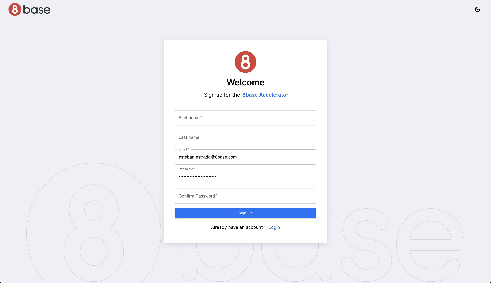

# Signup Page

The Signup page in the Authentication Accelerator allows new users to register and create an account. We will guide you through implementing and using the Signup function, along with the necessary requests and dependencies. By following this documentation, you can implement a secure and user-friendly signup process in your application using the Authentication Accelerator's Signup Page.

## Functions

### Signup Function

The `accAuthSignup` function allows users to sign up with their email and password, and then logs them in. <!-- Here's an annotated code snippet explaining how it works. -->

## Requests

### Signup Request

The `accAuthSignupRequest` GraphQL mutation is used for user signup. It takes the user's email, first name, last name, and password as input parameters and creates a new user account. <!-- Here's the request:-->

### Login Request

The `accAuthLoginRequest` GraphQL mutation is used for user login. It takes the user's email, password, and authentication profile ID as input parameters and returns authentication tokens. <!-- Here's the request:-->

This request is used to log in the user after a successful signup.