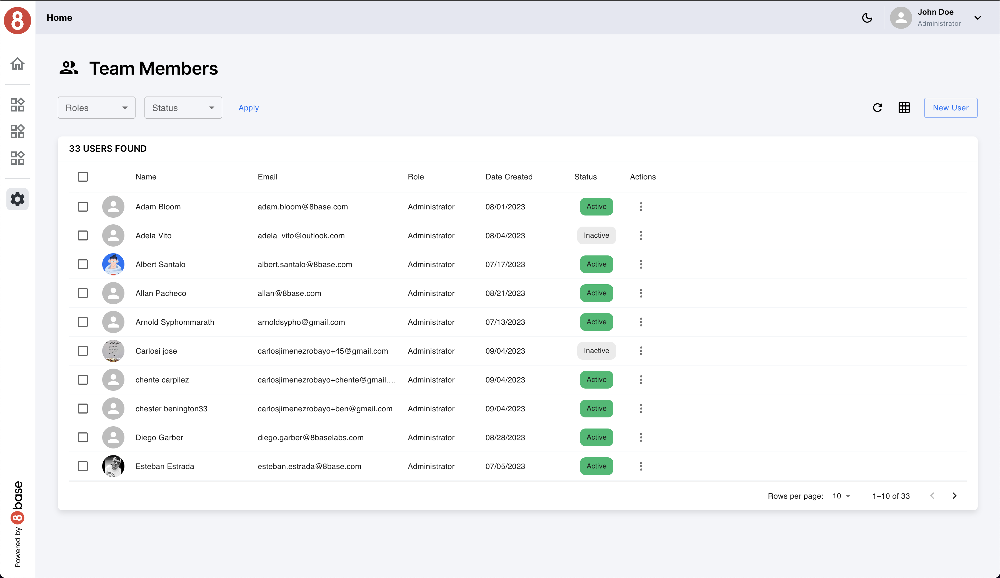

# Team Members Page

The Team Members page in the User Management Accelerator provides a comprehensive interface for managing users within your application. This page allows you to perform CRUD (Create, Read, Update, Delete) operations on user profiles and includes several features for enhanced usability.

If you need to view, edit, or create a user, you will be redirected to a dedicated user management page for these specific actions. The Team Members page primarily serves as a central hub for managing user profiles and applying filters to user data.

- [User Profile Page](./user-profile.md)
- [User Create Page](./user-create.md)

## Features

- **User Filtering**: The Team Members page offers user filtering options, allowing you to filter users based on their roles or status. This feature simplifies the process of finding specific users within your application.

- **View Modes**: Users can choose between two view modes - Grid and Table (default). Both modes use the same underlying data but offer different visualization options to accommodate varying preferences.

## Requests

### Get Users

The `accUsersGet` GraphQL query is employed to retrieve user data, including profiles and associated information. This query provides the data displayed on the Team Members page, allowing users to view and manage user profiles.

### Get Users Filter Values

The `accUsersFilterValues` GraphQL query is utilized to obtain filter values for user roles and status. It provides the necessary data for populating filter options, enabling users to refine their search criteria and streamline user management.

### User Update

The `accUserUpdate` function is called when you click on deactivate or activate a user.

### User Delete

The `accUserDelete` function is called when you click on delete a user. The modal opens and you confirm that want to delete the selected user.