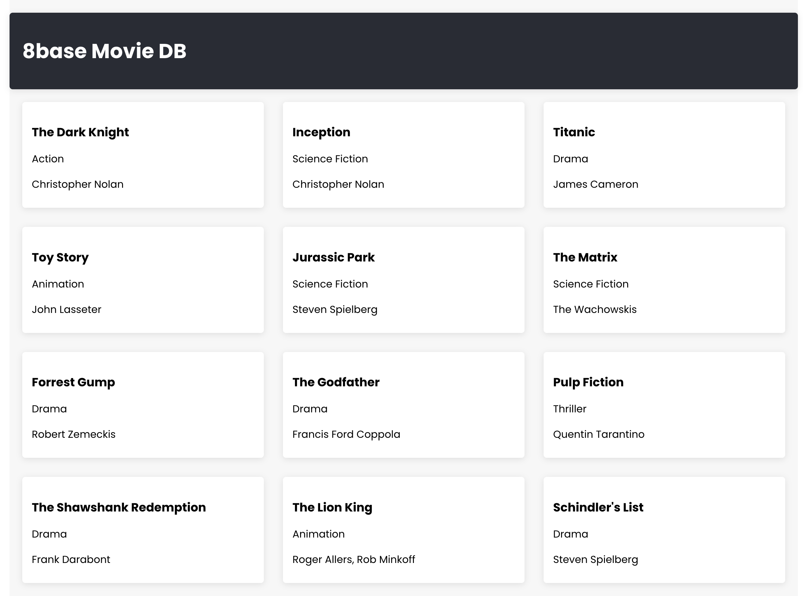
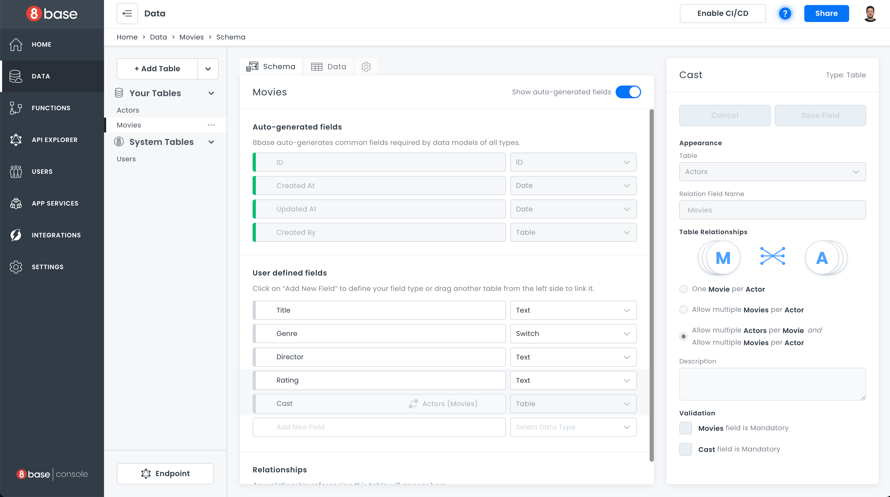
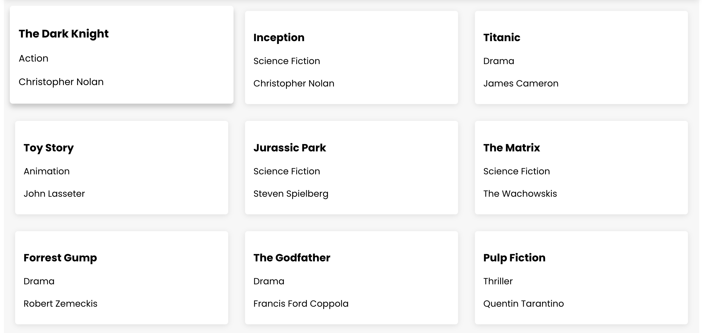
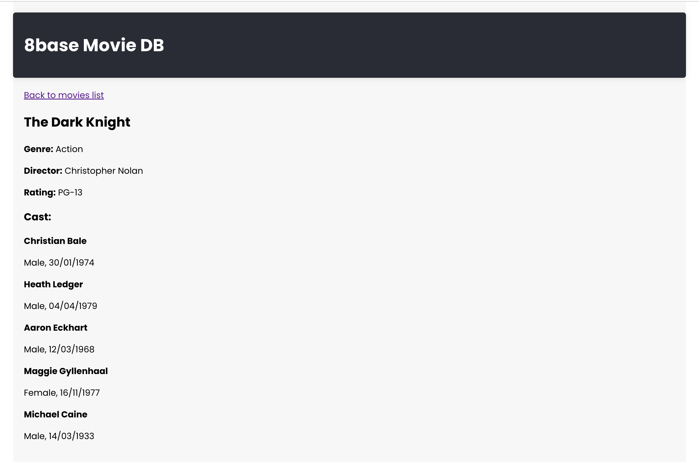

# Building a Frontend for a Backend-only Project

In this guide, we will show you how to create a basic movie database app to showcase the ease of integrating the 8base Backend with your own custom frontend. 




## Understanding the Backend Structure

We have already set up at this endpoint: [https://api.8base.com/clm0fahrv000008i67set12kz](https://api.8base.com/clm0fahrv000008i67set12kz).

 Our backend is structured around a `Movies` table, which has these fields:

* `title`
*  `genre`
* `director`
* `rating` 
* `Actors` table that holds `firstName`, `lastName`, `gender`, and `date of birth` for actors. 

`Movies` has many-to-many relations with `Actors`.



## Setting Up the Project

### Initialize a New React Project

We will use `create-react-app` here, the official tool backed by the React team, to bootstrap our project. It effortlessly sets up a new project environment, ensuring we dive straight into coding without dealing with initial configurations. For this walkthrough, Node.js version `18.11.0` was used:

`npm i -g create-react-app`

`create-react-app 8base-movie-app && cd 8base-movie-app`

### Install Required Packages

For our project, we will use `@apollo/client` for GraphQL operations and `react-router-dom` for routing.

`npm install @apollo/client react-router-dom` 

### Modify the index.js File

We must replace the content of `src/index.js` with following code. This will set up React-Router for our app.

```javascript
import React from 'react';
import ReactDOM from 'react-dom';
import './index.css';
import App from './App';
import { BrowserRouter } from 'react-router-dom';

ReactDOM.render(
  <React.StrictMode>
    <BrowserRouter>
      <App />
    </BrowserRouter>
  </React.StrictMode>,
  document.getElementById('root')
);
```

## Integrating Apollo Client

1. Create a file named `apolloClient.js` in the `src` of your app. This is where we will configure our Apollo Client to connect to the 8base backend.
2. In `apolloClient.js`, set up a new Apollo Client instance. We'll be using `HttpLink` to connect to our 8base Backend API endpoint.

```javascript
import { ApolloClient, InMemoryCache, HttpLink } from '@apollo/client';

const httpLink = new HttpLink({
  uri: 'https://api.8base.com/clm0fahrv000008i67set12kz',
});

const client = new ApolloClient({
  link: httpLink,
  cache: new InMemoryCache(),
});

export default client;
```

The backend is public and already configured for you - feel free to use it: [https://api.8base.com/clm0fahrv000008i67set12kz](https://api.8base.com/clm0fahrv000008i67set12kz)

## Creating Movie List View





We need to create a new component called `MoviesList.js` in the `src` folder. This component fetches a list of movies from our 8base backend using the GraphQL query `GET_MOVIES`. This query is one of the automatically-generated GraphQL queries and mutations added to your API for every table - in this case for `Movies` table.

```javascript
import React from 'react';
import { gql, useQuery } from '@apollo/client';
import { Link } from 'react-router-dom';

const GET_MOVIES = gql`
  query getMovies {
    moviesList {
      items {
        id
        title
        genre
        director
      }
    }
  }
`;

function MoviesList() {
  const { loading, error, data } = useQuery(GET_MOVIES);

  if (loading) return 'Loading...';
  if (error) return `Error: ${error.message}`;

  return (
    <div className="movies-container">
      {data.moviesList.items.map(movie => (
        <Link key={movie.id} to={`/movie/${movie.id}`} className="movie-card">
          <h3>{movie.title}</h3>
          <p>{movie.genre}</p>
          <p>{movie.director}</p>
        </Link>
      ))}
    </div>
  );
}

export default MoviesList;
```

We also handle the loading and error states, and then map through the fetched movies to display them in a card-like format.

## Adding Movie Details View





Next, we will create another component `src/MovieDetail.js`. Here, we'll fetch detailed information of a single movie using the GraphQL query `GET_MOVIE_DETAILS`. 

```javascript
import React from 'react';
import { gql, useQuery } from '@apollo/client';
import { useParams, Link } from 'react-router-dom';

const GET_MOVIE_DETAILS = gql`
  query getMovieDetails($id: ID!) {
    movie(id: $id) {
      title
      genre
      director
      rating
      cast {
        items {
          firstName
          lastName
          gender
          dOB
        }
      }
    }
  }
`;

function MovieDetail() {
  const { id } = useParams();
  const { loading, error, data } = useQuery(GET_MOVIE_DETAILS, {
    variables: { id },
  });

  if (loading) return 'Loading...';
  if (error) return `Error: ${error.message}`;

  return (
    <div className="movie-detail-container">
      <Link to="/" className="back-button">Back to movies list</Link>
      <h2>{data.movie.title}</h2>
      <p><strong>Genre:</strong> {data.movie.genre}</p>
      <p><strong>Director:</strong> {data.movie.director}</p>
      <p><strong>Rating:</strong> {data.movie.rating}</p>
      <h3>Cast:</h3>
      {data.movie.cast.items.map((actor, index) => (
        <div key={index} style={{ marginBottom: '10px' }}>
          <p><strong>{actor.firstName} {actor.lastName}</strong></p>
          <p>{actor.gender}, {new Date(actor.dOB).toLocaleDateString()}</p>
        </div>
      ))}
    </div>
  );
}

export default MovieDetail;
```

Just like in our `MoviesList` component, we handle the loading and error states. Once data is fetched, display the movie details along with its cast.

## Integrating Changes and Styling the App

Let's integrate all of our components into our main `App.js` component, wrapping everything with `ApolloProvider` . This makes the Apollo Client instance (`client`) available to all child components, enabling them to make GraphQL requests.

`Routes` determines which component to render based on the current URL. There are two defined routes:

-   **/movie/:id**: Displays the `MovieDetail` component, which fetches and shows detailed info about a movie with the given ID.

-   **/**: Displays the `MoviesList` component, which fetches and lists all the movies.

```javascript
import React from 'react';
import { ApolloProvider } from '@apollo/client';
import client from './apolloClient';
import MoviesList from './MoviesList';
import MovieDetail from './MovieDetail';
import { Routes, Route } from 'react-router-dom';
import './App.css';

function App() {
  return (
    <ApolloProvider client={client}>
      <div className="App">

        {/* Header Section */}
        <header className="app-header">
          <h1>8base Movie DB</h1>
        </header>

        <Routes>
          <Route path="/movie/:id" element={<MovieDetail />} />
          <Route path="/" element={<MoviesList />} />
        </Routes>
      </div>
    </ApolloProvider>
  );
}

export default App;
```

### Styling

Let's add some basic styles for clean design and responsiveness, by replacing the content of `App.css` with the provided snippet:

```css
.App {
  max-width: 1200px;
  margin: 0 auto;
  padding: 20px;
  font-family: 'Poppins', sans-serif;
  font-weight: 400;
  background-color: #f7f7f7;
  display: flex;
  flex-direction: column;
  align-items: center;
}

.back-button {
  align-self: flex-start;
}

.app-header {
  width: 100%;
  padding: 15px 20px;
  color: white;
  margin-bottom: 20px;
  background-color: #282c34;
  box-shadow: 0 2px 10px rgba(0, 0, 0, 0.1);
  border-radius: 5px;
  display: flex;
  align-items: center;
}

.movies-container {
  display: flex;
  flex-wrap: wrap;
  gap: 20px;
  justify-content: space-between;
}

.movie-card {
  box-sizing: border-box;
  width: calc(33.333% - 20px);
  padding: 15px;
  margin-bottom: 10px;
  background-color: #fff;
  border-radius: 5px;
  box-shadow: 0 2px 10px rgba(0, 0, 0, 0.1);
  text-decoration: none;
  color: black;
  transition: transform 0.3s ease, box-shadow 0.3s ease;
}

.movie-card:hover {
  transform: translateY(-5px) scale(1.05);
  box-shadow: 0 6px 8px rgba(0, 0, 0, 0.2);
}

.movie-card h3, .movie-card p {
  margin-bottom: 10px;
  user-select: none;
}

.movie-detail-container {
  width: 100%;
  text-align: left;
}

/* Responsive styles */
@media (max-width: 768px) {
  .app-header {
    flex-direction: column;
    text-align: center;
  }

  .movie-card {
    width: calc(50% - 10px);
  }
}

@media (max-width: 480px) {
  .movie-card {
    width: 100%;
  }
}
```

We will also add the Poppins font into our app, by adding following line to `public/index.html` file:

```
    &lt;link  href="https://fonts.googleapis.com/css2?family=Poppins:wght@400;500;700&display=swap"  rel="stylesheet">
```

## Running the App

Finally, run your app by typing `npm run start` in your terminal!


Well done! You have completed the guide and built a basic frontend app powered by 8base Backend GraphQL API. Keep experimenting and happy coding!
