# Building an App with an 8base Frontend-only Project

Let's dive into the process of creating a basic movie database app using an 8base frontend-only project. Our app is called **Movie DB**.


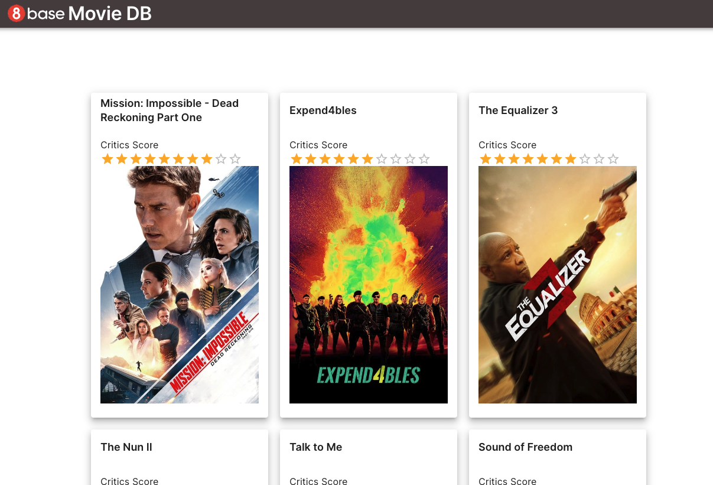

This approach integrates the external backend via an API, capitalizing on the features of App Builder.

## Getting Started

We must have pre-configured APIs on hand to perform queries to an external backend. 

In the context of our Movie DB app, we'll be utilizing the TMDB API. For reference, you can access the TMDB API documentation at [Getting Started](https://developer.themoviedb.org/docs).

### Acquiring TMDB API Access


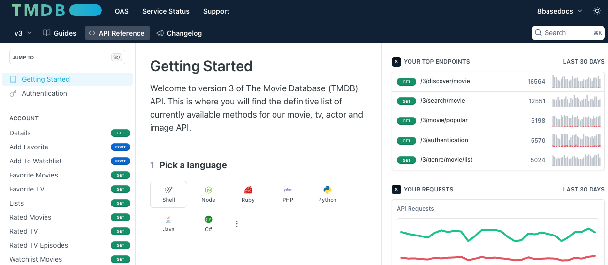


You will need to log in or create an account with TMDB. 

Then you can register at [Getting Started](https://developer.themoviedb.org/reference/intro/getting-started). After you register, you will receive an Access token authentication to consume TMDB's APIs.

You are now ready to integrate the requests with an 8base frontend-only project. 

## Integrating 8base Frontend with External Backend

When creating a project, you can choose between **Full-Stack** or **Backend-Only**, so to create a frontend-only project, we must add a frontend to an existing project.


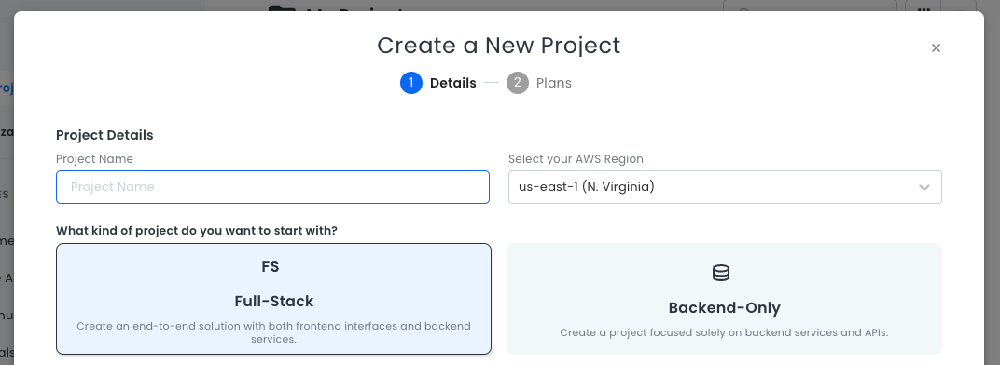


### Creating a Frontend

We will start by crafting a frontend from scratch. This example does not require a pre-built authentication system.  


1. In an existing project, select **Add new Frontend**.
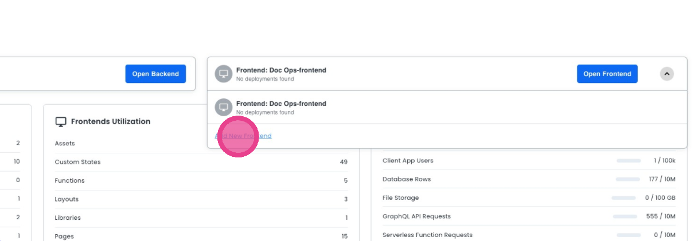
2. Click **Build from Scratch**, and then click **Create**.
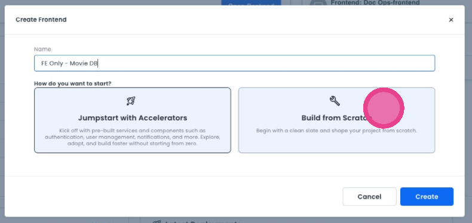
3. Select **DIY Authentication**.
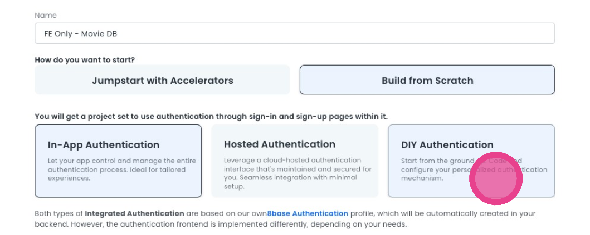


After creating the new frontend, we can establish and integrate the necessary requests.

### Adding a Resource to the Frontend

Before we create a request, we must add a resource:

1.  Click on **Resources** in the editor's sidebar.
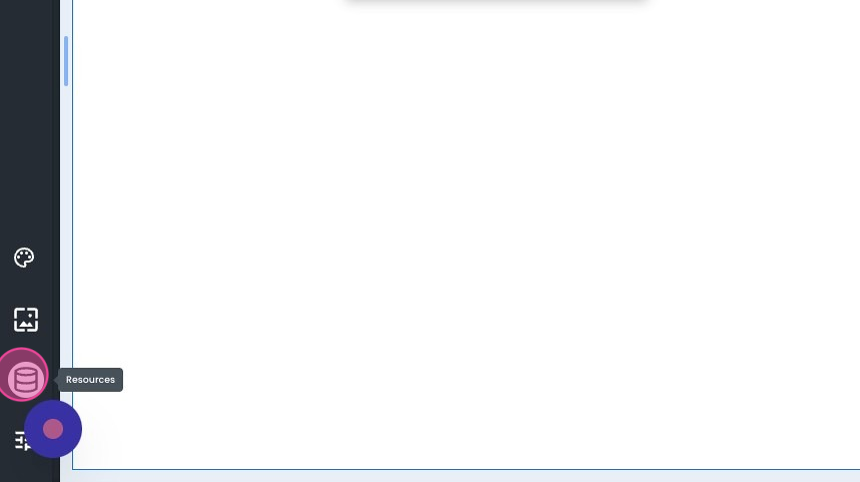
2. Add a REST resource according to your project requirements.
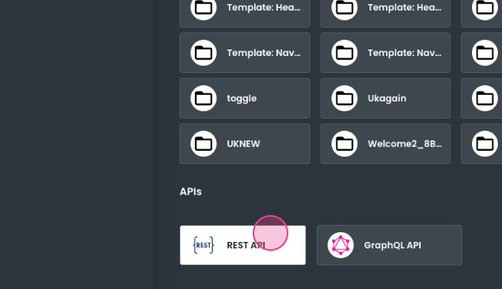
3.  Once the resource configuration is complete, click **Save**.
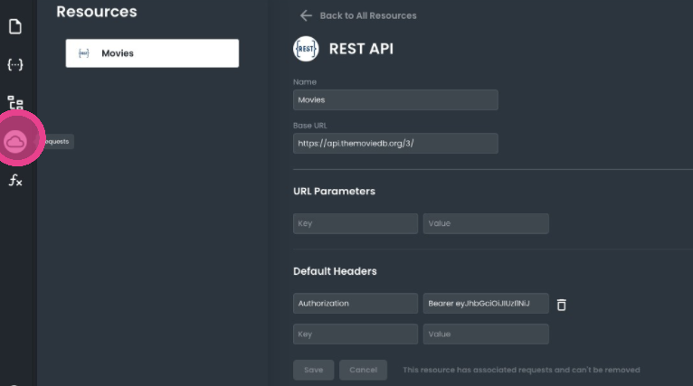


### Creating and Integrating Requests

After setting up the resource, the next step is to generate the requests for your application:

1.  Click on the **Requests** button located in the sidebar.
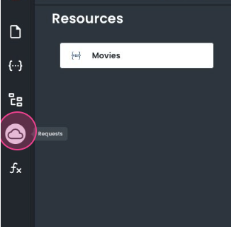    
2.  In this section, create two global requests:
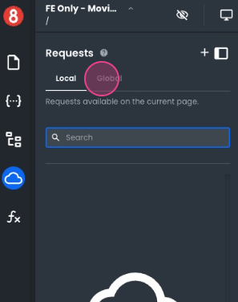

**Request 1**: `popularMovies`: This GET request returns a list of movies, sorted by popularity. 

Set it to execute on the  `BeforeRouteEnter`  navigation event on the homepage. This provides the necessary data to display the movie list as soon as the page loads.

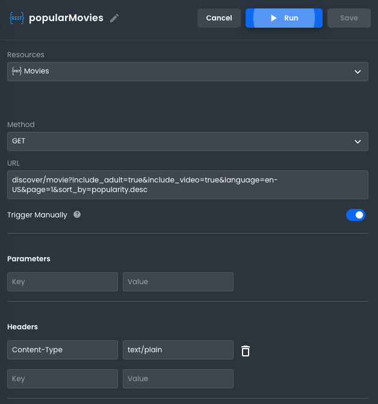


```javascript
curl --location 'https://api.themoviedb.org/3/discover/movie?include_adult=true&include_video=true&language=en-US&page=1&sort_by=popularity.desc' \

--header 'Authorization: Bearer PLEASE SIGN UP TO themoviedb' \

--header 'accept: application/json'
```

**Request 2**: `insideMovie`: This request fetches the details of a movie based on a provided ID. 

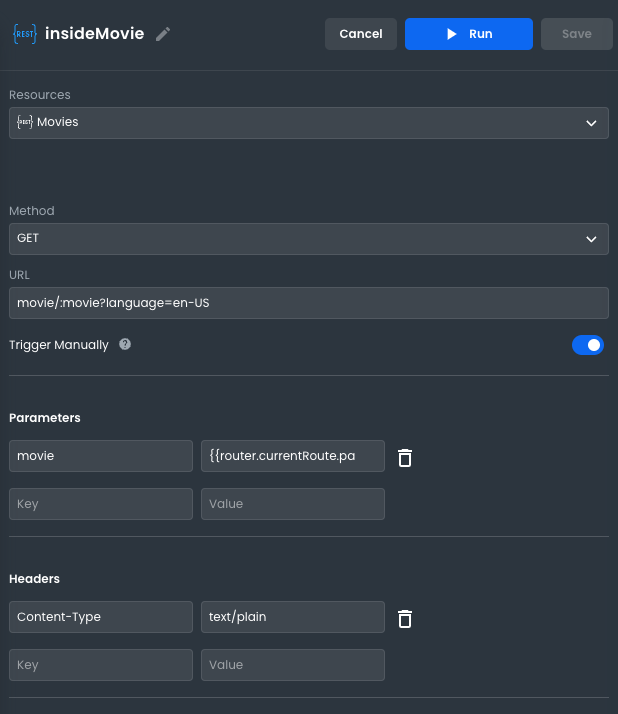


The movie ID is passed as a parameter (`:movie`). We'll extract this ID from the path of the "Movie Details" page, which is dynamic:  `/movie-details/:id`.

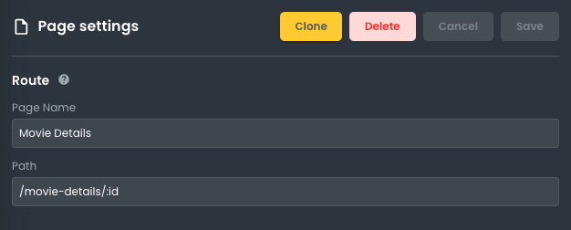


Pass the movie ID from the page path  `/movie-details/:id`  to the request  `movie/:movie?language=en-US`  via a global state called  `router.currentRoute.params.id`.


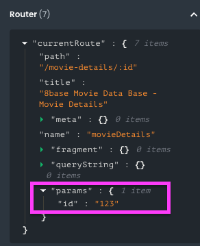


Once this is set up, place the request to be executed on the  `BeforeRouteEnter`  navigation event on the "Movie Details" page. This ensures the necessary movie data is loaded just before the page is displayed.


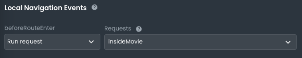


### Building the App

We have access to the external backend and the necessary requests to import the movie data. Now, we will display the data in the frontend.

Our app will have two pages:

 **Home Page**:  Shows the list of movies ordered by popularity.

We will use a looper with a card component inside it to show the details of each movie. This will iterate over the results of the `popularMovies` request.


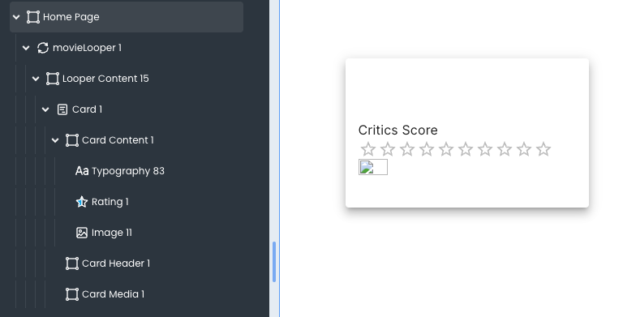

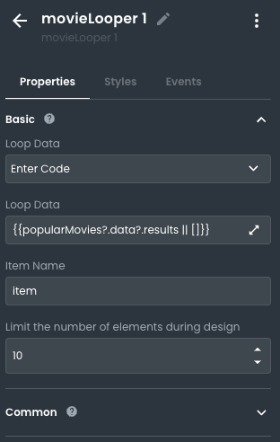

Additionally, each card will have an `onclick` event with a navigate action to redirect the user to the "Movie Details" page next to the ID of the selected movie.


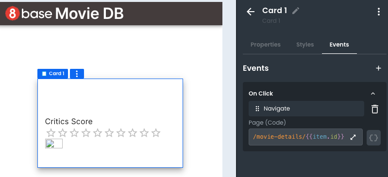


**Movie Details**: Shows the details of a selected movie

Here, we will show the details of a movie using these components:
- Heading: Contains the title of the movie
- Typography: to show the genre of the movie
- Rating: shows the user score
- Image: to show the movie poster
- Editable Text: Contains the Overview

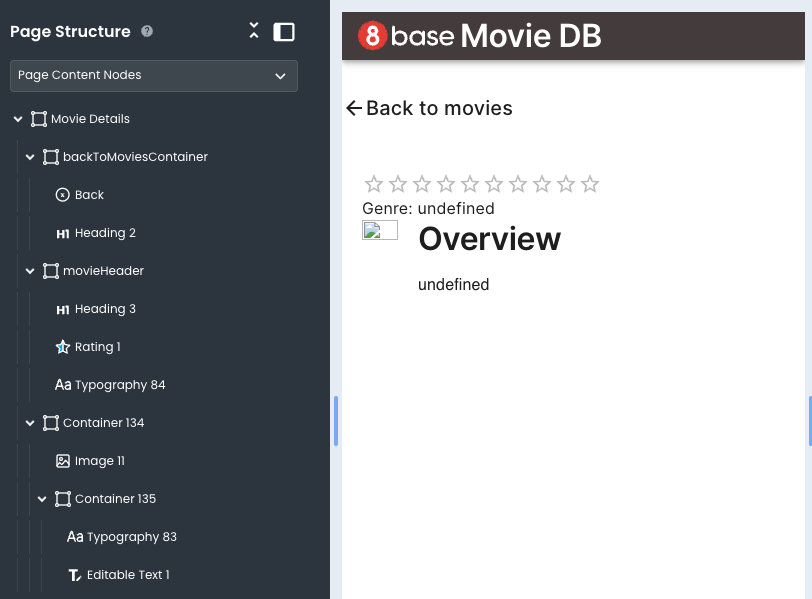

Each component will display the `insideMovie` request's content according to the ID sent from the Home Page.
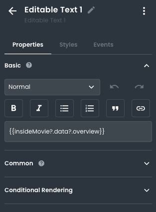

And that's all! You can see the app in action by clicking on **Preview** from the editor or by deploying the app.


You can try the deployed app for this example here: [8base movie DB](https://clnxlvytk00l308k16vxe84iv.appbuilder.8base.com/). 
