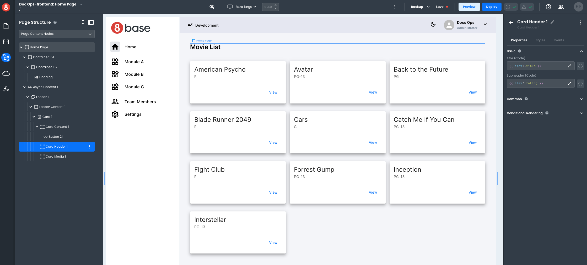
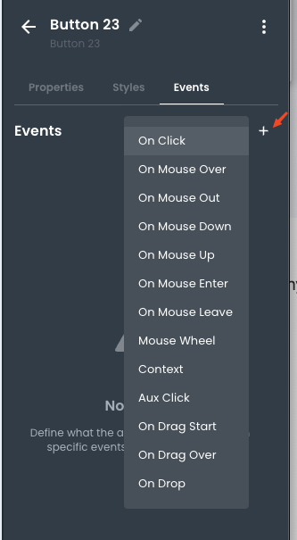
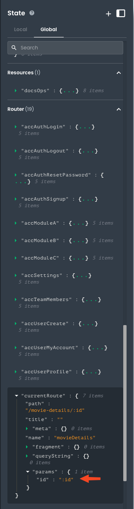
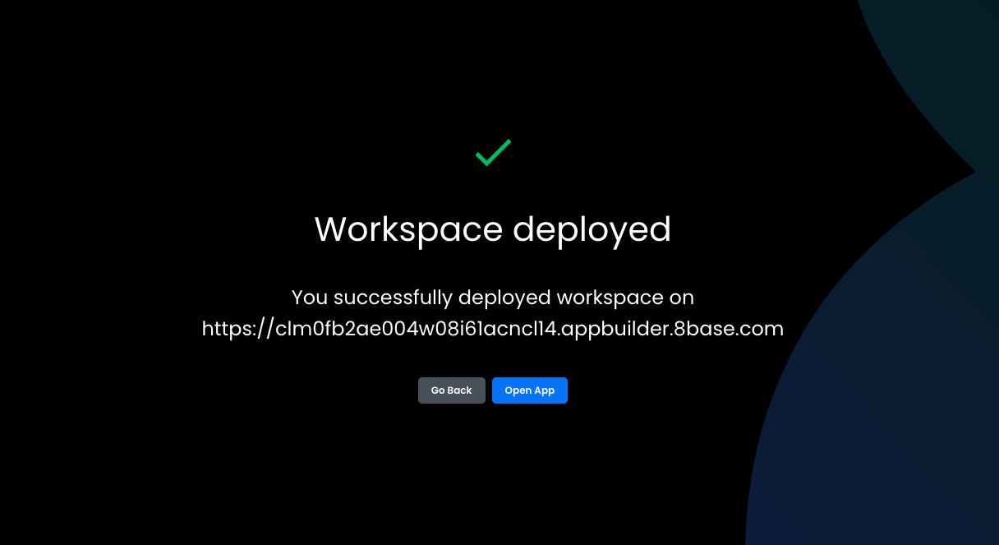

# Full-stack walkthrough

In this guide, we'll build a simple full-stack application leveraging the "Jumpstart with accelerators" template. Make sure to follow the [quickstart](/introduction/quickstart) tutorial to provision your project

## Configuring your data model
From your project dashboard, open your backend. You can also go to the "Backend" section and open it from there. Once in the backend, open the "Data" module to configure your data schema.

To create a table, click "Add table" and proceed to add fields to it following this process
1. Add the field name
2. Select the field type
3. Configure the details of the field
4. Click "Create field."

Repeat these steps to create the `Movie` table with this structure (Don't try to do the the `Cast` field yet)


For the `Genre` field, select `Switch` as the type and *Custom* for `Format.` Then, add options for the different genres.


Now, create the `Actor` table with this structure. This time, you will make the relationship between both tables. To accomplish this, follow these steps:

1. Add the field name as usual
2. Select `Table` as the field type
3. Select the target table, `Movie` in our case
4. Name the relationship **from the perspective of the target table**. In our case, that would be `Cast`
5. Select the relationship type. As in our case, a movie can have multiple actors, and an actor can participate in multiple movies, we will want to "*Allow multiple Movies per Actor and Allow multiple Actors per Movie*"


You don't only have now a couple of tables; you have just created a complete GraphQL API to support all your client app needs!

## Adding data
Other than having client applications write data, you have two options to add records to your backend: Use the data viewer or use the API explorer

### Add data using the data viewer
Switch to the data viewer by having a table selected and clicking on "Data" tab.


Then click on the + icon. A modal will appear that will let you add records. 


Just add the information you need and click "Add row". Once the data is saved, you can see it in the viewer and use the pencil icon to edit records.


### Using the API Explorer

A much more fun way to create data is by writing your own GraphQL mutation. We can even create related information in one transaction, and the best part is that you don't need to be an expert in GraphQL.

Navigate to the **API Explorer**, click on *Explorer* and then on *Add new mutation*


Find in the list of available mutations `movieCreate` and expand it. Use the `data` section in red to pass the arguments and select what you want to return from the blue fields. Notice that the proper GraphQL code is created for you as you choose and enter values.

If you provide values like this:


You'll get a GraphQL code that looks like this (Tip: click **Prettify** to format it)

```graphql
mutation MyMutation {
  __typename
  movieCreate(
    data: {
      title: "Blade Runner 2049"
      rating: "R"
      genre: "Science Fiction"
      director: "Denis Villeneuve"
      cast: {
        create: {
          firstName: "Ryan"
          lastName: "Gosling"
          gender: "Male"
          dOB: "1980-11-12"
        }
      }
    }
  ) {
    id
    title
    rating
    genre
    director
    cast {
      items {
        id
        firstName
        lastName
        gender
        dOB
      }
    }
  }
}
```
Once you hit the **Play** button, you will get results like these
```json
{
  "data": {
    "movieCreate": {
      "id": "clnxtoyh000gm08iddnng0vj7",
      "title": "Blade Runner 2049",
      "rating": "R",
      "genre": "Science Fiction",
      "director": "Denis Villeneuve",
      "cast": {
        "items": [
          {
            "id": "clnxtoyhz00gp08id54swb9bo",
            "firstName": "Ryan",
            "lastName": "Gosling",
            "gender": "Male",
            "dOB": "1980-11-12"
          }
        ]
      }
    }
  }
}
```

The **Explorer** is a great tool to create complex GraphQL statements easily!

## Queries for our frontend

In our frontend app, we will implement two pages:
1. A paginated list of movies
2. A page to show the details of the movie

There's no particular order in which pages like this are implemented, but you will need to craft the statements your app will use at some point. As we are already in the **API Explorer**, let's get it done.

### Paginated list

We will use the standard arguments `first` and `skip` to implement the paginated list. As these are meant to be passed by the client app, we'll set variables in our GraphQL statement. It will also be a good idea to have it return the number of records so the client app can implement the pagination logic.

This will be our query.

```graphql
query listMovies($first:Int, $skip:Int) {
  moviesList(first: $first, skip: $skip, sort: {title: ASC}) {
    items {
      id
      title
      rating
    }
    count
  }
}
```

In the API explorer, you can click on the *Variables* section to bring up an editor where you can add a JSON document with your variables values. It would look similar to this.


### Movie details

We will use the `movies` query and pass the movie we want the details as a variable. We will query the related information in the `Actor` table in this case.

```graphql
query getMovieDetails($movieID: ID) {
  movie(id: $movieID) {
    id
    title
    genre
    rating
    director
    cast(sort: {lastName: ASC}) {
      items {
        id
        firstName
        lastName
        gender
        dOB
        movies(sort: {title: ASC}) {
          items {
            id
            title
          }
        }
      }
    }
  }
}

```

A movie will load a list of actors, and each actor will load the list of movies. In both cases, we can control how the sorting of those lists would work. Here's an example of how this would look like in the **API Explorer**


## Building the frontend

Go back to your project dashboard and open your front end. This will get you to **App Builder**.

We are using the *"Jumpstart with accelerators"* template. Before we start, we can do some cleanup to begin tailoring our application. Select the elements in the Homepage that we won't need and delete them (use your `delete` key or the contextual menu) until you have a good starting point. Something like this will work great:


### Implementing the paginated list

Our goal will be to display a list of movies as a set of Cards, render in each card the movie title, genre, and rating, make available a couple of buttons to navigate through the list, and have a button to go into the details of the movie. We already crafted our query, but it expects two parameters. We will use a **state** to hold the value to send in the `$skip` parameter. This will make it very easy to update the data every time the user clicks `Previous` or `Next`

Click on the **State** pane in the left bar to open it. We will want this new **state entry** to be available only to the Homepage so that we will stay in the **local scope** and click the plus button to *Create a new state*. Call `skip`, make it a number, and default value 0:


This template already has a **Resource** connected to our backend. If you tried to work with multiple backends or would have started with a blank template, you can add additional resources in the **Resources** section. 


As things had been set up for use, we can go straight into the **Requests** pane and add a local request (Just as with the state, we don't need this request to be available anywhere but on the Homepage). We will want to change the *Operation type* to **Query**, as these execute automatically when the scope is mounted (in our case, when the Homepage is loaded). After copying our query, we will want to declare our variables. This is optional if you intend to run the query using a code block, but that won't be necessary in our case. For the `first` variable, we can set up a fixed value of `10`, which always returns ten entries at the most. We want to use the value stored in the state we created above for the' skip' variable. We will accomplish this with a **handlebar expression**, just an inline javascript expression. It will look like this: ` {{ skip.value }}`. Notice we used double curly brackets to enclose our handlebar expression.

Information within 8base is secured by default, so we need to pass a proper `Authorization` header with the calling user's identity to ensure the caller has permission to access the data.

:::caution
Your frontend within **App Builder** is a live application. This makes it very easy to understand how the application will look and behave, but it also forces the developer to deal with the fact that the application is running. Authentication against backends is a common situation where you need to consider how to pass the identity to the server while still in development. There's no prescribed way to achieve this, so you can implement it as it makes better sense for your application.
:::

The **Jumpstart with accelerators** makes it easy to use as it already implements all the authentication flow. When users are authenticated, their identity is available as a JWT token in the browser's local storage under the key `tokenID.` Conveniently, that key will be available within **App builder** as well, so we can set the value of our `Authorization` header to a handlebar expression like this ` {{ localStorage.getItem('tokenID')}}`

Name your query *getMovies* and put it all together; it should look like this after you *Save and run* it:


Executing your query populates an associated *state*, making developing your application easier. Let's put together our page to render the data.

First, select the Homepage and change the Layout configuration so the content stretches and occupies the available space.


Drop an **Async content** component on the page. This component will allow us to show the user we are loading data from the backend. We will want its *Loading* attribute to be tied to the execution of our query. You can copy the path to that property from the state pane.


Then select the Async component from the canvas, go to properties, click on the button next to the *Loading* attribute to switch to **Code**, and write the expression `{{ getMovied.loading}}` to bind the attribute. You can also change the styling pane so the spinner appears centered and children's components are organized from top to bottom, taking all the space.


It is time to drop a **Looper** inside our Async content component. The **Looper** is a special component that allows us to iterate over an array. Use the property pane to set it up to use the data in our query. You can change the number of elements to render during design to control how much content you have to deal with while working on your app. This setting does not affect the execution.

Set up your looper as shown below.


Now, drop a card inside the looper. You should see more than one! That's because the application is live and showing you what the results will look like. 


This is useful, but it could look better. Let's fix that by configuring the layout of the looper. Use the **Page Structure** pane to select the looper and reach the style pane. Change the layout to your liking. See below the configuration we used


The page structure pane is handy to select your components once you have more than a few. You can also move them directly in the page structure and access the context menu for operations like copy or clone.

Now, we want to achieve the following
1. Show the movie title as the header of the card
2. Show the movie rating as subheader
3. Add a button to navigate to the details

Using the page structure, select the card header and add handlebar expressions to show the data. In our looper configuration we set it up for each item to be referenced as `item`, so in our handlebar expressions we can do `item?.title` and `item?.rating`. It is a good practice to use optional chaining here, as we won't want our app to fail if for some reason `item` becomes undefined. 

Then drop a **Button** inside the *card content* and change the label to *View*

It should look like this:



:::note
We changed the style `layout` of the card content, to use *Flex* with `direction` set as `Row reverse`. That's why our button shows right-aligned.
:::


Now we want to add buttons to paginate through the data. Follow these steps
1. Drop a container below the async content
2. Drop two buttons inside the container
3. Change the lables of the buttons to *<< Previous* and *Next >>*
4. Set up stying with flex layout, space between justification and left and right padding

It should look like this


Now the fun part: We want to change the value of our `skip` state. As this state is used as the value of a variable in the query, every time it changes the query will be executed again and the data in our page will be updated. 

We will add this functionality as events in the buttons. Follow these steps
1. Select the button with the label *Next >>*
2. In the right pane, select events and click the plus sign
3. Select `On Click`



4. In the action options, select *Run Custom code*


5. Click *Add Custom Code* to open the editor
6. Add your code: `skip.setValue(skip.value + 10)`


7. Click done when ready

Repeat those steps for the button labeled *<< Previous*, but this time for the code substract from `skip`: 
```js
skip.setValue(skip.value - 10)
```

It is time for you to preview your application. Use the **Preview** button at the top bar and see how your application is behaving. 

### Adding the movie details page

We must add a new page to our `/movie-details/:id` URL. Notice how we intend to pass the movie identifier as an argument. We can achieve that by using the `[:param_name]` notation in our page's `Path` attribute. Later, we will access this parameter through our code. Create the page using a configuration similar to the one shown below.


Got back to the home page to implement the view button. If you don't see your data, just execute your query again. 

The url of the target page is dynamic, as we need to add the movie `id` to it. This can be achieved using the `router` object available in your global scope. This object provides a method `navigate` that will let you move between pages using code. Follow these steps to implement the navigation

1. Select the view button that you dropped inside the card content
2. In the right pane, go to events
3. Add an event handler for `On Click`
4. Select `Run Custom Code` as the action
5. Add the following code
```js
// Your JavaScript code here
router.navigate(`/movie-details/${item?.id}`)
```
Go back to the **Movie details** page.

We will need to use the `id` parameter to retrieve the data we need. You can access this information directly from the `router` object. Open the **State pane**, select global and scroll down. You'll see all the pages there which you can acces by name (Example `router.homepage`), a `list` attribute that let you retrieve the whole list of pages and `currentRoute` which is a reference to the current page. If you expand `currentRoute`, you can find where the `id` parameter will be available



Notice that it has "*id*" as value. That's because the application right now hasn't recieved an argument (Remember, your app is live inside App Builder). This will create challenges for us to assemble our app, but we can easily fix it by editing the page and providing a **Default path parameter**. In the *Page pane*, use the gear icon next to *Movie details* to edit its configuration and add an ID that you know exists in your backend


Now, we are ready to get our data. Just as we did in the homepage, let's add a local query

1. Create the local query
2. Name it `getMovie`
3. Set the type to Query
4. Copy the GraphQL statement we built before
5. Configure the variable `movieID` to `{{ router.currentRoute.params.id }}`
6. Set up your `Authorization` header to  `{{ localStorage.getItem('tokenID') }}`
7. Save and run


Now we are ready to assemble our page. We'll do a simple design inside an Async component. Drop components so your page looks like this


We set our attributes like this
1. Async content, `Loading` attribute: `{{ getMovie.loading }}`
2. Heading, `Title` attribute: `{{ getMovie.data?.movie.title }}`
3. First typography,`Text` attribute: `{{ getMovie.data?.movie.genre + " - " + getMovie.data?.movie.rating }}`
4. Second typography, `Text` attribute:  `{{ "by " + getMovie.data?.movie.director }}`

Let's use a table to display our cast. Follow these steps
1. Drop a table component
2. Change the `Data` attribute to `{{ getMovie.data?.movie.cast.items }}` (You might see errors while typing, ignore them)
3. Click **Autogenerate columns** and accept the option to delete existing columns


4. Click the gear icon next to the `Movies` column and then delete the column


And that's it. If you go to the homepage and preview the application, it should like similar to this:


## Deployment

The deploy process will publish your app from App Builder into a production application. Start by clicking the **Deploy** button in the top bar to bring up the deploy modal. You can set up versioning there and then click the second *Deploy* button


The process will start and take a few minutes


Once completed, you'll see this screen and your application is ready to be enjoyed!


