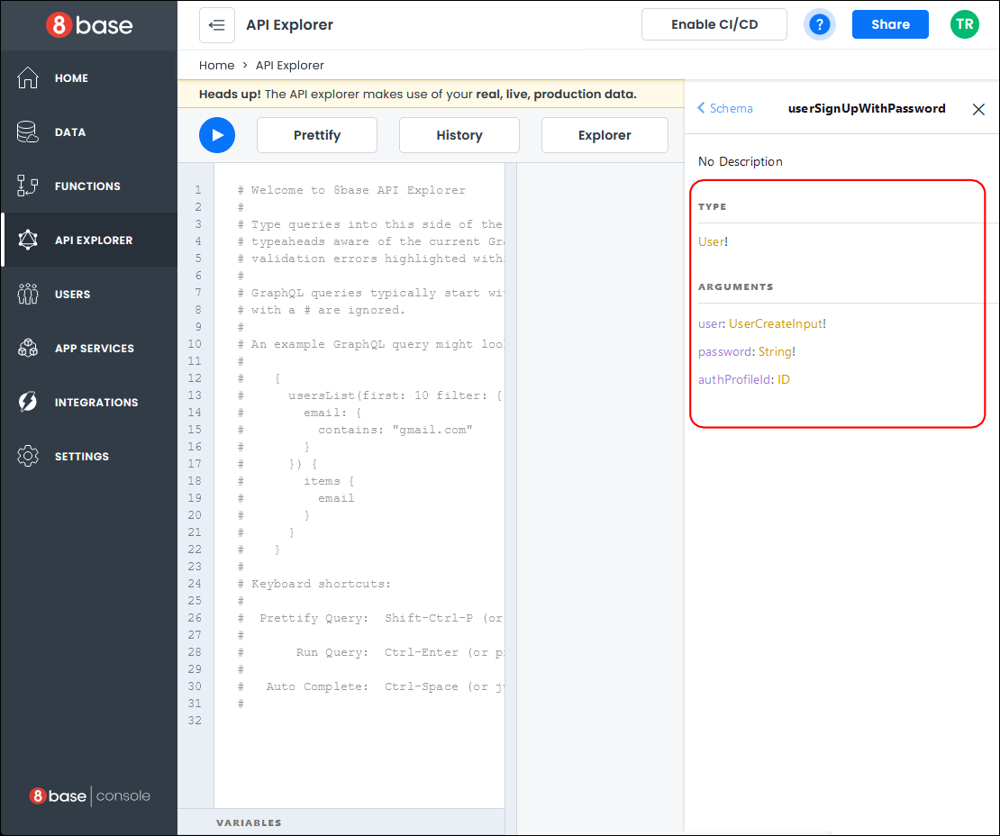

# Hosted Login Authentication

8base offers you two types of *Integrated Authentication* for your projects: **Hosted Login** and **Coded Login**. 

The **Hosted Login** integrated authentication is an external 8base branded page that manages **Login**, **Sign Up**, and **Change Password** functionalities.
_______

## Hosted Login Authentication

There are two cases for using the *Hosted Login* integrated authentication. When you create a new **Project**, and when you create a new **Frontened** for an existing full stack project.

**New Project**
If you selected *Hosted Login* as your integrated authentication during **project** creation, a default 8base authentication profile was automatically created for you.

**New Frontend**
If you selected *Hosted Login* as your integrated authentication during a new **frontend** creation, your project would use either an existing or new authentication profile.

### Default Authentication Profile

To view the default authentication profile created while creating a new project, open your project's **Backend** portion. Once your Backend loads, select *App Services > Authentication* to view the Authentication profile.

You then must set up the **Hosted Login URL** by selecting an option from the drop-down.

Close your project's **Backend** portion and go to the **Frontend** portion.

### Testing the Hosted Login Callback page

If you select the *Page* icon on the left-hand menu of your **Frontend**, you will see a page called "Hosted Login Callback" that was automatically created during project creation.

You can test the Hosted Login Callback page by previewing the page or deploying your Frontend application. 

To preview the page, click the "Preview" button, which opens your application in a new browser window.

To deploy your project, click the "Deploy" button at the top of the project builder. A small pop-up window opens with deployment information about your project. Click the "Deploy" button at the bottom of the pop-up to deploy your project.

The first time you deploy a project, it will take a few minutes to initialize and instantiate it.

Once your project is deployed, you will be directed to the "Hosted Login Callback" page.

### How the Sign Up works

Now that your application is deployed, we will take a look at how the backend works when a user signs up.

After you create a new account, the application will redirect you to the Home Page. Close this page and go back to your *Project Dashboard*.

Open your project's **Backend** and select the "Users" tab. You can see that your account was added to the database.

Click the "Data" tab in the left menu of the Data Builder.

To see the Users table, click "Users" under *System Tables*, then click the "Data" tab at the top of the right-hand panel. You can see the user you created in the Users table.

The Hosted Login executes a GraphQL mutation under the hood called **userSignUpWithPassword** to add a user to the Users table whenever a new user signs up.

Click the "API Explorer" tab in the left menu and enter "userSignUp" in the search field of the Documentation Explorer on the right-hand panel. Select the mutation **userSignUpWithPassword** from the search results.

The GraphQL mutation takes the **authProfileId**, a **password**, and the **user** details as its arguments and creates a user in the Amazon Web Service (AWS) cognito and the 8base Users table.

**Note:** For an in depth discussion on how authentication works see the article on [Authentication](/projects/backend/8base-console-authentication.md).