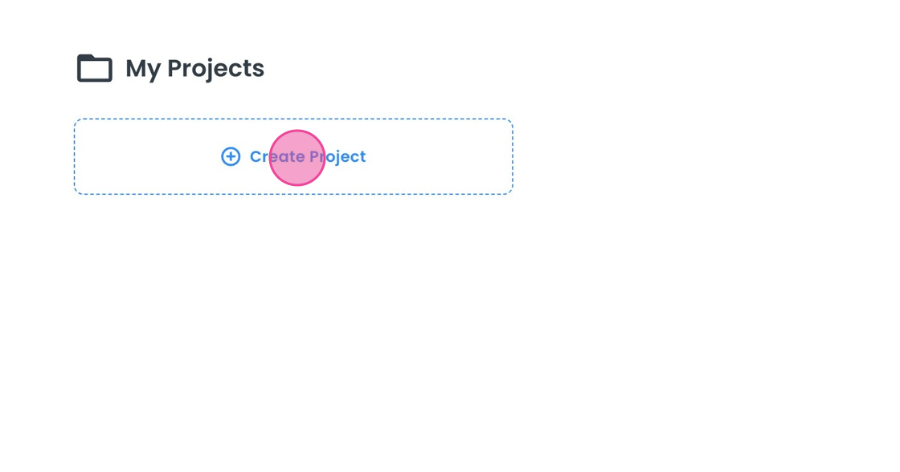

# Quickstart Guide for 8base

This guide describes the process of creating a project in 8base and outline the options available to you. A project in 8base serves as a container for backend services such as data management, API, authentication, and optionally, one or several frontend applications. Team members collaborate within a project, utilizing 8base tools to construct their applications.

Start by navigating to your developer's home and clicking the "Create Project" button.

Each project requires a name that’s unique within your account. After naming your project, you'll be prompted to select an initial project configuration.

## Project Types

There are two main types of projects you can create: Backend-Only and Full-Stack.

1. **Backend-Only Project:** This type of project primarily provides backend-related services, with the option to add a frontend later. This configuration is ideal when 8base is intended to serve as the backbone for applications developed externally.

2. **Full-Stack Project:** This project type provides both backend services and a frontend, which comes pre-configured to work with the project backend as the primary data source. However, developers are not limited to this data source and can connect to additional sources as needed.

Full-Stack projects offer two main options: "Jumpstart with Accelerators" and "Build from Scratch".

 **Jumpstart with Accelerators:** This template provides a basic application styling and pre-built services like authentication and user management, allowing developers to bypass the creation of these standard functionalities and giving an insight into best practices for implementing capabilities with 8base.

**"Build from Scratch"** provides three alternatives:

1. **In-App authentication:** This template includes screens and backend interactions needed for user authentication. Users can sign up and sign in on pages within the application.

2. **Hosted authentication:** This template includes the logic and backend interactions necessary for user authentication. However, the authentication screens are external to the application and are provided by the hosted options of 8base services.

3. **DIY Authentication:** This is a blank project which allows developers to implement their own user authentication or to choose not to include authentication at all.

## Data Centers

8base provides regional hosting options. We recommend selecting the hosting region closest to your application users. Contact 8base with any requrests for hosting regions not on our default list.

For this guide, we'll choose a Full-Stack project with "Jumpstart with Accelerators" in the US region. To proceed, click "Next".

## Project Plans

Each project comes with a specific plan that defines access to certain features and usage limits. Visit our [Pricing Page](https://www.8base.com/pricing) to learn more about our plans. For this guide, we'll select the "Free Tier" option.

Upon creation, you'll be directed to the Project Dashboard.

To access backend services, use the shortcut in the top left area of the dashboard. 

This will open a new tab in your browser for the backend console.

To access your frontend, use the shortcut in the top right area of the dashboard. A dropdown menu allows you to select from your different frontends or to add a new frontend.

## Working on Your Frontend

As you work on your frontend, you can preview the current page, which opens a new tab executing your app's code as if you were accessing the selected page.

As developers work on their frontend, they can preview their current page. This opens a new tab executing their app's code as if they were accessing the currently selected page.

Once development milestones are achieved, you can deploy your frontend. This action publishes a compiled version of your application to a production environment. To start this process, click the "Deploy" button.

A modal window will appear, showing the currently deployed version. Here you can manage your version number and confirm the deployment of your application.

Once deployed, the compiled version of your application is accessible at the public URL for the frontend. You can continue editing your frontend, while your application users can enjoy the published app.

