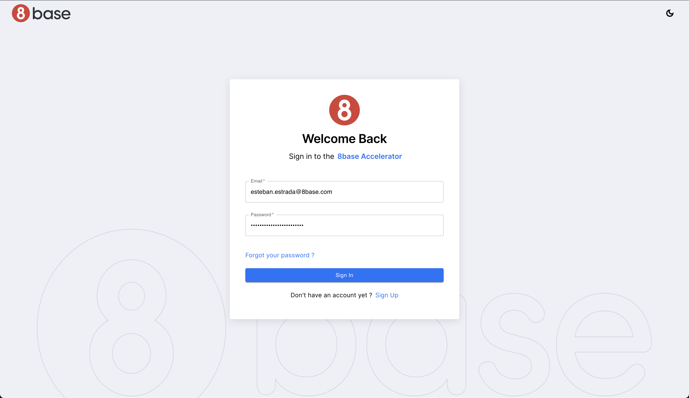

# Login Page

The Login page in the Authentication Accelerator allows users to securely log in to your application. This documentation will walk you through implementing and using the Login function, along with essential requests and dependencies.

# Functions

## Login Function

The `accAuthLogin` function is responsible for user login and authentication. When a user logs in, this function is called to initiate the login process. Here's an annotated code snippet explaining how it works.

# Requests

## LoginRequest

The `accAuthLoginRequest` is a GraphQL mutation used for user login. It takes the user's email, password, and authentication profile ID as input parameters and returns authentication tokens. Here's the request.

This request is crucial for the login process as it authenticates the user and provides the necessary tokens for subsequent API requests.

## UserGetByEmail

The `accUserGetByEmail` GraphQL query is used to retrieve user information based on their email address. It's used to check if a user with the provided email exists in your application.
