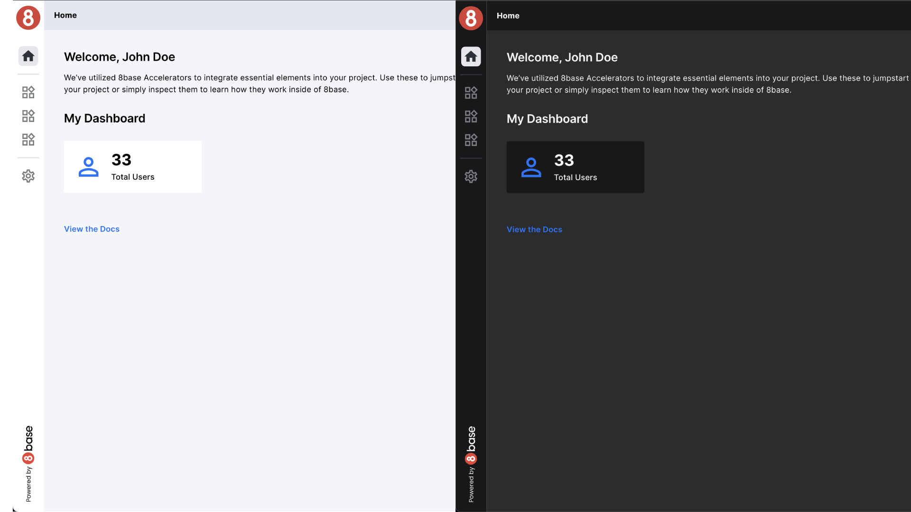

# Dark Mode Support



## Setting Dark Mode

In your application, Dark Mode is controlled by a global state variable named accThemeMode. This variable can have one of two values: "Light" or "Dark." The selected mode affects the overall appearance of the application, making it more adaptable to varying lighting conditions and user preferences.

## Implementation Approaches

Dark Mode Support can be implemented in different ways, depending on your application's architecture and design choices. Here are two common approaches.

## Global Custom CSS


In this approach, you create a separate CSS file specifically for Dark Mode styles. You define CSS rules within this file that apply to elements when Dark Mode is active. To distinguish Dark Mode styles, you can use a class, such as .Dark, as a parent selector for the elements you want to modify.

###  Example CSS for Dark Mode:

```css
/* Dark Mode Styles */
.Dark .elementToModify {
  background-color: #333; /* Dark background color */
  color: #fff; /* Light text color */
}
```

By applying the .Dark class to the HTML body when Dark Mode is active, the specified styles will take effect, transforming the appearance of elements throughout the application.

## Custom CSS in Components

Alternatively, you can implement Dark Mode Support directly within your individual components. In this approach, you specify specific CSS properties to change based on the selected mode. This method provides finer-grained control over styling within each component.

## Ways to do Custom CSS

### Directly styles

Directly styles is used to put custom and specific CSS properties in the components styles pane, to modify things like borders, colors, backgrounds, fills and other things that you found on Style Pane.

```js
{{accThemeMode.value === "Light" ? "#000" : "#fff"}}
```

```js
{{`var(--mainBg${accThemeMode.value})`}}
```

### Directly Class

```js
{{accThemeMode.value === "Light" ? "lightCard" : "darkCard"}}
```

```js
{{`container${accThemeMode.value}`}}
```


In this example, the component conditionally applies a dark-mode style, class based on the `accThemeMode` state.

## Flexible Dark Mode Implementation

The choice between global custom CSS and component-specific CSS allows you to tailor Dark Mode Support to your application's needs. You can use one or both methods to achieve a consistent and visually pleasing Dark Mode experience for your users.

By providing flexibility in Dark Mode implementation, your application ensures that users can enjoy a personalized and comfortable viewing experience.