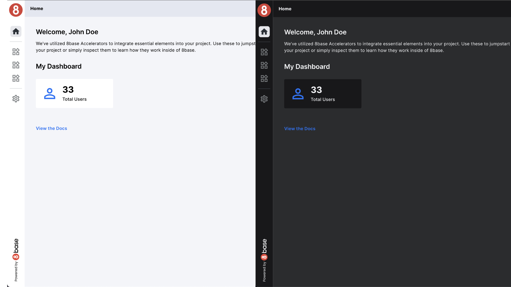

# Theme Management Accelerator

The Theme Management Accelerator in your application empowers users to personalize the appearance of their user interface (UI). Features include dark mode support, adaptable components, and theme customization.

## Dark Mode Support

Dark Mode Support is a user-centric feature that offers the following benefits:

- **Enhanced Visual Comfort**: Dark Mode reduces eye strain, especially in low-light environments, making it more comfortable for users to interact with your application for extended periods.

- **Personalization**: Users can choose their preferred theme to align with their aesthetic preferences and environmental conditions.

- **Battery Savings**: For users on mobile devices, Dark Mode can help conserve battery life by reducing the power consumption of OLED and AMOLED screens.

By providing Dark Mode Support, your application enhances user satisfaction and accessibility. Users can tailor their experience, ensuring a positive impression of your app.

### Learn More

If you want to learn how to implement dark mode support, see [Dark Mode Support](./darkmode-support.md).

## Adaptable Components

Adaptable Components are a core feature of the Theme Management Accelerator in your application. These components offer a dynamic and flexible user interface, ensuring that your application can adapt to various screen sizes and device types. Adaptable Components are designed to provide a seamless experience, regardless of the user's device. They have the following benefits:

- **Cross-Device Compatibility**: Adaptable Components enable your application to function smoothly on a wide range of devices, from smartphones to tablets and desktop computers.

- **Enhanced User Experience**: By automatically adjusting the layout and appearance of your app's components, users can navigate and interact with ease, improving overall satisfaction.

- **Responsive Design**: Adaptable Components ensure that your application's user interface responds to changes in screen size and orientation, providing a consistent and user-friendly experience.

### Learn More

If you want learn how to implement adaptable components, see [Adaptable Components](./adaptable-components.md).

## Theme Customization

Theme Customization is a valuable feature offered by the Theme Management Accelerator. It allows users to tailor the visual style of your application to suit their preferences. With Theme Customization, users can modify colors, fonts, and other design elements, creating a personalized and visually appealing interface. This has the following benefits:

- **Personalized Experience**: Theme Customization empowers users to personalize the appearance of your application, fostering a stronger connection between the user and your brand.

- **Brand Consistency**: While allowing customization, Theme Customization ensures that the core elements of your brand's identity remain intact, maintaining a cohesive user experience.

- **Accessibility**: Users with specific visual preferences or accessibility needs can adjust the theme to enhance readability and usability, making your app more inclusive.

### Learn More

If you want to learn how to implement ttheme customization, see [Theme Customization](./theme-customization.md).

