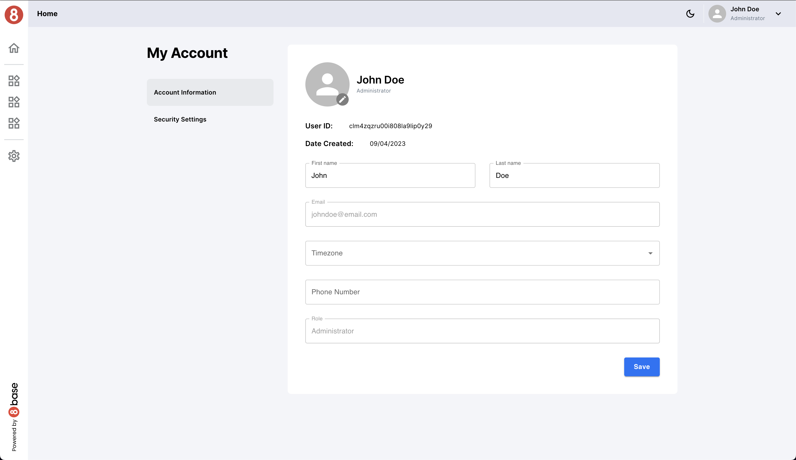

# My Account Page

The My Account page in the User Management Accelerator empowers users to manage their personal account information. It offers a convenient interface for updating user profiles and avatars. This page is designed for users to take control of their own account details.

## My Account Features

**Profile Update**: Users can easily update their personal information, such as their first name, last name, email address, and other profile-related details.

**Avatar Management**: The My Account page provides the functionality to update or change the user's profile picture (avatar), he will detect if the change only was the avatar and only will execute one query to best performance.

## Requests

## Get User By Email

The `accUserGetByEmail` GraphQL query is employed to retrieve the user's account information based on their email address. This query ensures that users can view their current account details before making any updates.

## Get File Upload Info

The `accGetFileUploadInfo` function is used to retrieve information required for file uploads, including avatar updates. It provides the necessary data for managing avatar uploads or changes.

## User Update Avatar

The `accUserUpdateAvatar` function is called when a user decides to update or change their avatar (profile picture). It handles the process of updating the user's profile picture.

## User Update

The `accUserUpdate` function is responsible for updating the user's account information, such as their first name, last name, and email address. It ensures that user profile details are up-to-date.

The My Account page offers users the convenience of managing their own account information and personalizing their profiles. Whether it's updating profile details or changing avatars, this page provides a user-friendly experience for account management.