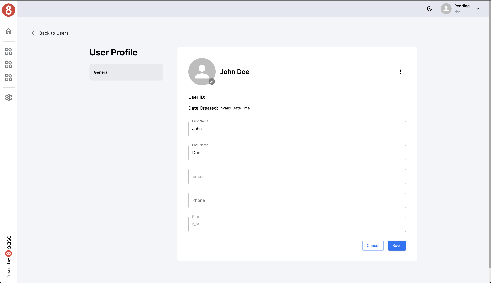

# Team Managment Accelerator - User Profile Page

The User Profile page in the User Management Accelerator allows users to view and edit their profile information. It provides a seamless user experience for managing user profiles within your application. Here are the primary functions used on this page.

## User Profile Page Workflows

The User profile page can be used in two different workflows:

**Editing a User Profile without Image**: In this workflow, the `accUserUpdate` function is called to create the user profile. No image upload is required in this case.

**Editing a User Profile with Image**: When a user decides to include a profile picture, the `accGetFileUploadInfo` function is called to obtain the necessary information for uploading the image. After that, a call to the FileStack API is made to perform the actual file upload. Once the image is uploaded, the accUserCreate function is invoked to create the user profile with the image.

The User Profile page streamlines the process of managing user profiles, including the option to include profile pictures. Depending on the user's preference, they can create a profile with or without an image using the provided functions and workflows.

# Requests

## User Update

The function `accUserUpdate` is called when a user profile is edited. It can be invoked with or without an associated profile picture upload, depending on whether the user chooses to include an image in their profile.

## Get FileUpload Info

The function `accGetFileUploadInfo` retrieves information from filestack API required for file uploads. It's used when a user wants to upload or update their profile picture.

